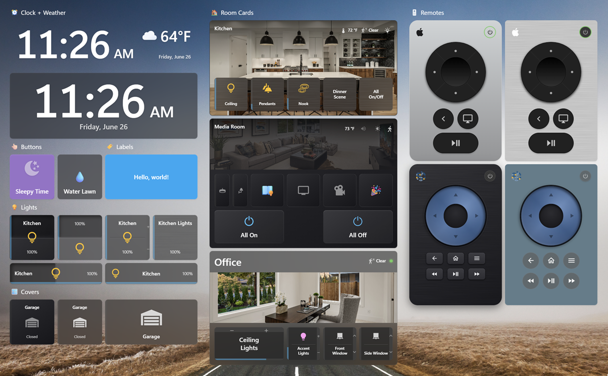
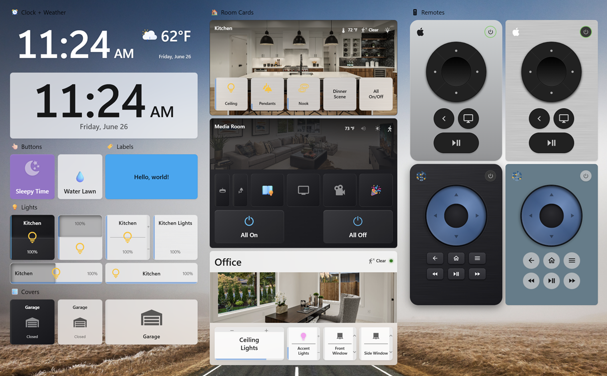
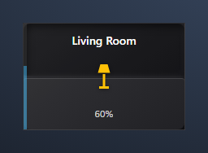
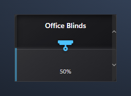
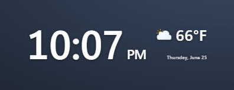
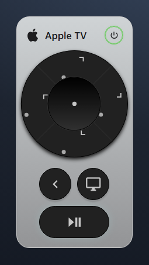
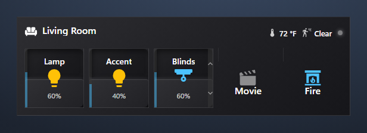

<p align="center">
  <picture>
    <source media="(prefers-color-scheme: dark)" srcset="images/logo4/logo-ondark-512.png">
    
  </picture>
</p>

[](https://github.com/hacs/integration)     [](LICENSE)

> **⚠️ Interim release — testing only.** This is a pre-release build published for testing purposes only and is not intended for production use. Features may change or break without notice.

# Ted's Cards

This is my collection of custom cards for [Home Assistant](https://www.home-assistant.io/) which I use for my HA wall panels and handheld devices. 

After spending months attempting to find an "on/off/brightness" switch that I liked aesthetically, I finally gave up and decided to create my own.  The rest of the cards happened as strived to achieve a consistent look and feel without a ton of styling overrides cluttering up all my YAML files. 😊


---

## ✨ Card Types

| Card | Type | Description |
| --- | --- | --- |
| Light Card | `custom:ted-light-card` | Light tile with click-to-dim halves and an indicator bar. |
| Cover Card | `custom:ted-cover-card` | Cover tile with click-to-position halves and an indicator bar. |
| Button Card | `custom:ted-button-card` | Label or button tile with an optional entity, icon, and tap/hold actions. |
| Expandable Button Card | `custom:ted-button-card` is the trigger; type `custom:ted-expandable-button-card` | A button that opens a popup of child buttons on tap (children can be expandable too). |
| Clock Weather Card | `custom:ted-clock-weather-card` | A large clock with the date and current weather. |
| Remote Card | `custom:ted-remote-card` | Remote control for media devices (e.g. Apple TV and Kaleidescape). |
| Room Card | `custom:ted-room-card` | Overview card for a Home Assistant area. |
| Camera Card | `custom:ted-camera-card` | One or more camera feeds (auto thumbnail or live stream) in single, quad, or multi layouts. |
| Navbar Card | `custom:ted-navbar-card` | Navigation bar pinned to the top or bottom, with buttons and status items in left/center/right zones. |
| Alarm Card | `custom:ted-alarm-card` | Add, view, and enable/disable alarms (requires the Ted's Cards Backend integration). |
| Timer Card | `custom:ted-timer-card` | Start, view, and cancel countdown timers (requires the Ted's Cards Backend integration). |

---

## 📸 Screenshots



---

## 🔧 Requirements

* Home Assistant
* One or more calendar entities (e.g. `calendar.family`, `calendar.work`)

---

## 🚀 Installation

### Recommended: Install via HACS

[](https://my.home-assistant.io/redirect/hacs_repository/?owner=tedr91&repository=ha-teds-card&category=frontend)

OR

<details>
<summary>Add custom repository</summary>

1. Open HACS in Home Assistant.
2. Go to **Frontend** → menu (⋮) → **Custom repositories**.
3. Add `https://github.com/tedr91/Teds-Cards` with category **Dashboard**.
4. Search for **Ted's Cards** and install.
5. Refresh your browser.

</details>

👉 If you don’t have HACS yet, follow: [https://hacs.xyz/docs/use/](https://hacs.xyz/docs/use/)

---

### Manual Installation

<details>

<summary>Without HACS</summary>

1. Download `ted-cards.js` from the [latest release](https://github.com/tedr91/Teds-Cards/releases/latest).
2. Copy it to `<config>/www/community/ted-cards/ted-cards.js`.
3. Add the resource to your dashboard:
   - **Settings** → **Dashboards** → ⋮ → **Resources** → **Add resource**
   - URL: `/local/community/ted-cards/ted-cards.js`
   - Type: **JavaScript Module**
4. Refresh your browser.

💡 After updates, bump the version (`?v=2`) to avoid caching issues.

</details>


---

## 📖 Usage

> 🎨 **Every card** has an **Appearance (general)** section with **Transparency** and **Background blur** sliders — fade the card's surface and blur whatever sits behind it for a frosted-glass look over a dashboard wallpaper. Both default to off (fully opaque, no blur).

### 💡 Light Card

A compact light tile split into two clickable halves by a subtle divider. Supports `light`
entities only. Brightness is shown on a thin vertical indicator bar on the card's left edge.

**Interactions**

The card has **three interactive regions** — the **upper half**, the **lower half**, and the **centered icon** — each of which spans the full card area (padding and hint bars included). Every region responds to **single tap**, **double tap**, and **long press**, and each gesture can be reassigned in the editor's **Switch Behavior** section.

| Region | Single tap (default) | Double tap (default) | Long press (default) |
| --- | --- | --- | --- |
| Upper half | Increase brightness to the next 5% | Full on (100%) | More info |
| Lower half | Turn off | Turn off | More info |
| Icon | Toggle | More info | More info |

Available actions: **Increase brightness**, **Decrease brightness**, **Full on (100%)**, **Turn off**, **Toggle**, **More info**, and **Nothing**.

For **toggle-only** lights (no brightness support), the upper-half single tap defaults to **Full on** and the lower-half single tap to **Turn off**; the left indicator bar shows full when on and empty when off.

<p align="center">
  
</p>

Minimal config:

```yaml
type: custom:ted-light-card
entity: light.living_room
```

<details>
<summary><b>Detailed options</b></summary>

```yaml
type: custom:ted-light-card
entity: light.living_room
name: Living Room          # optional, defaults to entity friendly name
icon: mdi:floor-lamp       # optional, defaults to entity icon
theme: ted-style           # optional, visual styling: ted-style (default) | ha
```

`theme` (optional) — **Visual styling**, selectable in the editor's **Appearance** section:
- `ted-style` (default): a self-contained "Ted's Home Theater" look (Windows 11 Fluent / Mica-dark) that looks the same regardless of your Home Assistant theme.
- `ha`: follow the active Home Assistant theme (surfaces, text, and accent color).

Brightness is shown on a thin vertical **indicator bar** pinned to the card's left edge (it fills bottom→up with the light's brightness; it is not interactive). Its color — labeled **Indicator bar color** in the editor's **Appearance** section — is set by `indicator_color` (optional) when the light is on:
- `theme` (default): the theme accent color.
- `light`: the light's current color (its `rgb_color`), falling back to a warm tone.
- `other`: a custom color — set `indicator_color_custom` to an `[r, g, b]` array (chosen via the editor's color picker).

`show_indicator` (optional, default `true`, in the **Appearance** section) toggles the indicator bar on or off, and `indicator_width` (optional, px, default `4`) sets its width.

`show_hint` (optional, default `false`, in the **Appearance** section): show a matching **hint bar** up the right edge with **+** / **−** hints, indicating the top half raises brightness and the bottom half lowers it. `hint_width` (optional, px, default `8`) sets the hint bar width.

The icon is centered in the card and lights up when the light is on. `icon_color` (optional, in the **Appearance** section) sets its on color:
- `theme`: the theme accent color.
- `light` (default): the light's current color (its `rgb_color`), falling back to a warm tone.
- `other`: a custom color — set `icon_color_custom` to an `[r, g, b]` array.

`background_on` (optional, in the **Appearance** section): override the card's background color while the light is **on**. Pick a color with the editor's color picker (stored as a `#RRGGBB` hex string). When unset, the theme background is used.

`brushed` (optional, default off, in the **Appearance** section): overlay a brushed-metal sheen just above the background. Pair it with a metallic `background_on` color (e.g. silver `#c0c0c0`) for a brushed-aluminum look.

`rocker` (optional, default on, in the **Appearance** section): when on, the card behaves as a rocker switch — the two halves run separate **UP** / **DOWN** actions and a divider separates them. Turn it **off** to make the whole card a single button that always runs the **Icon** behavior (the UP/DOWN options and divider are hidden). `rocker_effect` (optional, default on, disabled when **Rocker** is off): a Decora-style rocker bevel that makes one half of the card appear raised, pivoting at the center. The raised half follows the state — **top** half raised when off, **bottom** half raised when on.

`orientation` (optional, default `vertical`, directly below **Visual styling**): switch the card to **horizontal**. In horizontal mode the indicator bar runs along the **bottom** (filling left → right), the hint bar runs along the **top**, the divider is vertical, the **right** half is **UP** and the **left** half is **DOWN**, and the name sits on the left with the state on the right (icon centered). The default size becomes 6 × 1 in a grid (Sections) view, or 240 × 80 px elsewhere.

Also in the **Appearance** section: `show_name`, `show_icon`, and `show_state` (all default **on**) toggle the name, centered icon, and the state/brightness label; `name_scale`, `icon_scale`, and `state_scale` (percent, default `100`) scale the name text, icon, and state label. `width` and `height` (px, default `100` × `120` vertical, `240` × `80` horizontal) set the card's fixed size when it is **not** a direct item in a grid (Sections) view — e.g. inside a stack, masonry, or panel view. As a direct grid item the card honors the grid cell size instead.

**Switch Behavior**

The editor's **Switch Behavior** section lets you reassign the action for every region × gesture. It contains three groups — **UP behavior**, **DOWN behavior**, and **Icon behavior** — each exposing a **Single tap**, **Double tap**, and **Long press** action picker. The config keys are `up_tap` / `up_double_tap` / `up_hold`, `down_tap` / `down_double_tap` / `down_hold`, and `icon_tap` / `icon_double_tap` / `icon_hold`. Any option left at its default is omitted from the saved YAML.

```yaml
up_tap: increase           # increase | decrease | full_on | full_off | toggle | more_info | none
down_double_tap: toggle
icon_hold: none
```

**Memory (dimmable lights)**

For dimmable lights you can choose the brightness the light turns **on** to. The editor shows a **Memory** section (only for brightness-capable lights) with three modes:
- `off` (default): turn on at the light's last brightness (standard Home Assistant behavior).
- `static`: always turn on to a fixed brightness — set `memory_value` (1–100 %, default 100).
- `helper`: turn on to the value of an `input_number` / `number` helper, read as a **percentage** (1–100). **Choosing this mode auto-creates and selects a dedicated helper for you** (`input_number.ted_light_mem_<entity>`) — no need to add one in Settings → Helpers. Add a card for the same light elsewhere and it reuses that helper automatically; delete the helper and the card falls back to the default. You can still point `memory_entity` at your own helper instead.

```yaml
memory_mode: static        # off | static | helper
memory_value: 60           # static mode, 1–100 %
# or
memory_mode: helper
memory_entity: input_number.living_room_brightness
```

</details>

### 🪟 Cover Card

A compact cover tile split into two clickable halves by a subtle divider. Supports `cover`
entities only (blinds, shades, shutters, curtains, garage doors, …). The current position is
shown on a thin vertical indicator bar on the card's left edge.

**Interactions**

The card has **three interactive regions** — the **upper half**, the **lower half**, and the
**centered icon** — each spanning the full card area (padding and hint bars included). Every region
responds to **single tap**, **double tap**, and **long press**, reassignable in the editor's
**Switch Behavior** section.

| Region | Single tap (default) | Double tap (default) | Long press (default) |
| --- | --- | --- | --- |
| Upper half | Open more (next 5%) | Fully open | More info |
| Lower half | Close more (next 5%) | Fully closed | More info |
| Icon | Toggle | More info | More info |

The **icon's Toggle** is smart: while the cover is moving it **stops**, otherwise it opens (to the
configured memory position) or closes. Available actions: **Open more**, **Close more**, **Fully
open**, **Fully closed**, **Toggle**, **Stop**, **Tilt open**, **Tilt closed**, **More info**, and
**Nothing**. Tilt actions appear in the editor only for tilt-capable covers.

For **open/close-only** covers (no position support), the upper-half single tap defaults to **Fully
open** and the lower-half to **Fully closed**. Tilt-only covers use their tilt position as the
primary value driven by the up/down regions.

<p align="center">
  
</p>

Minimal config:

```yaml
type: custom:ted-cover-card
entity: cover.living_room_blinds
```

<details>
<summary><b>Detailed options</b></summary>

```yaml
type: custom:ted-cover-card
entity: cover.living_room_blinds
name: Living Room Blinds   # optional, defaults to entity friendly name
icon: mdi:blinds           # optional, defaults to a device-class icon
icon_open: mdi:blinds-open # optional, shown while the cover is open
theme: ted-style           # optional, visual styling: ted-style (default) | ha
```

`icon_open` (optional) sets a different icon to show while the cover is open — e.g. `icon: mdi:garage`
with `icon_open: mdi:garage-open`. When unset, `icon` (or a device-class default) is used in all states.

`theme`, `show_indicator`, `indicator_color`, `indicator_width`, `icon_color`, `show_hint`, and `hint_width`
work as in the Light Card (all in the editor's **Appearance** section). `show_indicator` (**on by
default**) toggles the indicator bar; `indicator_color` (`theme` default / `other` custom) — labeled
**Indicator bar color** — colors it when open, and `indicator_width` (px, default `4`) sets its width.
`show_hint` (**on by default**) shows a right-edge **hint bar** with **up/down chevron** hints, and
`hint_width` (px, default `8`) sets its width. The indicator bar fills from the bottom up with the
cover's current position.

`background_open` (optional, in the **Appearance** section): override the card's background color while the cover is **open**. Pick a color with the editor's color picker (stored as a `#RRGGBB` hex string). When unset, the theme background is used.

`brushed` (optional, default off, in the **Appearance** section): overlay a brushed-metal sheen just above the background. Pair it with a metallic `background_open` color (e.g. silver `#c0c0c0`) for a brushed-aluminum look.

`rocker` (optional, default on, in the **Appearance** section): when on, the card behaves as a rocker switch — the two halves run separate **UP** / **DOWN** actions and a divider separates them. Turn it **off** to make the whole card a single button that always runs the **Icon** behavior (the UP/DOWN options and divider are hidden). `rocker_effect` (optional, default on, disabled when **Rocker** is off): a Decora-style rocker bevel that makes one half of the card appear raised, pivoting at the center. The raised half follows the state — **top** half raised when closed, **bottom** half raised when open.

`orientation` (optional, default `vertical`, directly below **Visual styling**): switch the card to **horizontal**. In horizontal mode the indicator bar runs along the **bottom** (filling left → right), the hint bar runs along the **top**, the divider is vertical, the **right** half is **UP** and the **left** half is **DOWN**, and the name sits on the left with the state on the right (icon centered). The default size becomes 6 × 1 in a grid (Sections) view, or 240 × 80 px elsewhere.

Also in the **Appearance** section: `show_name`, `show_icon`, and `show_state` (all default **on**) toggle the name, centered icon, and the state/position label; `name_scale`, `icon_scale`, and `state_scale` (percent, default `100`) scale the name text, icon, and state label. `width` and `height` (px, default `100` × `120` vertical, `240` × `80` horizontal) set the card's fixed size when it is **not** a direct item in a grid (Sections) view — e.g. inside a stack, masonry, or panel view. As a direct grid item the card honors the grid cell size instead.

**Switch Behavior**

The **Switch Behavior** section reassigns the action for every region × gesture, grouped into **UP
behavior**, **DOWN behavior**, and **Icon behavior**. Config keys are `up_tap` / `up_double_tap` /
`up_hold`, `down_tap` / `down_double_tap` / `down_hold`, and `icon_tap` / `icon_double_tap` /
`icon_hold`. Any option left at its default is omitted from the saved YAML.

```yaml
up_tap: open_step          # open_step | close_step | open | close | toggle | stop | tilt_open | tilt_close | more_info | none
icon_hold: stop
```

**Memory (position-capable covers)**

For covers that support `set_cover_position` you can choose the position the cover **opens** to. The
editor shows a **Memory** section (only for position-capable covers) with three modes:
- `off` (default): open fully (100%).
- `static`: always open to a fixed position — set `memory_value` (1–100 %, default 100).
- `helper`: open to the value of an `input_number` / `number` helper, read as a percentage (1–100).
  **Choosing this mode auto-creates and selects a dedicated helper for you** (`input_number.ted_cover_mem_<entity>`)
  — no need to add one in Settings → Helpers; add a card for the same cover elsewhere and it reuses that
  helper, and deleting the helper falls back to the default. Changing the position from the card also
  writes the new value back to the helper. You can still point `memory_entity` at your own helper instead.

```yaml
memory_mode: static        # off | static | helper
memory_value: 70           # static mode, 1–100 %
# or
memory_mode: helper
memory_entity: input_number.blinds_position
```

</details>

### 🏷️👆 Button Card

A small, versatile tile that works as either a **label** or a **button**. The entity is optional: with
no entity it's a static label (or an action button via the tap/hold actions); with an entity it shows
the entity's state and toggles (or opens more-info) by default. It's also the button type used inside
**Room Card** sections.

<p align="center">
  
</p>

Minimal config (button bound to an entity):

```yaml
type: custom:ted-button-card
entity: light.living_room
```

Minimal config (plain label):

```yaml
type: custom:ted-button-card
name: Hello, world!
```

<details>
<summary><b>Detailed options</b></summary>

```yaml
type: custom:ted-button-card
entity: light.living_room   # optional, the entity to control / show
name: Living Room           # optional label text, defaults to the entity friendly name
icon: mdi:lightbulb         # optional, defaults to the entity icon
theme: ted-style            # optional, visual styling: ted-style (default) | ha
icon_color: amber           # optional icon color (theme color name or #RRGGBB)
background: '#1c1c1c'        # optional background color override
brushed: false              # optional brushed-metal sheen over the background
neumorphic: false           # raised tile when off/idle, pressed when the entity is active
show_name: false            # show the name/label (default off)
name_scale: 100             # name text size, % (10–300)
show_icon: true             # show the icon
icon_scale: 100             # icon size, % (10–300)
show_state: true            # show the entity state under the name
state_scale: 100            # state text size, % (10–300)
width: 100                  # fixed width (px) when NOT a direct grid (Sections) item
height: 120                 # fixed height (px) when NOT a direct grid (Sections) item
tap_action:                 # optional, see Interactions below
  action: toggle
hold_action:
  action: more-info
double_tap_action:
  action: none
# Badge — a small number badge from any entity (e.g. an unread/notification count)
badge:
  entity: sensor.notifications   # the entity whose state is shown as the badge number
  color: red                     # optional badge background color
  text_color: white              # optional badge text color
  show_when_zero: false          # show the badge even when the value is 0 (default hides it)
# Dynamic highlighting — recolor the button from another entity's value
highlight:
  entity: sensor.days_until_bin_day
  rules:
    - operator: '<='             # is | is_not | > | >= | < | <=
      value: 2
      background_color: red
      icon_color: white          # optional
      halt: true                 # stop checking further rules once this one matches
    - operator: '<='
      value: 5
      background_color: orange
      halt: true
```

`theme` and `brushed` work as in the other cards (see the Light Card section). `icon_color` and
`background` are picked with the editor's color picker; leave them unset to follow the theme.

`neumorphic` (default **off**, in the **Appearance** section): a soft "neumorphic" effect — the tile
looks **raised** when the entity is off/idle (or has no entity) and **pressed in** when the entity is
active (e.g. a light `on`, a cover `open`, a media player `playing`, a lock `unlocked`).

In the **Appearance** section, `show_icon` (default **on**) and `show_name` / `show_state` (default
**off**) toggle the icon, label, and the entity-state line, and `name_scale` / `icon_scale` /
`state_scale` (percent, default `100`) scale each of them. `width` and `height` (px, default `100` ×
`120`) set the card's fixed size when it is **not** a direct item in a grid (Sections) view — e.g.
inside a stack, masonry, or panel view; as a direct grid item the card honors the grid cell.

**Interactions** — the editor's **Interactions** section sets `tap_action`, `hold_action`, and (under
**Add interaction**) `double_tap_action`, using Home Assistant's standard action picker (toggle,
more-info, navigate, call-service, etc.). Defaults adapt to the entity: **tap** is `toggle` for
toggleable domains (light, switch, fan, cover, lock, climate, media_player, …) and `more-info`
otherwise; **hold** is `more-info` when an entity is set. With no entity, both default to nothing.

**Badge** (editor **Badge** section) — overlays a small number from any entity in the top-right corner
(e.g. a notification count). It hides automatically when the value is `0` (or unavailable) unless
**Show when value is zero** is on; the badge and text colors are configurable.

**Dynamic highlighting** (editor **Dynamic highlighting** section) — recolors the button's background
and/or icon from a chosen entity's state. Add one or more **rules**, each comparing the entity with an
operator (`is` / `is not` / `>` / `≥` / `<` / `≤`) and a value (the value becomes a state dropdown for
`is` / `is not`). Rules are checked top-to-bottom and can be dragged to reorder; turn on **stop
processing** to halt at the first match — handy for threshold ladders like `≤ 2 → red`, `≤ 5 → orange`,
`≤ 10 → yellow`.

</details>

### �️👆 Expandable Button Card

A **Button Card that opens a popup of child buttons on tap**. The trigger looks and is configured
exactly like a normal **Button Card** (icon/name/state, theme, badge, dynamic highlighting); tapping it
opens a native popover holding a configurable set of child buttons. Each child is a full **Button
Card** with its own icon, colors, and actions — and a child can itself be **another Expandable Button
Card**, opening a nested popup without closing its parent. Selecting a leaf button runs its action and
closes the popup.

Minimal config:

```yaml
type: custom:ted-expandable-button-card
name: Scenes
icon: mdi:movie-open
items:
  - type: custom:ted-button-card
    name: Movie
    icon: mdi:movie-open
    tap_action: { action: call-service, service: script.movie_night }
  - type: custom:ted-button-card
    name: Bright
    icon: mdi:white-balance-sunny
    tap_action: { action: call-service, service: script.bright }
```

<details>
<summary><b>Detailed options</b></summary>

```yaml
type: custom:ted-expandable-button-card
# --- Trigger appearance: any Button Card option (icon/name/state, theme, badge, highlight, …) ---
name: Scenes
icon: mdi:movie-open
theme: ted-style
# --- Popup ---
popup_layout: grid          # grid (default) | list
popup_max_columns: 3        # optional cap on grid columns; unset = size to the button count
popup_title: Scenes         # optional heading shown at the top of the popup
flip_icon: true             # flip the trigger icon (e.g. a chevron) 180° while open (default true)
items:                      # child buttons shown in the popup
  - type: custom:ted-button-card
    name: Movie
    icon: mdi:movie-open
    tap_action: { action: call-service, service: script.movie_night }
  - type: custom:ted-expandable-button-card   # a nested expandable child
    name: More
    icon: mdi:dots-horizontal
    items:
      - type: custom:ted-button-card
        name: Reading
        icon: mdi:book-open-variant
```

The trigger's own tap/hold/double-tap actions are ignored — tapping the trigger always opens the
popup. Configure each child's actions on the child button itself.

**Popup** (editor) — **Popup layout** is **Grid** (square tiles) or **List** (a single vertical column).
For the grid, **Max columns** is optional — leave it empty and the grid sizes to the number of buttons
(a single row); set it to wrap onto multiple rows after that many columns. **Popup title** adds an
optional heading. **Flip icon when open** (default **on**) rotates the trigger icon 180° while the popup
is open — handy for a chevron that flips to point the other way. The popover anchors to the trigger,
opening downward (flipping up if there isn't room) and dismisses on outside-click or `Esc`.

**Popup buttons** (editor) — add **Button** or **Expandable button** children, drag to reorder, and edit
each inline with its own card editor. Nested expandable children open their own sub-popups, so you can
build multi-level menus behind a single tile.

</details>

### �🕒⛅ Clock Weather Card

A large clock with the current date and weather, designed to sit transparently on top of a dashboard
background. The clock, date, and weather can each be shown or hidden and positioned independently.

<p align="center">
  
</p>

Minimal config:

```yaml
type: custom:ted-clock-weather-card
weather_entity: weather.home
```

<details>
<summary><b>Detailed options</b></summary>

```yaml
type: custom:ted-clock-weather-card
theme: ted-style            # optional, visual styling: ted-style (default) | ha
force_transparent: true     # transparent card background (default true)
background: '#1c1c1c'        # background color override (only used when force_transparent: false)
brushed: false              # optional brushed-metal sheen over the background
# Clock
show_clock: true
clock_size: large           # small (60%) | medium (80%) | large (100%, default) | extra_large (120%) | custom
clock_size_custom: 100      # size %, used when clock_size: custom (10–400)
clock_offset: 0             # horizontal position: 0 = left, 50 = center, 100 = right
time_format: auto           # auto (default) | 12h | 24h | custom
time_format_custom: 'H:MM'  # token string, used when time_format: custom
# Date
show_date: true
date_size: standard         # standard (default) | custom
date_size_custom: 100       # size %, used when date_size: custom
date_format: standard       # standard (default) | custom
date_format_custom: 'dddd, MMMM D'   # token string, used when date_format: custom
date_below_clock: false     # stack the date directly under the clock
date_offset: 100            # horizontal position: 0 = left, 50 = center, 100 = right
# Weather
show_weather: true
weather_entity: weather.home   # a weather entity
weather_size: standard      # standard (default) | custom
weather_size_custom: 100    # size %, used when weather_size: custom
show_weather_icon: true     # show the condition icon (default true)
icon_style: fancy           # fancy (default) | cool | basic
show_current_temp: true     # show the current temperature
weather_above_clock: false  # place the weather above the clock instead of below
weather_offset: 100         # horizontal position: 0 = left, 50 = center, 100 = right
```

`theme` and `brushed` work as in the other cards (see the Light Card section). `force_transparent`
(default **on**) drops the card background so the clock floats over your dashboard; turn it **off** to
use the theme background or a `background` color override.

The editor groups the rest into **Clock Settings**, **Date Settings**, **Weather Settings**, and a
**Layout** section:

- **Sizes** — `clock_size`, `date_size`, and `weather_size` use preset percentages, or set them to
  **Custom** to enter an exact percent (`*_size_custom`).
- **Time / date format** — `time_format` (`auto` follows your Home Assistant locale) and `date_format`
  both offer a **Custom** mode where you supply a token string (`time_format_custom`,
  `date_format_custom`).
- **Layout** — `show_clock` / `show_date` / `show_weather` toggle each element, and `clock_offset`,
  `date_offset`, and `weather_offset` slide each one horizontally (0 left ↔ 50 center ↔ 100 right).
  `date_below_clock` stacks the date under the clock, and `weather_above_clock` moves the weather
  above it.

**Weather icon styles** (`icon_style`, shown when **Show weather icon** is on): **Fancy** (animated
Meteocons — the default), **Cool** (the Home Assistant frontend weather SVGs), or **Basic** (Material
Design weather icons). See [Credits](#credits) for icon attribution.

</details>

### 🎛️ Remote Card

A remote-control card for **Apple TV** and **Kaleidescape** players. The device family is auto-detected
from the remote entity's integration — Apple TV uses the built-in `apple_tv` integration, while
Kaleidescape uses the custom [`kaleidescape_strato`](https://github.com/tedr91/HA-kaleidescape-strato)
integration (note: **not** the built-in Kaleidescape integration). Buttons send `remote.send_command`
calls to the selected entity.

<p align="center">
  
</p>

Minimal config:

```yaml
type: custom:ted-remote-card
remote_entity: remote.living_room_apple_tv
```

<details>
<summary><b>Detailed options</b></summary>

```yaml
type: custom:ted-remote-card
remote_entity: remote.living_room_apple_tv             # required, the remote. entity (Apple TV or Kaleidescape)
media_player_entity: media_player.living_room_apple_tv  # recommended, drives state + play/pause + power
name: Living Room            # optional header name
theme: manufacturer          # visual styling: manufacturer (default) | ted-style | ha
background: '#1c1c1c'         # optional background color override
brushed: false               # optional brushed-metal sheen over the background
show_icon: true              # show the device icon in the header
icon_scale: 100              # icon size, % (10–300)
show_name: false             # show the name in the header
name_scale: 100              # name size, % (10–300)
scale: 100                   # overall card scale, % (50–200)
show_status_indicator: false # on/off/playing status dot in the header
# Apple TV only — quick-launch app buttons (each value is a media_player source name)
app_launch_1: Netflix
app_launch_2: Disney+
app_launch_3: YouTube
# Kaleidescape only — where the Home button navigates
kaleidescape_home: home      # home (default) | movie_covers | movie_list | movie_collections | system_status
```

`remote_entity` (required) is the `remote.*` entity that receives the button commands. The entity
pickers are limited to the two supported integrations, and the **device family is detected
automatically** from your selection — there's no family dropdown.

`media_player_entity` (recommended) is a matching `media_player.*` entity used to show the current
state and to make the **power** and **play/pause** buttons state-aware. When you pick the remote, the
card tries to auto-fill the matching media player (an entity on the same device first, then by name).

`theme` (in the **Appearance** section) offers **Manufacturer's Style** (default — a per-device look
resembling the real remote), **Ted's Style** (the self-contained "Ted's Home Theater" look), or
**Home Assistant theme**. `background` and `brushed` work as in the other cards (see the Light Card
section). The header is controlled by `show_icon` / `icon_scale`, `show_name` / `name_scale`, and
`show_status_indicator`; `scale` resizes the whole remote (50–200%).

**App Launchers** (Apple TV only) — up to six quick-launch buttons. Each `app_launch_N` is a
media_player **source** name; when a media player is configured the editor offers a dropdown of its
available sources.

**Home button target** (Kaleidescape only) — `kaleidescape_home` chooses where the **Home** button
navigates: **Home** (default), **Movie covers**, **Movie list**, **Movie collections**, or **System
status**.

</details>

### 🏠 Room Card

An overview card for a Home Assistant **area**, with a compact **status bar** along the top edge and
one or more **button sections** below it. The area is the card's primary selection, made in the
editor's **Room** section (an Area picker fed by your Home Assistant areas); it also seeds default
temperature/occupancy entities for new status items.

<p align="center">
  
</p>

Minimal config:

```yaml
type: custom:ted-room-card
area: living_room
```

<details>
<summary><b>Detailed options</b></summary>

```yaml
type: custom:ted-room-card
area: living_room          # the Home Assistant area id
name: Living Room          # optional title override, defaults to the area's name
theme: ted-style           # optional, visual styling: ted-style (default) | ha
brushed: false             # optional brushed-metal sheen over the background
status_items:              # optional, the top status bar (see below)
  - type: temperature
    entity: sensor.living_room_temperature
  - type: occupancy
    entity: binary_sensor.living_room_motion
  - type: brightness
    entity: light.living_room
  - type: volume
    entity: media_player.living_room
  - type: led
    entity: binary_sensor.living_room_window
sections:                  # optional, grids of buttons below the status bar
  - title: Lights
    max_rows: 0            # 0 = unlimited; otherwise caps rows (5 buttons/row)
    buttons:
      - type: custom:ted-light-card
        entity: light.living_room
      - type: custom:ted-cover-card
        entity: cover.living_room
      - type: custom:ted-button-card
        name: Scene
```

`theme` and `brushed` work as in the other cards (see the Light Card section).

**Header** — the top strip shows an optional **icon** and the room **name**. In the editor's **Header**
section: **Display icon in header** (default off; pick the icon below **Name**) with an optional **Icon
size override**, **Display name in header** (default on) with an optional **Name size override**, and
**Display header divider line** (default on).

**Room Photo** — an optional photo behind the card UI (above the background/brushed effect, below the
header, status, and buttons). In the editor's **Room Photo** section:

- **Show photo** (default on).
- **Photo source** — **Bundled** (a curated set served from a CDN; pick one or leave **Auto** to match
  the room name), **Custom** (upload your own via the HA image picker), or **Camera feed** (pick a
  `camera` entity, then choose its **Camera view** — Auto thumbnail (default) / Live stream — and
  **Fit mode** — Cover / Contain / Fill).
- **Photo placement** — **Top of card** (default), **Below header**, or **Fill card**.
- **Photo height** (px) — leave empty to show the full image at card width; set a height to crop it
  (hidden for **Fill**).
- **Photo alignment** — the vertical focal point (Top / Center / Bottom) used when the photo is cropped.
- **Edge Gradient (Scrim)** — darken any of the **Top / Left / Right / Bottom** edges so text/buttons
  stay readable. Sensible defaults per placement (Top→top edge, Fill→top+bottom, Below header→none).
- **Photo opacity** (default 100%).

The default (Show photo on, Auto) silently shows nothing when the room name doesn't match a bundled
photo or the image can't be loaded.

**Status bar** — a small strip of items pinned to the top edge of the card, managed in the editor's
**Status items** section (add, reorder, delete). Each item is one of:

| Type | Shows | Entity |
| --- | --- | --- |
| `temperature` | Icon + value | any sensor (auto-filled from the area) |
| `occupancy` | Icon + value | any sensor (auto-filled from the area) |
| `brightness` | Tap-to-open vertical slider | `light`, `number`, or `input_number` |
| `volume` | Tap-to-open volume slider (double-tap mutes) | `media_player` |
| `led` | Colored status dot | any entity |

Each item also accepts an optional `icon` and `name`. `led` items accept `on_color` / `off_color`
and an advanced `colors` map (state → color) for per-state colors.

**Button sections** — one or more grids of buttons below the status bar, managed in the editor's
**Button sections** section (add, reorder, delete sections; add, reorder, delete buttons within each).
Each button is a `ted-button-card`, `ted-cover-card`, `ted-light-card`, or `ted-camera-card`, edited inline with
that card's own editor. Buttons lay out 5 per row as squares; set a section's **Max rows** to cap the
height (`0` = unlimited). When the buttons overflow the cap, the last visible cell becomes a **…**
button that reveals the rest.

Each section has a **Section title** plus a **Show title in card** toggle (default **off**) and a
**Title alignment** selector (Left / Center / Right; disabled while the title is hidden). The title
still labels the section in the editor even when it isn't shown in the card.

**Spacer** — both the status strip and button sections can hold a **Spacer**: a transparent,
non-interactive placeholder whose only option is its **Size** in px. Status-strip spacers add a
horizontal gap (default `24` px); button-section spacers reserve an empty square cell (default `100`
px, matching a button).

</details>

---

### 📷 Camera Card

<a id="camera-card"></a>

A **camera feed** — or **several** — rendered with Home Assistant's own picture-glance image element so
each feed gets both **auto** thumbnail polling and **live** streaming for free. Show one camera, or lay
out multiple in a **Quad** (2×2) or **Multi** (one big feed plus a strip of smaller ones) arrangement. Use it on its own, as a Room
Card button, or as a Room Card photo source.

Minimal config:

```yaml
type: custom:ted-camera-card
cameras:
  - entity: camera.front_door
```

<details>
<summary><b>Detailed options</b></summary>

```yaml
type: custom:ted-camera-card
layout: single              # optional: single (default) | quad | big-small ("Multi")
big_small_position: right   # optional (Multi only): right (default) | bottom
big_small_width: 25         # optional (Multi only): small-feed strip width, % of the card
cameras:                    # required — one or more cameras, shown in order
  - entity: camera.front_door
    name: Front Door         # optional camera name, defaults to the entity's friendly name
    camera_view: auto        # optional per-camera: auto (thumbnail, default) | live (stream)
    enabled: true            # optional, set false to hide this camera from the layout
  - entity: camera.back_yard
    camera_view: live
show_name: false            # optional, overlay each camera's name along the bottom edge
name_size: 14               # optional, camera-name font size in px (default 14)
fit_mode: cover             # optional: cover (default) | contain | fill
aspect_ratio: "16:9"        # optional, e.g. "16:9" or "1.78" (ignored in grid layout)
theme: ted-style            # optional, visual styling: ted-style (default) | ha
brushed: false              # optional brushed-metal sheen behind the feed
width: 800                  # optional manual width (px), ignored in grid layout
height: 450                 # optional manual height (px), ignored in grid layout
tap_action:                 # optional, defaults to More Info of the tapped camera
  action: more-info
double_tap_action:
  action: none
```

- **Cameras** — add one or more `camera.*` entities. In the editor, use **Auto populate cameras** to
  add every camera at once, **drag** to reorder, the **switch** in each row header to show/hide a camera,
  and the **trash** icon to remove one. Each camera has an optional **Camera Name** (defaults to the
  entity's friendly name) and its own **view** (auto thumbnail or live stream).
- **Layout** — **Single** (one feed), **Quad** (2×2), or **Multi** (one large feed plus a strip of
  smaller ones, positioned to the **right** or **bottom**, with an adjustable **Small feeds width**
  that auto-sizes to keep every feed equal as you show/hide cameras). Slots with
  no camera show an empty placeholder.
- **Per-camera view** — each feed is an **Auto thumbnail** (default; periodically refreshed still) or a
  **Live stream** (continuous video), set in that camera's editor row.
- **Camera name overlay** — **Show Camera Name** overlays each feed's name along the bottom edge, with a
  configurable **Camera name size**.
- **Long-press a feed** — opens a quick popup to switch **that** feed between **Auto thumbnail** and
  **Live stream**, and (for any non-primary feed) **Make primary camera** to swap it into the big slot.
  These are live-view tweaks only and reset on reload — the editor holds the saved defaults.
- **Fit mode** — how each image fills its box: **Cover** (default), **Contain**, or **Fill**.
- **Aspect ratio** — optional, sets the card's shape when it isn't sized by the dashboard grid.
- **Sizing** — in a **grid** (sections) layout the card fills its grid cell; otherwise it uses the
  optional **Width** / **Height** (defaulting to 800×450). `theme` and `brushed` work as in the other
  cards (see the Light Card section).
- **Interactions** — **Tap** defaults to **More Info** of the tapped camera; **Double tap** defaults to
  none. Both accept the standard Home Assistant action options. (Long-press is reserved for the view popup.)
- **Efficient** — feeds only stream while the card is on-screen and the browser tab is visible, and
  hidden cameras use no bandwidth.

</details>

### 🧭 Navbar Card

A **navigation bar pinned to the top or bottom** of the dashboard. Each section holds an ordered mix of
**buttons** — each a full **Button Card**, so they get icons, colors, actions, badges, and dynamic
highlighting — and **status items** such as the **time**, **date**, **weather**, or a room's temperature,
brightness and volume, arranged in **left / center / right** zones. The **center** zone stays pinned to the
exact middle regardless of what's on the sides, so a "Home" button can sit perfectly centered.

> ℹ️ The navbar overlays the dashboard and reserves space so your content isn't hidden underneath it.
> It's brand new — please report any layout quirks.

Minimal config:

```yaml
type: custom:ted-navbar-card
sections:
  - placement: center
    items:
      - type: custom:ted-button-card
        name: Home
        icon: mdi:home
```

<details>
<summary><b>Detailed options</b></summary>

```yaml
type: custom:ted-navbar-card
theme: ha                 # optional, visual styling: ha (default) | ted-style
alignment: bottom         # bottom (default) | top | left | right (left/right = vertical bar)
bar_type: snap            # snap (edge-to-edge, default) | float (centered) — top/bottom only
size: 48                  # bar thickness in px; buttons size from this
min_width: 16             # float only: minimum bar width in px
max_width: 920            # float only: maximum bar width in px
background: ""            # optional card background color (theme name or hex/rgb)
transparency: 0           # 0–100% — fade the bar's background
blur: 0                   # 0–100% — blur the dashboard behind the bar
size_source:              # optional (View Assist): set bar thickness from a VA size
  va_device: true                # this device's VA sensor (or use entity: sensor.<name>)
  attribute: status_icons_size   # View Assist size 6vw/7vw/8vw → 35/42/50 px
sections:                 # up to 5 sections
  - placement: left       # left | center | right (which zone the section sits in)
    align: center         # left | center | right (alignment of items within the section)
    visible: true         # optional, show/hide the section
    overflow: true        # optional, collapse items that don't fit into a “…” popover
    items:                # ordered mix of buttons, status items, and popups
      - type: datetime                      # status item (date + time; set display: time/date to show one)
        display: date
      - type: weather                       # status item (auto-picks a weather entity, or set entity:)
  - placement: center
    items_source:         # optional (View Assist): append buttons from a status-icon list
      va_device: true                     # this device's VA sensor (or use entity: sensor.<name>)
      attribute: status_icons             # or menu_items
    items:
      - type: custom:ted-button-card  # a button
        name: Home
        icon: mdi:home
        nav_button_size: normal             # normal (default) | wide
  - placement: right
    items:
      - type: datetime                      # status item — updates live
        display: time
      # A "popup menu" is an Expandable Button Card: a normal button tile that opens a
      # popover of child buttons (configure layout / title / nesting on the card itself).
      - type: custom:ted-expandable-button-card
        icon: mdi:dots-horizontal
        popup_layout: grid                  # grid (default) | list
        popup_max_columns: 3                # optional cap on grid columns (unset = fit items)
        popup_title: Settings               # optional heading
        flip_icon: true                     # flip the trigger icon 180° while open (default true)
        items:
          - type: custom:ted-button-card
            name: Settings
            icon: mdi:cog
```

- **Navbar alignment** — pin the bar to the **Bottom** (default) or **Top** edge (horizontal), or the **Left** / **Right** edge for a **vertical** bar. A vertical bar is always snap (Float is hidden), clears the header & sidebar, and maps the section zones top→**left**, middle→**center**, bottom→**right**.
- **Navbar type** — **Snap** spans edge-to-edge; **Float** centers the bar with margins and rounded corners (top/bottom bars only). A floating bar **auto-sizes to fit its buttons** (just a little wider) — unless it has **left-** or **right-**zone items, in which case it spans the full (maximum) width so those items can pin to the edges.
- **Minimum width** / **Maximum width** (float only) — the bounds the floating bar is sized within (defaults **16** and **920** px).
- **Size** — the bar thickness in pixels; buttons size automatically from it.
- **Size source** *(View Assist)* — optionally drive the **bar thickness** from an entity attribute holding a View Assist size (`6vw` / `7vw` / `8vw` → `35` / `42` / `50` px). Set `va_device: true` to read **this device's** View Assist sensor (so one shared dashboard fits each display), or point at a fixed `entity:`. View Assist's own `vw` rendering isn't used; everything inside the bar auto-scales from the resulting thickness.
- **Items source** *(View Assist)* — a section can **append buttons from a View Assist status-icon / menu list** (e.g. a VA sensor's `status_icons` or `menu_items` attribute). Use `va_device: true` to read **this device's** View Assist sensor on a shared dashboard, or a fixed `entity:`. Each entry becomes a button — `view:` navigates, `entity:` toggles, `service:` calls a service, and known names like `home` / `weather` map automatically — added after the section's own items and **de-duped** against them.
- **Sections** (up to **5**) — each sits in a **left / center / right** zone and has its own content
  **alignment**. Sections, and the items inside them, are added and **dragged to reorder** in the
  editor. The **center** zone is pinned to the exact center of the bar, independent of the left/right
  content.
- **Items** — each section's **+ Add item** menu adds a **button**, a **status item**, or a **popup**, mixed in
  any order and **dragged to reorder**.
- **Buttons** — a full **Button Card** (entity, icon, colors, actions, badge, dynamic
  highlighting). **Button size** is **Normal** (square) or **Wide**.
- **Status items** — **Time**, **Date** and **Weather**, plus a room's **Temperature**, **Occupancy**,
  **Brightness**, **Volume**, an entity **Status LED**, and a **Spacer**. Brightness and volume open a
  slider on tap, and the clock updates live.
- **Popups** — the **+ Add item** menu's **Popup menu** adds an **Expandable Button Card**: a normal
  button tile that opens a popover of child buttons. Configure its layout (Grid with optional **Max
  columns**, or List), an optional **title**, **Flip icon when open**, and nested menus on the card
  itself — handy for tucking extra controls behind one button.
- **Overflow** — when a section's items don't fit the bar, the extras **auto-collapse into a “…” popover**
  (turn **Auto-collapse overflow** off per section to keep them inline).

</details>

### ⏰ Alarm Card

Add, view, and enable/disable **alarms**. Requires the **[Ted's Cards Backend](https://github.com/tedr91/Teds-Cards-Backend)**
integration (which owns the alarms and fires them reliably server-side). The card reads
`sensor.teds_alarms` and calls the backend's `add_alarm` / `update_alarm` / `remove_alarm` services.

```yaml
type: custom:ted-alarm-card
title: Alarms            # optional header (default "Alarms")
entity: sensor.teds_alarms   # optional, override the alarms sensor
show_add: true           # optional, show the add form (default true)
theme: ha                # optional, visual styling: ha (default) | ted-style
```

Each alarm row has an enable toggle, its label (and any description / repeat days), the time, and a
delete button. The add form takes a label and time. **Appearance** (in the editor) offers **Visual
styling**, **Transparency** / **Background blur**, a **Brushed** sheen, and a **Subtle shadow** toggle —
matching the other cards.

### ⏱️ Timer Card

Start, view, and cancel **countdown timers**. Also requires the **Ted's Cards Backend** integration;
the card reads `sensor.teds_timers` and calls `start_timer` / `cancel_timer`.

```yaml
type: custom:ted-timer-card
title: Timers            # optional header (default "Timers")
entity: sensor.teds_timers   # optional, override the timers sensor
show_add: true           # optional, show the start form (default true)
theme: ha                # optional, visual styling: ha (default) | ted-style
```

Running timers show a **live countdown** with a cancel button; the start form takes a name and an
**H / M / S** duration; recently used timers appear as quick-start chips. The same **Appearance**
options as the Alarm card apply.

---

## 📋 Changelog

The newest entry below is used as the GitHub Release notes by the release workflow, so it shows in
the Home Assistant / HACS **update** dialog when you update. Newest first.

### v1.0.82

- **Settings card — sections, shared scope, and root-relative paths** — the Settings card can now render a single group via `sections: [...]` (so each section can live in its own Ted Tab Card tab), hide its header with `show_header: false`, and follow a shared **Global / This device** toggle across several cards via `scope: shared` + a `variant: scope-toggle` card. The Navigation **Home / Alarms / Timers dashboard** fields are now root-relative — they show a fixed `<dashboard root>/` prefix and you type only the path segment (stored as `[root]/…`, so nothing else changes). The **Home dashboard** default is now `[root]/welcome`.

### v1.0.81

- **Button/Navbar icons — icon-set fallback** — a Button Card `icon` can now be a per-set name map instead of a single string, and the card renders the first icon set that's actually installed on the device, in priority order (`streamline-ultimate-color` → `streamline-freehand-color` → `pepicons-print` → `fluent` → `mdi`). This lets a dashboard prefer fancy icon packs and degrade gracefully to MDI when a pack isn't present. Also applies to the Expandable Button Card trigger/children and Navbar buttons (they're all Button Cards). Example: `icon: { streamline-ultimate-color: bedroom-hotel, mdi: bed }`.

### v1.0.80

- **MessageBox card — standard visibility conditions** — the card's bespoke `show_if` (form factor / View Assist presence / missing cards / entity state) is replaced by a `visibility:` list using the **same conditions engine as the Navbar Card** (`screen`, `view-assist`, `card`, `state`, `numeric_state`, `user`, and `and`/`or`/`not`). Top-level conditions are AND-ed. A new generic **`card`** condition (`registered` / `not_registered`) covers the old "warn when a dependency card isn't installed" use.
- **Devices report their screen to the backend** — on registration each device now sends its viewport **width/height, orientation, and form factor** to Ted's Cards Backend (updated, throttled, when the screen changes), so server-side logic and dashboards can reason about the client. Pairs with Ted's Cards Backend v1.0.17+.

### v1.0.79

- **Fix release build** — resolved a TypeScript type error in the Clock/Weather card (`_stackRows`) that failed the release workflow's type-check, so v1.0.78's build didn't attach. This is a clean rebuild of the v1.0.78 changes.

### v1.0.78

- **Clock/Weather card — consistent auto-sizing** — the clock, date, and weather are now auto-sized together at their base (100%) to fit a fixed-height cell **before** each element's **clock size** / **date size** / **weather size** factor is applied, so those adjustments scale relative to the fitted size (and can shrink or overflow as configured).

### v1.0.77

- **Clock/Weather card — smarter auto-sizing in fixed-height cells** — when the card fills a fixed-height container (e.g. a `grid-layout` area) the clock is now sized by its **inked height** (the time has no descenders and short ascenders) rather than the full line box, so it fills the space instead of leaving a big gap below. The auto-fit targets **clock size = Large**; the configured **clock size** then scales relative to that base, so a larger size can overflow and a smaller one shrinks, as set.

### v1.0.76

- **Clock/Weather card — centered when filling a cell** — when the card fills a fixed-height container (e.g. a `grid-layout` area) and the clock is smaller than the cell, the leftover vertical space is now split evenly above and below instead of piling above the (bottom-aligned) clock.

### v1.0.75

- **Settings card — sound fields show their real default** — media/sound fields no longer display the literal word "default"; the box is empty with a **placeholder of the actual default it resolves to** (the bundled sound, or the general notification sound for per-severity fields). Clearing the box keeps it inheriting.
- **Date/Time status item — default time format** is now `h:MM a` (e.g. `7:05 pm`).
- **Clock/Weather card — sizes to its container height** when it isn't a direct Sections-grid item (e.g. a fixed-height `grid-layout` area): the text now scales to fit both the width **and** the available height instead of overflowing.

### v1.0.74

- **Alarms/Timers status items — tap & hold actions** — tapping the Alarms or Timers navbar item navigates to its configured dashboard; holding opens a quick menu: **View Alarms** / **Disable Alarms**, and **View Timers** / **Pause all timers** / **Cancel all timers** (scoped to the device's area). New **Alarms dashboard** and **Timers dashboard** settings (default to the alarms-timers view's matching tab). Requires **Ted's Cards Backend v1.0.15+**.
- **Notifications status item — hold for Do Not Disturb** — tapping still opens the notifications list; holding now offers **Enable / Disable Do not disturb** for this device.
- **Count badge** — the Alarms/Timers/Notifications count badge is smaller and tucked further into the corner so it no longer covers the icon.

### v1.0.73

- **Navbar — Alarms & Timers status items** — new status items showing a fluent icon with a count badge for enabled alarms / active timers (area-scoped, with a **Hide when there are none** option, default on).
- **Navbar — combined Date/Time item** — the separate **Time** and **Date** items are now one **Date/Time** item with a **Display** choice (Both / Time only / Date only) and token-based **Date format** (default `ddd, MMMM D`) and **Time format** (default `h:MM`); the unused format field disables based on Display.
- **Badge-item editor** — Notifications / Alarms / Timers now share a tidy layout (Area + Name, Icon + Hide-when-empty side by side, then a **Display badge icon** toggle to show/hide the count bubble).
- **Navbar menu tidy-up** — removed Temperature, Occupancy, and Spacer from the navbar's status-item menu (still available on the Room Card); "Brightness control"/"Volume control" are now just **Brightness**/**Volume**.
- **New default navigation** — **Home dashboard** defaults to `[root]/home` and **Auto-return home after** defaults to `0` (never). Requires **Ted's Cards Backend v1.0.14+**.

### v1.0.72

- **Per-severity notification sounds** — the Settings card's **Notifications** group now has Info / Success / Warning / Danger / Tip sound fields (each `"default"` falls back to the general alert sound), so different severities can play different sounds. Requires **Ted's Cards Backend v1.0.13+**.
- **Notification persistence replaces "sticky"** — notifications now carry a `persistence` of **transient** (toast only, never stored), **normal** (auto-clears when read/dismissed), or **sticky** (stays until manually cleared).
- **Repeat is now a simple on/off** — the timer/alarm **Max repeats** setting is gone; a repeating alert loops for the sound's own length until dismissed (or the notification times out), handled server-side.

### v1.0.71

### v1.0.70

- **Settings card — media player fixes** — the **This device** media-player override now works (clicking override enables the entity picker even when there's no inherited value, instead of doing nothing), and the **Media player** field is greyed out on the **Global** tab since it only makes sense per-device.

### v1.0.69

- **Settings system (global + per-device)** — a new backend-backed settings layer with a **Ted Settings card** (`custom:ted-settings-card`) featuring **Global** and **This device** tabs (each field can inherit or override). Covers timer/alarm snooze, alert sounds/volume/repeat, media player, notification sound, Do Not Disturb, and dashboard navigation. Requires **Ted's Cards Backend v1.0.11+**.
- **Snooze is now per-device** — timer/alarm completion notifications show **Snooze (Xmin)** / **Dismiss** resolved from *this device's* effective snooze settings (or hide Snooze if disabled), on both the toast and the Notification Center.
- **Do Not Disturb** — suppresses toasts (and mutes server-side alert sounds) on a device.
- **Auto-return home** — the navbar returns the device to its configured Home dashboard after an idle period (`auto_return_home_after`, 0 = never); only active when the settings backend is installed.
- **Room Card — photo height default** — the room photo again defaults to **132px** for top / below-header placements when no height is set (use `0` for a full natural-height image).

### v1.0.68

- **Tab Card — fills its container's height** — the Tab Card now stretches to the full height of its grid cell / container (e.g. a full-height `custom:grid-layout` view) instead of collapsing to its content height.

### v1.0.67

- **Notifications — “Clear all” / “Mark all read” now include house-wide items** — in an area-scoped view (navbar bell popup or Notification Center card) these actions now clear/mark the notifications actually shown — this room's **plus** house-wide (area-less) ones — instead of leaving the house-wide ones behind.
- **Button Card — area-scoped badge/highlight fallback** — when a device's area can't be resolved (e.g. a plain browser with no View Assist / browser_mod / saved area), an area-scoped `count_attribute` badge/highlight now counts everything instead of hiding all room-scoped items, so the navbar Alarm/Timer badges & accents reappear.

### v1.0.66

- **Timer card — Recent presets show scope tags** — Recent timer tiles now tag **House-wide** presets (and presets from another room) the same way the Active list does, instead of showing nothing or a raw area name.

### v1.0.65

- **Notification toasts clear on every device** — dismissing a notification toast (or marking it read / clearing it) now closes the matching toast on **all** devices, so a house-wide alarm/timer that popped everywhere disappears everywhere the moment you dismiss it on one screen. Requires Ted's Cards Backend v1.0.9+.
- **Button Card — area-scoped badge & highlight counts** — the badge and dynamic-highlight can now count a list attribute (e.g. `alarms` / `active`) with an optional **area scope**, so navbar Alarm/Timer badges & accents reflect only the current device's area (plus house-wide items) instead of the raw total. New `count_attribute` + `area_scoped` options (badge fields added to the visual editor).

### v1.0.64

- **Notifications — device-area scoping everywhere** — the navbar's notifications bell popup and the Notification Center card now scope to the **current device's area** (resolved from the item/card Area override, View Assist, browser_mod, or a per-device saved value), matching the toast. Each shows that device's area notifications **plus** house-wide (area-less) ones, so an area-scoped timer/alarm no longer appears on other rooms' devices.

### v1.0.63

- **Alarm & Timer cards — area shown in title** — the scoped area now appears next to the title, e.g. **Alarms (Kitchen)** / **Timers (Primary Bedroom)**, with a new **Display area in title** toggle (default on) beside the Area option.
- **Room Card — header horizontal alignment** — a new **Horizontal alignment** (Left / Center / Right) option controls where the header name/icon sits, alongside the existing vertical alignment. The **Display header divider line** option moved to the bottom of the Header section, and the default room-photo height is now 132px.

### v1.0.62

- **Alarm & Timer cards — per-device area scoping** — a card with no fixed **Area** now scopes to the **current device's area**, resolved from (in order) the card's Area override, the View Assist device, the browser_mod device's assigned area, or a per-device saved value; if none is known it shows a banner to pick one (saved on that device). House-wide items always show everywhere.
- **Alarm & Timer cards — per-item scope** — the Add/Edit dialog now has a **This room / House-wide** choice, so you can create a house-wide alarm or countdown that appears on every device.
- **Room Card — watermark refinements** — the watermark now sits flush in the top-left corner (no rounding), defaults to 300% size with 30%/70% icon/background transparency, sizes the header so buttons start below it, and adds optional **Icon color** and **Icon background color** overrides.

> Note: the per-item scope requires the latest **Ted's Cards Backend** integration.

### v1.0.61

- **Notifications — icons in the popover & detail view** — a notification's icon now shows in the navbar bell dropdown and the full-notification popup (not just the pop-up toast), falling back to a severity icon when none is set.

### v1.0.60

- **Notifications popover — reliable two-line clamp** — hardened the message truncation so it consistently wraps to **two lines** and then shows an ellipsis, with a fallback for browsers that don't support line-clamp.

### v1.0.59

- **Button Card — horizontal orientation layout** — horizontal orientation now positions the icon / name / state by their order (1st = left, 2nd = center, 3rd = right) and centers content vertically, matching the vertical layout's slot logic. Fixes off-center content on short horizontal buttons.

### v1.0.58

- **Button Card — horizontal orientation centering** — fixed the icon / name / state not centering in **Horizontal** orientation (they were left-aligned).
- **Tab Card editor — nested collapse fix** — collapsing a section inside a tab's card editor no longer collapses the whole tab panel.

### v1.0.57

- **Button Card — orientation** — a new **Orientation** option (**Vertical**, the default, or **Horizontal**) lays the icon / name / state out stacked or side-by-side.
- **Room Card — header icon modes** — the header icon toggle is now a **None / Standard Icon / Watermark** choice. **Watermark** shows a large room icon tucked into the top-left corner (clipped by the card edge) as a subtle background emblem, with adjustable **Icon transparency** and **Icon background transparency**.

### v1.0.56

- **Tab Card — child card popups no longer clipped** — dialogs opened by a card placed inside a **Tab Card** (e.g. the Alarm/Timer **add** dialog) now cover the full screen again instead of being trapped and cut off inside the tab card. On translucent (glass/Mica) themes the tab card's frosted surface was acting as a boundary for those pop-ups; the surface is now painted as a separate layer so it stays pretty without constraining the cards inside it.
- **Notifications popover — easier to read** — each notification's message now wraps to **two lines** before truncating, and **tapping a notification opens the full text** in a centered pop-up (and marks it read).

### v1.0.55

- **New — Tab Card** — a new **Ted's Tab Card** that organises any cards into **tabs** within a single card. Each tab has its own label, icon and card, edited with a full visual editor (add, reorder and remove tabs; pick and configure each tab's card with the standard card editor). The active tab can be **deep-linked** with a URL query parameter (e.g. `?tab=timers`), so a button or notification can open straight to the right tab.
- **Alarm & Timer cards — external "Add" buttons** — the Alarm and Timer cards now open their **add** dialog in response to an external `fire-dom-event` action (`ted_add: alarm` / `ted_add: timer`), so a prominent Add button placed anywhere on the dashboard can start a new alarm or timer while the card's own **+** stays hidden.

### v1.0.54

- **Navbar Card — button hover tooltips** — navbar buttons now show a native **tooltip** (and expose an accessibility **aria-label**) with the button's **name** when you hover, so icon-only bars are easier to learn at a glance. No layout change; names still don't render inline unless you enable **Show name**.

### v1.0.53

- **Room Card editor — tidier tabbed options** — when **Section layout** is set to **Tabbed**, the now-irrelevant per-section **Show title in card** and **Title alignment** fields are hidden (the tab already shows the section title).

### v1.0.52

- **Room Card — Fixed broken bundled photos** — the built-in room photos are now served from the current repository tag again. They had stopped loading after the repository was renamed, because the image URL still pointed at an old tag that no longer exists. Documentation links across the cards were also updated to the current repository name.

### v1.0.51

- **Room Card — Tabbed button sections** — a new **Section layout** option (Stacked / Tabbed) lets you show one button section at a time behind a tab bar instead of stacking them all. Each section gets an optional **Tab icon** shown next to its title in the tab, and the last-selected tab is remembered per card across reloads.

### v1.0.50

- **Room Card — Full width/height & renamed button sizes** — section button **Width** and **Height** options are now **2x / 3x / 4x** (renamed from Double/Triple/Quad) and add a new **Full width** / **Full height** option that spans the entire section grid. Note: the old `double`/`triple`/`quad` values are no longer recognized — re-pick the size in the editor for any buttons that used them.
- **New project logo** — added a **Ted's Cards** wordmark logo to the README.

### v1.0.49

- **Notification toasts fixed on kiosk dashboards** — toasts now subscribe via the backend's `teds_cards_backend/subscribe_notifications` WebSocket command instead of the raw event, resolving the "Unauthorized"/refused-subscription errors that non-admin (e.g. Wallpanel) users hit. Requires Ted's Cards Backend v1.0.7+.

### v1.0.48

- **Room Card — Triple & Quad button sizes** — section button **Width** and **Height** now offer **Triple** (3×) and **Quad** (4×) footprints in addition to Half / Normal / Double.

### v1.0.47

- **Status item alignment fix** — brightness, volume, and notification icons (which are clickable buttons) now match the exact height of the other status items, so every item lines up in all alignment modes. Their tap targets are unchanged.

### v1.0.46

- **Camera editor fix** — collapsing an expanded camera feed no longer collapses the whole **Cameras** section.

### v1.0.45

- **Camera Card — "Camera Name"** — the caption is now called **Camera Name** (defaults to the entity's friendly name). The **Show Camera Name** toggle moved into the Cameras section next to a new **Camera name size** control.

### v1.0.44

- **Camera editor tidy-up** — the **Appearance (general)** section now sits at the top of the editor, and **Fit mode** and **Aspect ratio** share a row.

### v1.0.43

- **Camera Card — per-camera view** — each feed now picks its own **Auto thumbnail** or **Live stream** in the editor (the old card-wide "Camera view" option is gone).
- **Long-press a feed** — opens a quick popup to switch **that** feed between Auto/Live and, for any non-primary feed, **Make primary camera** to swap it into the big slot. These are live-view tweaks that reset on reload; the editor keeps the saved defaults. (Long-press replaces the old `hold_action`.)
- **Bandwidth** — feeds now only stream while the card is on-screen and the browser tab is visible; live streams tear down when scrolled away or backgrounded, and hidden cameras use none.

### v1.0.42

- **Camera editor polish** — the camera list is now a **Camera Feeds** group with the **Auto populate** and **+** (add) buttons in its header; long camera names truncate cleanly so each row's toggle, delete, and expand controls stay aligned.
- **Big + Small layout** — new **Small feeds width** slider controls how much of the card the small-feed strip takes (works for both **right** and **bottom** positions).
- **Editor layout** — **Camera view**, **Fit mode**, and **Aspect ratio** moved up into the Cameras section; the appearance panel is now **Appearance (general)** at the top.

### v1.0.41

- **Camera Card — multi-camera support** — a single card can now show **several cameras** in a **Single**, **Dual** (side by side), **Quad** (2×2), or **Big + Small(s)** layout (small feeds on the **right** or **bottom**).
- **Camera editor** — new **Cameras** section: **drag to reorder**, a **show/hide** switch per camera, **add**/**remove** cameras, and an **Auto populate cameras** button that adds every camera and picks a best-fit layout.
- **Bigger default size** — standalone cards now default to **800×450** (grid cells fill their cell as before).
- ⚠️ **Breaking:** the old single `entity:` option is gone — cameras are now listed under `cameras:`. Existing camera cards need to be reconfigured.

### v1.0.40

- **Notification toasts** — manually dismissing a toast (the ✕ button) now marks that notification as **read** (auto-timeout still leaves it unread).
- **Notification Center card** — the **Clear all** and **dismiss** buttons now follow the card's theme instead of showing the default Material button styling.

### v1.0.39

- **Navbar Notifications bell** — the bell popover now matches the Notification Center card: **Clear all** is an icon, each item shows a **“Xm ago”** timestamp, and items have a **read/unread** state (unread dot; click to mark read).

### v1.0.38

- **Translucent themes (e.g. Windows 11 Mica)** — timer/alarm dialogs, notification toasts, and the bell / brightness / volume / overflow popovers no longer look **see-through**; they now pick up the theme's frosted-glass blur like regular cards do.

### v1.0.37

- **Navbar Card** — a fired notification now **reveals an auto-hidden navbar** when that bar carries the Notifications bell item, so alerts aren't missed while the bar is collapsed.
- **Notification toasts** — toasts no longer **overlap a bottom navbar**; they now stack neatly above it.

### v1.0.36

- **Notification toasts** — toasts now show a **severity icon** and any **action buttons** the notification defines, and the **navbar Notifications bell** pops toasts too. The toast countdown bar is fully contained within the rounded corners.
- **Notification Center card** — **mark individual items as read** (unread dot + click the row) in addition to Mark all read, and the navbar bell gains a **Hide when empty** option.
- **Navbar Card** — count **badges** on navbar buttons are now sized proportionally to the button (they scale with the navbar size) instead of a fixed, oversized dot.

### v1.0.35

- **New: Notification Center card** — a bell with an unread badge over a scrollable list of notifications (severity accents, per-item dismiss, actions, time-ago, room labels), with **Mark all read** / **Clear all**. Has an **Area** filter and can pop toasts. Reads `sensor.teds_notifications` (needs **Ted's Cards Backend v1.0.6+**).
- **Navbar Card** — new **Notifications bell** status item: a bell + unread badge that opens a popover list of notifications (dismiss / clear all), with an optional **Area** filter.

### v1.0.34

- **Notifications (foundation)** — the Timer and Alarm cards now show **toast notifications** driven by Ted's Cards Backend: finished timers and ringing alarms pop a dismissable message, and any `teds_cards_backend.notify` service call does too. Toasts respect the card's **Area**. Requires **Ted's Cards Backend v1.0.6+**. (A dedicated Notification Center card and navbar bell are coming next.)

### v1.0.33

- **Timer Card** — **long-press** a **Recent** preset to open a **Delete** popup that removes it from the recent list. Requires **Ted's Cards Backend v1.0.5+**.

### v1.0.32

- **Timer Card** — the completion message now reads "&lt;name&gt; (X min timer)" and stays for **60 seconds** before auto-dismissing (still closable anytime).

### v1.0.31

- **Timer Card** — when a timer finishes it now pops a dismissable **completion message** (styled like Ted's MessageBox) reading "&lt;name&gt; — X hr, Y min, Z sec completed!", with a close button and a ~10s auto-dismiss. Respects the card's **Area** so each room only announces its own timers. Requires **Ted's Cards Backend v1.0.4+**.

### v1.0.30

- **Navbar Card** — new **Auto-hide** option: the bar collapses into its edge, leaving a small **pill** you tap (or hover) to reveal it. It re-hides after a configurable delay (default 5s) or when you interact with anything outside the bar, and dashboard content reclaims the space while it's hidden. Works on all four edges.

### v1.0.29

- **Remote Card** — removed the glow around the **play/pause** button while media is playing.

### v1.0.28

- **Alarm & Timer Cards** — new **Area** option scopes a card to a room: when set, the card only shows alarms/timers for that area and tags anything created here with it (needs **Ted's Cards Backend v1.0.3+**). Leave it unset for a whole-home view, where each item shows a small **room label**. The redundant "sensor" option was removed.

### v1.0.27

- **Alarm & Timer Cards** — the editors are reorganised to match the other cards, with a standard **Appearance (general)** section and a new **Header** section (Display icon / name in header with size overrides, header divider line, and the Show add button toggle).
- **Alarm & Timer Cards** — the header icon and **+** add button now match the header text colour.
- **Timer Card** — recent-tile text is vertically centred.

### v1.0.26

- **Light & Cover Cards** — the indicator and hint bars now look the same whether the neumorphic/rocker effect is on or off (previously they were dimmer with the effect off).

### v1.0.25

- **Alarm & Timer Cards** — the **Appearance** editor now matches the other cards, adding **Background color**, **Show icon** + **Icon size**, **Show name** + **Name size**, and **Card scale**.
- **Timer Card** — **Recent** tiles are a bit shorter and their minimum width is smaller, so more fit per row.

### v1.0.24

- **Timer Card** — **Recent** presets are now compact, fully clickable **`duration (name)`** tiles (no separate play button). Clicking one opens the timer editor pre-filled with its values; pressing the primary button starts the timer.
- **Alarm Card** — saving edits to a **disabled** alarm now re-enables it (Cancel leaves it unchanged).

### v1.0.23

- **Alarm & Timer Cards** — when given a fixed height shorter than their content (lots of alarms, or several active/recent timers), the card body now **scrolls** while the header stays put.
- **Alarm Card** — fixed a bug where toggling one alarm off could momentarily show another alarm as off after the list re-sorted (the toggle state no longer bleeds between rows).

### v1.0.22

- **Timer Card editor** — the **Appearance** section now appears above the elements list, and the **Sections** group is renamed to **Card Elements**.

### v1.0.21

- **Alarm & Timer Cards** — the header **+** (add) button now uses the same themed button as the other controls, so its corners follow your theme.
- **Timer Card** — a **paused** active timer's **resume** button now uses a **caution (amber)** colour to make paused timers stand out.

### v1.0.20

- **Alarm & Timer Cards** — the shared inline control buttons now render with **themed (rounded-rectangle) corners** that follow your theme instead of always being circular, and their footprint is sized tightly to the icon for a cleaner look.

### v1.0.19

- **Alarm & Timer Cards** — the per-row / per-tile **delete** button has moved into the **edit popup** (opened via the gear), tidying up the main list. Alarm rows now show just the on/off switch and the gear.

### v1.0.18

- **Alarm & Timer Cards** — tuned the inline control icons to be larger within the compact buttons for better legibility.

### v1.0.17

- **Alarm & Timer Cards** — the shared inline control buttons are now more compact (smaller footprint) with a slightly larger icon inside, for a cleaner, tighter look on both cards.

### v1.0.16

- **Alarm & Timer Cards** — the inline row/tile controls (on/off, edit, delete, pause/resume, start) now share a single **themed icon button**, so they look and feel consistent across both cards and pick up theme colours and radii uniformly. Both cards also **auto-shrink** these buttons when the card is narrow.
- **Alarm Card** — the repeat-day badge now sits **inline with the alarm name**, and the row controls align to the **top**, level with the time.

### v1.0.15

- **Alarm Card** — the **New alarm** popup now has a **repeat-day picker** (Mon–Sun), and each alarm row shows a **gear** to edit it (label, time, and days). Day sets are summarised as **Every day**, **Weekdays**, or **Weekends** where they match, otherwise the individual days are listed. Requires **Ted's Cards Backend v1.0.2+** so newly added or edited alarms refresh the card immediately.
- **Timer Card** — **Active** timers now span the **full width** of the card (one per row) instead of sitting in columns, and every tile's controls (pause / resume, edit, and a new **delete**) are **inline** with the time and name, in both the Active and Recent sections.

### v1.0.14

- **Alarm & Timer Cards** — the **New alarm** / **New timer** / **Edit timer** popups no longer render with a blank body. Their fields were built on a Home Assistant component that is often not yet loaded when a card first appears; they now use self-contained native inputs so the form always shows. The popups also correctly follow the card's theme (border radii, surface, and accent colours) in both the HA and ted-style themes.

### v1.0.13

- **Alarm & Timer Cards** — fixed the **New alarm** / **New timer** (and **Edit timer**) popups, which could appear unstyled with unresponsive buttons on dashboards where Home Assistant hadn't yet loaded its dialog components. They're now a self-contained, themed pop-up that works reliably everywhere.

### v1.0.12

- **Alarm Card** — redesigned: a **+** in the header opens a **New alarm** popup; alarms now **sort by time of day with enabled ones first**; each row shows a large **12-hour time**; and the per-row menu is replaced by a **delete** button that confirms via Home Assistant's standard dialog.
- **Timer Card** — redesigned as a **responsive grid of tiles** (column count adapts to the card width) split into **Active** and **Recent** sections. Active tiles show a **progress bar**, remaining time and name, with **pause / resume** and a **gear** to edit (rename, change duration, or delete). A **+** in the header opens a **New timer** popup. Requires **Ted's Cards Backend v1.0.1+** for pause/resume/edit.
- **Editor sections** — the Timer editor's sections (Active / Recent) support **drag-to-reorder** and inline **show/hide** toggles, matching the other cards.

### v1.0.11

- **Alarm & Timer Cards** — rebuilt on the same foundations as the other cards: a **Visual styling** option (ted-style / ha, default HA), **Appearance** controls (transparency, background blur, brushed sheen, subtle shadow), an optional **Title** and **sensor entity** override, and a **Show add form** toggle — all via a proper visual editor. Themed inputs throughout; the Timer card now shows a **live countdown** and starts timers with an **H / M / S** duration.

### v1.0.10

- **MessageBox Card** — border radii now follow the theme (no longer hard-coded); the **Visual styling** option defaults to **Home Assistant**; and **Pinned side** gains a **center** option.
- **Navbar Card** — a **Popup menu** item is now an **Expandable Button Card**, so it renders as a normal button tile (with its own configurable popup) instead of a bare chevron. The old bespoke popup type was removed.

### v1.0.9

- **Light & Cover Cards** — the neumorphic indicator fill and the +/- (up/down) hint symbols are now fully opaque, so the level indicator and hints read clearly against the faint bar track.

### v1.0.8

- **Button Card** — added **Width** / **Height** overrides (used when the card isn't a direct item in a grid/Sections view), matching the Light and Cover cards.
- **Light & Cover Cards** — refined the neumorphic rocker so the paddles span the full card and fill the corners (no more card surface peeking at the rounded corners); the indicator/hint bars become faint overlays with the fill and +/- symbols kept readable.
- **Navbar Card** — the **Popup menu** item now matches the Expandable Button Card: configurable popup **layout** (grid with optional **max columns**, or list), an optional **title**, a **Flip icon when open** toggle (default on), and support for **nested popups**.

### v1.0.7

- **Button Card** — **Show name** now defaults to **off** (set `show_name: true` to show the label), so buttons are icon-only by default.
- **Expandable Button Card** — the grid's **Columns** is now an optional **Max columns**: leave it empty and the popup grid sizes to the number of buttons (a single row); set it to wrap after that many columns. Also fixed the **Flip icon when open** option, which wasn't rotating a centered icon.

### v1.0.6

- **Expandable Button Card** — the trigger editor now hides options that don't apply to a menu trigger (entity, "background color when on", the State element, badge, dynamic highlighting, and interactions, since a tap always opens the popup); new **Flip icon when open** option (default on) rotates the trigger icon 180° while the popup is open (e.g. a chevron); fixed an editor bug where edits could sometimes revert.
- **Button Card** — the **Neumorphic effect** now defaults to **off** (set `neumorphic: true` to keep the raised/pressed tile look).

### v1.0.5

- **Expandable Button Card** — a new `custom:ted-expandable-button-card`: a Button Card that opens a popup of child buttons on tap. The trigger has the full Button Card look; children are full Button Cards with their own actions, and a child can itself be an Expandable Button Card for nested menus. Popup layout is a configurable grid (with columns) or list; selecting a leaf button runs its action and closes the popup.

### v1.0.4

- **Button Card** — renamed from **Label / Button Card** to **Button Card**; its config type is now `custom:ted-button-card`. A label is just a non-clickable button, so the single name is clearer. Update any dashboards using the old `custom:ted-label-button-card` type.

### v1.0.3

- **Navbar Card** — `items_source` / `size_source` gain a `va_device: true` option that reads **this device's** View Assist sensor (resolved from `localStorage`) instead of a fixed `entity:`, so one shared View Assist dashboard sources each display's own status icons and size.

### v1.0.2

- **Navbar Card** — sections can now **source buttons from a View Assist status-icon / menu list** (`items_source`) and the bar can **size its thickness from a View Assist size** (`size_source`); sourced `view:` / `entity:` / `service:` items and known names like `home` / `weather` are mapped automatically and de-duped against the section's own buttons.

### v1.0.1

- **MessageBox Card** — a new dismissible message banner (inline, pinned, or modal) with severities, action buttons, a learn-more link, and built-in visibility conditions.
- **Label / Button Card** — new `view-assist-navigate` and `view-assist-hold` tap actions for View Assist dashboards (navigate following each device's configured screens; toggle hold mode).
- **Navbar Card** — per-item `visible` / `visibility` conditions (Home Assistant `state` / `screen` / `and` / `or` / `not` plus a `view-assist` condition), re-evaluated live as state and the current view change, with a **Visible** toggle in the editor.

### v1.0.0

- **Light & Cover Cards** — neumorphic rocker/button tiles, vertical or horizontal, indicator/hint bars, brightness & position control, optional memory helper.
- **Label / Button Card** — icon/name/state in any order, number badge, dynamic highlighting rules, tap/hold actions.
- **Room Card** — header + status strip (temperature, occupancy, brightness, volume, status LED, spacer) and packed button sections, with an optional room photo or live camera feed.
- **Camera Card** — thumbnail or live stream with view/fit/aspect options.
- **Clock Weather Card** — clock, date, and weather with basic/cool/fancy icon styles.
- **Remote Card** and **Spacer Card**.
- **Navbar Card** — pin top/bottom (horizontal) or left/right (vertical), snap or float, left/center/right zones, buttons + status items + popups, and auto-overflow.
- **Every card** — Ted's Style or Home Assistant theme, background colour, transparency, and frosted-glass background blur.

## Development

```sh
npm install
npm run build      # produces dist/ted-cards.js
npm run watch      # rebuild on change (with sourcemaps)
npm run typecheck  # tsc --noEmit
```

To test against a running Home Assistant instance, copy `dist/ted-cards.js` into `<config>/www/` and add it as a Lovelace resource (type: JavaScript Module).

---

## 💪 Support

If you'd like to support future development, simply following and starring the projects you enjoy is more than enough. ❤️

But please take a look in the Acknowledgements section below and consider supporting those amazing creators instead!

---

## 💕 Acknowledgements

The **Clock Weather Card** was inspired by [Patrick Kissling](https://github.com/pkissling)'s [clock-weather-card](https://github.com/pkissling/clock-weather-card). 
- His card is fantastic and has more weather info and such so I recommend you check it out!


The **"Fancy"** animated weather icons I used are from [Meteocons](https://github.com/basmilius/meteocons) by [Bas Milius](https://github.com/basmilius). 
  - If you'd like to support **Bas**' work: 

    [](https://github.com/sponsors/basmilius)


The **Remote Card** was heavily inspired by the *outstanding* [Firemote](https://github.com/PRProd/HA-Firemote) card by Doug Nelson ([PRProd](https://github.com/PRProd)). Firemote supports so many devices/remotes and is very well done! My remote card pales in comparison and only really exists because of the specific look/feel I want for my home theater control panels. 
  - Please consider supporting **PRProd**'s work: 

    [](https://www.buymeacoffee.com/prprod) 


The **Room Card** was loosely inspired by [Clooos](https://github.com/Clooos)'s [Bubble-Card](https://github.com/Clooos/Bubble-Card), whose button-driven layout shaped how my card came together. Bubble-Card is simply amazing and *very* feature-rich! 
- If you'd like to support **Clooos**' work: 

  [](https://www.buymeacoffee.com/clooos) 
  [](https://www.paypal.com/donate/?business=MRVBV9PLT9ZPL&no_recurring=0&item_name=Hi%2C+I%27m+Clooos+the+creator+of+Bubble+Card.+Thank+you+for+supporting+me+and+my+passion.+You+are+awesome%21+%F0%9F%8D%BB&currency_code=EUR) 
  [](https://www.patreon.com/Clooos)

--- 

## License

[MIT](./LICENSE)
