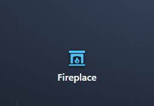

[](https://github.com/hacs/integration)     [](LICENSE)

> **⚠️ Interim release — testing only.** This is a pre-release build published for testing purposes only and is not intended for production use. Features may change or break without notice.

# Ted's Cards

This is my collection of custom cards for [Home Assistant](https://www.home-assistant.io/) which I use for my HA wall panels and handheld devices. 

After spending months attempting to find an "on/off/brightness" switch that I liked aesthetically, I finally gave up and decided to create my own.  The rest of the cards happened as strived to achieve a consistent look and feel without a ton of styling overrides cluttering up all my YAML files. 😊


---

## ✨ Card Types

| Card | Type | Description |
| --- | --- | --- |
| Light Card | `custom:ted-light-card` | Light tile with click-to-dim halves and an indicator bar. |
| Cover Card | `custom:ted-cover-card` | Cover tile with click-to-position halves and an indicator bar. |
| Label / Button Card | `custom:ted-label-button-card` | Label or button tile with an optional entity, icon, and tap/hold actions. |
| Clock Weather Card | `custom:ted-clock-weather-card` | A large clock with the date and current weather. |
| Remote Card | `custom:ted-remote-card` | Remote control for media devices (e.g. Apple TV and Kaleidescape). |
| Room Card | `custom:ted-room-card` | Overview card for a Home Assistant area. |
| Camera Card | `custom:ted-camera-card` | Camera feed (auto thumbnail or live stream), like Home Assistant's picture-glance. |
| Navbar Card | `custom:ted-navbar-card` | Navigation bar pinned to the top or bottom, with buttons and status items in left/center/right zones. |

---

## 📸 Screenshots


---

## 🔧 Requirements

* Home Assistant
* One or more calendar entities (e.g. `calendar.family`, `calendar.work`)

---

## 🚀 Installation

### Recommended: Install via HACS

[](https://my.home-assistant.io/redirect/hacs_repository/?owner=tedr91&repository=ha-teds-card&category=frontend)

OR

<details>
<summary>Add custom repository</summary>

1. Open HACS in Home Assistant.
2. Go to **Frontend** → menu (⋮) → **Custom repositories**.
3. Add `https://github.com/tedr91/HA-Teds-Cards` with category **Dashboard**.
4. Search for **Ted's Cards** and install.
5. Refresh your browser.

</details>

👉 If you don’t have HACS yet, follow: [https://hacs.xyz/docs/use/](https://hacs.xyz/docs/use/)

---

### Manual Installation

<details>

<summary>Without HACS</summary>

1. Download `ted-cards.js` from the [latest release](https://github.com/tedr91/HA-Teds-Cards/releases/latest).
2. Copy it to `<config>/www/community/ted-cards/ted-cards.js`.
3. Add the resource to your dashboard:
   - **Settings** → **Dashboards** → ⋮ → **Resources** → **Add resource**
   - URL: `/local/community/ted-cards/ted-cards.js`
   - Type: **JavaScript Module**
4. Refresh your browser.

💡 After updates, bump the version (`?v=2`) to avoid caching issues.

</details>


---

## 📖 Usage

> 🎨 **Every card** has an **Appearance (general)** section with **Transparency** and **Background blur** sliders — fade the card's surface and blur whatever sits behind it for a frosted-glass look over a dashboard wallpaper. Both default to off (fully opaque, no blur).

### 💡 Light Card

A compact light tile split into two clickable halves by a subtle divider. Supports `light`
entities only. Brightness is shown on a thin vertical indicator bar on the card's left edge.

**Interactions**

The card has **three interactive regions** — the **upper half**, the **lower half**, and the **centered icon** — each of which spans the full card area (padding and hint bars included). Every region responds to **single tap**, **double tap**, and **long press**, and each gesture can be reassigned in the editor's **Switch Behavior** section.

| Region | Single tap (default) | Double tap (default) | Long press (default) |
| --- | --- | --- | --- |
| Upper half | Increase brightness to the next 5% | Full on (100%) | More info |
| Lower half | Turn off | Turn off | More info |
| Icon | Toggle | More info | More info |

Available actions: **Increase brightness**, **Decrease brightness**, **Full on (100%)**, **Turn off**, **Toggle**, **More info**, and **Nothing**.

For **toggle-only** lights (no brightness support), the upper-half single tap defaults to **Full on** and the lower-half single tap to **Turn off**; the left indicator bar shows full when on and empty when off.

<p align="center">
  
</p>

Minimal config:

```yaml
type: custom:ted-light-card
entity: light.living_room
```

<details>
<summary><b>Detailed options</b></summary>

```yaml
type: custom:ted-light-card
entity: light.living_room
name: Living Room          # optional, defaults to entity friendly name
icon: mdi:floor-lamp       # optional, defaults to entity icon
theme: ted-style           # optional, visual styling: ted-style (default) | ha
```

`theme` (optional) — **Visual styling**, selectable in the editor's **Appearance** section:
- `ted-style` (default): a self-contained "Ted's Home Theater" look (Windows 11 Fluent / Mica-dark) that looks the same regardless of your Home Assistant theme.
- `ha`: follow the active Home Assistant theme (surfaces, text, and accent color).

Brightness is shown on a thin vertical **indicator bar** pinned to the card's left edge (it fills bottom→up with the light's brightness; it is not interactive). Its color — labeled **Indicator bar color** in the editor's **Appearance** section — is set by `indicator_color` (optional) when the light is on:
- `theme` (default): the theme accent color.
- `light`: the light's current color (its `rgb_color`), falling back to a warm tone.
- `other`: a custom color — set `indicator_color_custom` to an `[r, g, b]` array (chosen via the editor's color picker).

`show_indicator` (optional, default `true`, in the **Appearance** section) toggles the indicator bar on or off, and `indicator_width` (optional, px, default `4`) sets its width.

`show_hint` (optional, default `false`, in the **Appearance** section): show a matching **hint bar** up the right edge with **+** / **−** hints, indicating the top half raises brightness and the bottom half lowers it. `hint_width` (optional, px, default `8`) sets the hint bar width.

The icon is centered in the card and lights up when the light is on. `icon_color` (optional, in the **Appearance** section) sets its on color:
- `theme`: the theme accent color.
- `light` (default): the light's current color (its `rgb_color`), falling back to a warm tone.
- `other`: a custom color — set `icon_color_custom` to an `[r, g, b]` array.

`background_on` (optional, in the **Appearance** section): override the card's background color while the light is **on**. Pick a color with the editor's color picker (stored as a `#RRGGBB` hex string). When unset, the theme background is used.

`brushed` (optional, default off, in the **Appearance** section): overlay a brushed-metal sheen just above the background. Pair it with a metallic `background_on` color (e.g. silver `#c0c0c0`) for a brushed-aluminum look.

`rocker` (optional, default on, in the **Appearance** section): when on, the card behaves as a rocker switch — the two halves run separate **UP** / **DOWN** actions and a divider separates them. Turn it **off** to make the whole card a single button that always runs the **Icon** behavior (the UP/DOWN options and divider are hidden). `rocker_effect` (optional, default on, disabled when **Rocker** is off): a Decora-style rocker bevel that makes one half of the card appear raised, pivoting at the center. The raised half follows the state — **top** half raised when off, **bottom** half raised when on.

`orientation` (optional, default `vertical`, directly below **Visual styling**): switch the card to **horizontal**. In horizontal mode the indicator bar runs along the **bottom** (filling left → right), the hint bar runs along the **top**, the divider is vertical, the **right** half is **UP** and the **left** half is **DOWN**, and the name sits on the left with the state on the right (icon centered). The default size becomes 6 × 1 in a grid (Sections) view, or 240 × 80 px elsewhere.

Also in the **Appearance** section: `show_name`, `show_icon`, and `show_state` (all default **on**) toggle the name, centered icon, and the state/brightness label; `name_scale`, `icon_scale`, and `state_scale` (percent, default `100`) scale the name text, icon, and state label. `width` and `height` (px, default `100` × `120` vertical, `240` × `80` horizontal) set the card's fixed size when it is **not** a direct item in a grid (Sections) view — e.g. inside a stack, masonry, or panel view. As a direct grid item the card honors the grid cell size instead.

**Switch Behavior**

The editor's **Switch Behavior** section lets you reassign the action for every region × gesture. It contains three groups — **UP behavior**, **DOWN behavior**, and **Icon behavior** — each exposing a **Single tap**, **Double tap**, and **Long press** action picker. The config keys are `up_tap` / `up_double_tap` / `up_hold`, `down_tap` / `down_double_tap` / `down_hold`, and `icon_tap` / `icon_double_tap` / `icon_hold`. Any option left at its default is omitted from the saved YAML.

```yaml
up_tap: increase           # increase | decrease | full_on | full_off | toggle | more_info | none
down_double_tap: toggle
icon_hold: none
```

**Memory (dimmable lights)**

For dimmable lights you can choose the brightness the light turns **on** to. The editor shows a **Memory** section (only for brightness-capable lights) with three modes:
- `off` (default): turn on at the light's last brightness (standard Home Assistant behavior).
- `static`: always turn on to a fixed brightness — set `memory_value` (1–100 %, default 100).
- `helper`: turn on to the value of an `input_number` / `number` helper, read as a **percentage** (1–100). **Choosing this mode auto-creates and selects a dedicated helper for you** (`input_number.ted_light_mem_<entity>`) — no need to add one in Settings → Helpers. Add a card for the same light elsewhere and it reuses that helper automatically; delete the helper and the card falls back to the default. You can still point `memory_entity` at your own helper instead.

```yaml
memory_mode: static        # off | static | helper
memory_value: 60           # static mode, 1–100 %
# or
memory_mode: helper
memory_entity: input_number.living_room_brightness
```

</details>

### 🪟 Cover Card

A compact cover tile split into two clickable halves by a subtle divider. Supports `cover`
entities only (blinds, shades, shutters, curtains, garage doors, …). The current position is
shown on a thin vertical indicator bar on the card's left edge.

**Interactions**

The card has **three interactive regions** — the **upper half**, the **lower half**, and the
**centered icon** — each spanning the full card area (padding and hint bars included). Every region
responds to **single tap**, **double tap**, and **long press**, reassignable in the editor's
**Switch Behavior** section.

| Region | Single tap (default) | Double tap (default) | Long press (default) |
| --- | --- | --- | --- |
| Upper half | Open more (next 5%) | Fully open | More info |
| Lower half | Close more (next 5%) | Fully closed | More info |
| Icon | Toggle | More info | More info |

The **icon's Toggle** is smart: while the cover is moving it **stops**, otherwise it opens (to the
configured memory position) or closes. Available actions: **Open more**, **Close more**, **Fully
open**, **Fully closed**, **Toggle**, **Stop**, **Tilt open**, **Tilt closed**, **More info**, and
**Nothing**. Tilt actions appear in the editor only for tilt-capable covers.

For **open/close-only** covers (no position support), the upper-half single tap defaults to **Fully
open** and the lower-half to **Fully closed**. Tilt-only covers use their tilt position as the
primary value driven by the up/down regions.

<p align="center">
  
</p>

Minimal config:

```yaml
type: custom:ted-cover-card
entity: cover.living_room_blinds
```

<details>
<summary><b>Detailed options</b></summary>

```yaml
type: custom:ted-cover-card
entity: cover.living_room_blinds
name: Living Room Blinds   # optional, defaults to entity friendly name
icon: mdi:blinds           # optional, defaults to a device-class icon
icon_open: mdi:blinds-open # optional, shown while the cover is open
theme: ted-style           # optional, visual styling: ted-style (default) | ha
```

`icon_open` (optional) sets a different icon to show while the cover is open — e.g. `icon: mdi:garage`
with `icon_open: mdi:garage-open`. When unset, `icon` (or a device-class default) is used in all states.

`theme`, `show_indicator`, `indicator_color`, `indicator_width`, `icon_color`, `show_hint`, and `hint_width`
work as in the Light Card (all in the editor's **Appearance** section). `show_indicator` (**on by
default**) toggles the indicator bar; `indicator_color` (`theme` default / `other` custom) — labeled
**Indicator bar color** — colors it when open, and `indicator_width` (px, default `4`) sets its width.
`show_hint` (**on by default**) shows a right-edge **hint bar** with **up/down chevron** hints, and
`hint_width` (px, default `8`) sets its width. The indicator bar fills from the bottom up with the
cover's current position.

`background_open` (optional, in the **Appearance** section): override the card's background color while the cover is **open**. Pick a color with the editor's color picker (stored as a `#RRGGBB` hex string). When unset, the theme background is used.

`brushed` (optional, default off, in the **Appearance** section): overlay a brushed-metal sheen just above the background. Pair it with a metallic `background_open` color (e.g. silver `#c0c0c0`) for a brushed-aluminum look.

`rocker` (optional, default on, in the **Appearance** section): when on, the card behaves as a rocker switch — the two halves run separate **UP** / **DOWN** actions and a divider separates them. Turn it **off** to make the whole card a single button that always runs the **Icon** behavior (the UP/DOWN options and divider are hidden). `rocker_effect` (optional, default on, disabled when **Rocker** is off): a Decora-style rocker bevel that makes one half of the card appear raised, pivoting at the center. The raised half follows the state — **top** half raised when closed, **bottom** half raised when open.

`orientation` (optional, default `vertical`, directly below **Visual styling**): switch the card to **horizontal**. In horizontal mode the indicator bar runs along the **bottom** (filling left → right), the hint bar runs along the **top**, the divider is vertical, the **right** half is **UP** and the **left** half is **DOWN**, and the name sits on the left with the state on the right (icon centered). The default size becomes 6 × 1 in a grid (Sections) view, or 240 × 80 px elsewhere.

Also in the **Appearance** section: `show_name`, `show_icon`, and `show_state` (all default **on**) toggle the name, centered icon, and the state/position label; `name_scale`, `icon_scale`, and `state_scale` (percent, default `100`) scale the name text, icon, and state label. `width` and `height` (px, default `100` × `120` vertical, `240` × `80` horizontal) set the card's fixed size when it is **not** a direct item in a grid (Sections) view — e.g. inside a stack, masonry, or panel view. As a direct grid item the card honors the grid cell size instead.

**Switch Behavior**

The **Switch Behavior** section reassigns the action for every region × gesture, grouped into **UP
behavior**, **DOWN behavior**, and **Icon behavior**. Config keys are `up_tap` / `up_double_tap` /
`up_hold`, `down_tap` / `down_double_tap` / `down_hold`, and `icon_tap` / `icon_double_tap` /
`icon_hold`. Any option left at its default is omitted from the saved YAML.

```yaml
up_tap: open_step          # open_step | close_step | open | close | toggle | stop | tilt_open | tilt_close | more_info | none
icon_hold: stop
```

**Memory (position-capable covers)**

For covers that support `set_cover_position` you can choose the position the cover **opens** to. The
editor shows a **Memory** section (only for position-capable covers) with three modes:
- `off` (default): open fully (100%).
- `static`: always open to a fixed position — set `memory_value` (1–100 %, default 100).
- `helper`: open to the value of an `input_number` / `number` helper, read as a percentage (1–100).
  **Choosing this mode auto-creates and selects a dedicated helper for you** (`input_number.ted_cover_mem_<entity>`)
  — no need to add one in Settings → Helpers; add a card for the same cover elsewhere and it reuses that
  helper, and deleting the helper falls back to the default. Changing the position from the card also
  writes the new value back to the helper. You can still point `memory_entity` at your own helper instead.

```yaml
memory_mode: static        # off | static | helper
memory_value: 70           # static mode, 1–100 %
# or
memory_mode: helper
memory_entity: input_number.blinds_position
```

</details>

### 🏷️👆 Label / Button Card

A small, versatile tile that works as either a **label** or a **button**. The entity is optional: with
no entity it's a static label (or an action button via the tap/hold actions); with an entity it shows
the entity's state and toggles (or opens more-info) by default. It's also the button type used inside
**Room Card** sections.

<p align="center">
  
</p>

Minimal config (button bound to an entity):

```yaml
type: custom:ted-label-button-card
entity: light.living_room
```

Minimal config (plain label):

```yaml
type: custom:ted-label-button-card
name: Hello, world!
```

<details>
<summary><b>Detailed options</b></summary>

```yaml
type: custom:ted-label-button-card
entity: light.living_room   # optional, the entity to control / show
name: Living Room           # optional label text, defaults to the entity friendly name
icon: mdi:lightbulb         # optional, defaults to the entity icon
theme: ted-style            # optional, visual styling: ted-style (default) | ha
icon_color: amber           # optional icon color (theme color name or #RRGGBB)
background: '#1c1c1c'        # optional background color override
brushed: false              # optional brushed-metal sheen over the background
neumorphic: true            # raised tile when off/idle, pressed when the entity is active
show_name: true             # show the name/label
name_scale: 100             # name text size, % (10–300)
show_icon: true             # show the icon
icon_scale: 100             # icon size, % (10–300)
show_state: true            # show the entity state under the name
state_scale: 100            # state text size, % (10–300)
tap_action:                 # optional, see Interactions below
  action: toggle
hold_action:
  action: more-info
double_tap_action:
  action: none
# Badge — a small number badge from any entity (e.g. an unread/notification count)
badge:
  entity: sensor.notifications   # the entity whose state is shown as the badge number
  color: red                     # optional badge background color
  text_color: white              # optional badge text color
  show_when_zero: false          # show the badge even when the value is 0 (default hides it)
# Dynamic highlighting — recolor the button from another entity's value
highlight:
  entity: sensor.days_until_bin_day
  rules:
    - operator: '<='             # is | is_not | > | >= | < | <=
      value: 2
      background_color: red
      icon_color: white          # optional
      halt: true                 # stop checking further rules once this one matches
    - operator: '<='
      value: 5
      background_color: orange
      halt: true
```

`theme` and `brushed` work as in the other cards (see the Light Card section). `icon_color` and
`background` are picked with the editor's color picker; leave them unset to follow the theme.

`neumorphic` (default **on**, in the **Appearance** section): a soft "neumorphic" effect — the tile
looks **raised** when the entity is off/idle (or has no entity) and **pressed in** when the entity is
active (e.g. a light `on`, a cover `open`, a media player `playing`, a lock `unlocked`).

In the **Appearance** section, `show_name` / `show_icon` / `show_state` (all default **on**) toggle the
label, icon, and the entity-state line, and `name_scale` / `icon_scale` / `state_scale` (percent,
default `100`) scale each of them.

**Interactions** — the editor's **Interactions** section sets `tap_action`, `hold_action`, and (under
**Add interaction**) `double_tap_action`, using Home Assistant's standard action picker (toggle,
more-info, navigate, call-service, etc.). Defaults adapt to the entity: **tap** is `toggle` for
toggleable domains (light, switch, fan, cover, lock, climate, media_player, …) and `more-info`
otherwise; **hold** is `more-info` when an entity is set. With no entity, both default to nothing.

**Badge** (editor **Badge** section) — overlays a small number from any entity in the top-right corner
(e.g. a notification count). It hides automatically when the value is `0` (or unavailable) unless
**Show when value is zero** is on; the badge and text colors are configurable.

**Dynamic highlighting** (editor **Dynamic highlighting** section) — recolors the button's background
and/or icon from a chosen entity's state. Add one or more **rules**, each comparing the entity with an
operator (`is` / `is not` / `>` / `≥` / `<` / `≤`) and a value (the value becomes a state dropdown for
`is` / `is not`). Rules are checked top-to-bottom and can be dragged to reorder; turn on **stop
processing** to halt at the first match — handy for threshold ladders like `≤ 2 → red`, `≤ 5 → orange`,
`≤ 10 → yellow`.

</details>

### 🕒⛅ Clock Weather Card

A large clock with the current date and weather, designed to sit transparently on top of a dashboard
background. The clock, date, and weather can each be shown or hidden and positioned independently.

<p align="center">
  
</p>

Minimal config:

```yaml
type: custom:ted-clock-weather-card
weather_entity: weather.home
```

<details>
<summary><b>Detailed options</b></summary>

```yaml
type: custom:ted-clock-weather-card
theme: ted-style            # optional, visual styling: ted-style (default) | ha
force_transparent: true     # transparent card background (default true)
background: '#1c1c1c'        # background color override (only used when force_transparent: false)
brushed: false              # optional brushed-metal sheen over the background
# Clock
show_clock: true
clock_size: large           # small (60%) | medium (80%) | large (100%, default) | extra_large (120%) | custom
clock_size_custom: 100      # size %, used when clock_size: custom (10–400)
clock_offset: 0             # horizontal position: 0 = left, 50 = center, 100 = right
time_format: auto           # auto (default) | 12h | 24h | custom
time_format_custom: 'H:MM'  # token string, used when time_format: custom
# Date
show_date: true
date_size: standard         # standard (default) | custom
date_size_custom: 100       # size %, used when date_size: custom
date_format: standard       # standard (default) | custom
date_format_custom: 'dddd, MMMM D'   # token string, used when date_format: custom
date_below_clock: false     # stack the date directly under the clock
date_offset: 100            # horizontal position: 0 = left, 50 = center, 100 = right
# Weather
show_weather: true
weather_entity: weather.home   # a weather entity
weather_size: standard      # standard (default) | custom
weather_size_custom: 100    # size %, used when weather_size: custom
show_weather_icon: true     # show the condition icon (default true)
icon_style: fancy           # fancy (default) | cool | basic
show_current_temp: true     # show the current temperature
weather_above_clock: false  # place the weather above the clock instead of below
weather_offset: 100         # horizontal position: 0 = left, 50 = center, 100 = right
```

`theme` and `brushed` work as in the other cards (see the Light Card section). `force_transparent`
(default **on**) drops the card background so the clock floats over your dashboard; turn it **off** to
use the theme background or a `background` color override.

The editor groups the rest into **Clock Settings**, **Date Settings**, **Weather Settings**, and a
**Layout** section:

- **Sizes** — `clock_size`, `date_size`, and `weather_size` use preset percentages, or set them to
  **Custom** to enter an exact percent (`*_size_custom`).
- **Time / date format** — `time_format` (`auto` follows your Home Assistant locale) and `date_format`
  both offer a **Custom** mode where you supply a token string (`time_format_custom`,
  `date_format_custom`).
- **Layout** — `show_clock` / `show_date` / `show_weather` toggle each element, and `clock_offset`,
  `date_offset`, and `weather_offset` slide each one horizontally (0 left ↔ 50 center ↔ 100 right).
  `date_below_clock` stacks the date under the clock, and `weather_above_clock` moves the weather
  above it.

**Weather icon styles** (`icon_style`, shown when **Show weather icon** is on): **Fancy** (animated
Meteocons — the default), **Cool** (the Home Assistant frontend weather SVGs), or **Basic** (Material
Design weather icons). See [Credits](#credits) for icon attribution.

</details>

### 🎛️ Remote Card

A remote-control card for **Apple TV** and **Kaleidescape** players. The device family is auto-detected
from the remote entity's integration — Apple TV uses the built-in `apple_tv` integration, while
Kaleidescape uses the custom [`kaleidescape_strato`](https://github.com/tedr91/HA-kaleidescape-strato)
integration (note: **not** the built-in Kaleidescape integration). Buttons send `remote.send_command`
calls to the selected entity.

<p align="center">
  
</p>

Minimal config:

```yaml
type: custom:ted-remote-card
remote_entity: remote.living_room_apple_tv
```

<details>
<summary><b>Detailed options</b></summary>

```yaml
type: custom:ted-remote-card
remote_entity: remote.living_room_apple_tv             # required, the remote. entity (Apple TV or Kaleidescape)
media_player_entity: media_player.living_room_apple_tv  # recommended, drives state + play/pause + power
name: Living Room            # optional header name
theme: manufacturer          # visual styling: manufacturer (default) | ted-style | ha
background: '#1c1c1c'         # optional background color override
brushed: false               # optional brushed-metal sheen over the background
show_icon: true              # show the device icon in the header
icon_scale: 100              # icon size, % (10–300)
show_name: false             # show the name in the header
name_scale: 100              # name size, % (10–300)
scale: 100                   # overall card scale, % (50–200)
show_status_indicator: false # on/off/playing status dot in the header
# Apple TV only — quick-launch app buttons (each value is a media_player source name)
app_launch_1: Netflix
app_launch_2: Disney+
app_launch_3: YouTube
# Kaleidescape only — where the Home button navigates
kaleidescape_home: home      # home (default) | movie_covers | movie_list | movie_collections | system_status
```

`remote_entity` (required) is the `remote.*` entity that receives the button commands. The entity
pickers are limited to the two supported integrations, and the **device family is detected
automatically** from your selection — there's no family dropdown.

`media_player_entity` (recommended) is a matching `media_player.*` entity used to show the current
state and to make the **power** and **play/pause** buttons state-aware. When you pick the remote, the
card tries to auto-fill the matching media player (an entity on the same device first, then by name).

`theme` (in the **Appearance** section) offers **Manufacturer's Style** (default — a per-device look
resembling the real remote), **Ted's Style** (the self-contained "Ted's Home Theater" look), or
**Home Assistant theme**. `background` and `brushed` work as in the other cards (see the Light Card
section). The header is controlled by `show_icon` / `icon_scale`, `show_name` / `name_scale`, and
`show_status_indicator`; `scale` resizes the whole remote (50–200%).

**App Launchers** (Apple TV only) — up to six quick-launch buttons. Each `app_launch_N` is a
media_player **source** name; when a media player is configured the editor offers a dropdown of its
available sources.

**Home button target** (Kaleidescape only) — `kaleidescape_home` chooses where the **Home** button
navigates: **Home** (default), **Movie covers**, **Movie list**, **Movie collections**, or **System
status**.

</details>

### 🏠 Room Card

An overview card for a Home Assistant **area**, with a compact **status bar** along the top edge and
one or more **button sections** below it. The area is the card's primary selection, made in the
editor's **Room** section (an Area picker fed by your Home Assistant areas); it also seeds default
temperature/occupancy entities for new status items.

<p align="center">
  
</p>

Minimal config:

```yaml
type: custom:ted-room-card
area: living_room
```

<details>
<summary><b>Detailed options</b></summary>

```yaml
type: custom:ted-room-card
area: living_room          # the Home Assistant area id
name: Living Room          # optional title override, defaults to the area's name
theme: ted-style           # optional, visual styling: ted-style (default) | ha
brushed: false             # optional brushed-metal sheen over the background
status_items:              # optional, the top status bar (see below)
  - type: temperature
    entity: sensor.living_room_temperature
  - type: occupancy
    entity: binary_sensor.living_room_motion
  - type: brightness
    entity: light.living_room
  - type: volume
    entity: media_player.living_room
  - type: led
    entity: binary_sensor.living_room_window
sections:                  # optional, grids of buttons below the status bar
  - title: Lights
    max_rows: 0            # 0 = unlimited; otherwise caps rows (5 buttons/row)
    buttons:
      - type: custom:ted-light-card
        entity: light.living_room
      - type: custom:ted-cover-card
        entity: cover.living_room
      - type: custom:ted-label-button-card
        name: Scene
```

`theme` and `brushed` work as in the other cards (see the Light Card section).

**Header** — the top strip shows an optional **icon** and the room **name**. In the editor's **Header**
section: **Display icon in header** (default off; pick the icon below **Name**) with an optional **Icon
size override**, **Display name in header** (default on) with an optional **Name size override**, and
**Display header divider line** (default on).

**Room Photo** — an optional photo behind the card UI (above the background/brushed effect, below the
header, status, and buttons). In the editor's **Room Photo** section:

- **Show photo** (default on).
- **Photo source** — **Bundled** (a curated set served from a CDN; pick one or leave **Auto** to match
  the room name), **Custom** (upload your own via the HA image picker), or **Camera feed** (pick a
  `camera` entity, then choose its **Camera view** — Auto thumbnail (default) / Live stream — and
  **Fit mode** — Cover / Contain / Fill).
- **Photo placement** — **Top of card** (default), **Below header**, or **Fill card**.
- **Photo height** (px) — leave empty to show the full image at card width; set a height to crop it
  (hidden for **Fill**).
- **Photo alignment** — the vertical focal point (Top / Center / Bottom) used when the photo is cropped.
- **Edge Gradient (Scrim)** — darken any of the **Top / Left / Right / Bottom** edges so text/buttons
  stay readable. Sensible defaults per placement (Top→top edge, Fill→top+bottom, Below header→none).
- **Photo opacity** (default 100%).

The default (Show photo on, Auto) silently shows nothing when the room name doesn't match a bundled
photo or the image can't be loaded.

**Status bar** — a small strip of items pinned to the top edge of the card, managed in the editor's
**Status items** section (add, reorder, delete). Each item is one of:

| Type | Shows | Entity |
| --- | --- | --- |
| `temperature` | Icon + value | any sensor (auto-filled from the area) |
| `occupancy` | Icon + value | any sensor (auto-filled from the area) |
| `brightness` | Tap-to-open vertical slider | `light`, `number`, or `input_number` |
| `volume` | Tap-to-open volume slider (double-tap mutes) | `media_player` |
| `led` | Colored status dot | any entity |

Each item also accepts an optional `icon` and `name`. `led` items accept `on_color` / `off_color`
and an advanced `colors` map (state → color) for per-state colors.

**Button sections** — one or more grids of buttons below the status bar, managed in the editor's
**Button sections** section (add, reorder, delete sections; add, reorder, delete buttons within each).
Each button is a `ted-label-button-card`, `ted-cover-card`, `ted-light-card`, or `ted-camera-card`, edited inline with
that card's own editor. Buttons lay out 5 per row as squares; set a section's **Max rows** to cap the
height (`0` = unlimited). When the buttons overflow the cap, the last visible cell becomes a **…**
button that reveals the rest.

Each section has a **Section title** plus a **Show title in card** toggle (default **off**) and a
**Title alignment** selector (Left / Center / Right; disabled while the title is hidden). The title
still labels the section in the editor even when it isn't shown in the card.

**Spacer** — both the status strip and button sections can hold a **Spacer**: a transparent,
non-interactive placeholder whose only option is its **Size** in px. Status-strip spacers add a
horizontal gap (default `24` px); button-section spacers reserve an empty square cell (default `100`
px, matching a button).

</details>

---

### 📷 Camera Card

<a id="camera-card"></a>

A single **camera feed**, rendered with Home Assistant's own picture-glance image element so it gets
both **auto** thumbnail polling and **live** streaming for free. Use it on its own, as a Room Card
button, or as a Room Card photo source.

Minimal config:

```yaml
type: custom:ted-camera-card
entity: camera.front_door
```

<details>
<summary><b>Detailed options</b></summary>

```yaml
type: custom:ted-camera-card
entity: camera.front_door   # the camera entity to show (required)
name: Front Door            # optional caption text, defaults to the entity's name
show_name: false            # optional, overlay the name along the bottom edge
camera_view: auto           # optional: auto (thumbnail, default) | live (stream)
fit_mode: cover             # optional: cover (default) | contain | fill
aspect_ratio: "16:9"        # optional, e.g. "16:9" or "1.78" (ignored in grid layout)
theme: ted-style            # optional, visual styling: ted-style (default) | ha
brushed: false              # optional brushed-metal sheen behind the feed
width: 240                  # optional manual width (px), ignored in grid layout
height: 135                 # optional manual height (px), ignored in grid layout
tap_action:                 # optional, defaults to More Info
  action: more-info
hold_action:
  action: none
double_tap_action:
  action: none
```

- **Camera view** — **Auto thumbnail** (default; periodically refreshed still) or **Live stream**
  (continuous video).
- **Fit mode** — how the image fills its box: **Cover** (default), **Contain**, or **Fill**.
- **Aspect ratio** — optional, sets the card's shape when it isn't sized by the dashboard grid.
- **Sizing** — in a **grid** (sections) layout the card fills its grid cell; otherwise it uses the
  optional **Width** / **Height** (defaulting to 240×135). `theme` and `brushed` work as in the other
  cards (see the Light Card section).
- **Interactions** — **Tap** defaults to **More Info** (the camera's live dialog); **Hold** and
  **Double tap** default to none. All accept the standard Home Assistant action options.

</details>

### 🧭 Navbar Card

A **navigation bar pinned to the top or bottom** of the dashboard. Each section holds an ordered mix of
**buttons** — each a full **Label / Button Card**, so they get icons, colors, actions, badges, and dynamic
highlighting — and **status items** such as the **time**, **date**, **weather**, or a room's temperature,
brightness and volume, arranged in **left / center / right** zones. The **center** zone stays pinned to the
exact middle regardless of what's on the sides, so a "Home" button can sit perfectly centered.

> ℹ️ The navbar overlays the dashboard and reserves space so your content isn't hidden underneath it.
> It's brand new — please report any layout quirks.

Minimal config:

```yaml
type: custom:ted-navbar-card
sections:
  - placement: center
    items:
      - type: custom:ted-label-button-card
        name: Home
        icon: mdi:home
```

<details>
<summary><b>Detailed options</b></summary>

```yaml
type: custom:ted-navbar-card
theme: ha                 # optional, visual styling: ha (default) | ted-style
alignment: bottom         # bottom (default) | top
bar_type: snap            # snap (edge-to-edge, default) | float (centered with margins)
size: 48                  # bar thickness in px; buttons size from this
min_width: 16             # float only: minimum bar width in px
max_width: 920            # float only: maximum bar width in px
background: ""            # optional card background color (theme name or hex/rgb)
transparency: 0           # 0–100% — fade the bar's background
blur: 0                   # 0–100% — blur the dashboard behind the bar
sections:                 # up to 5 sections
  - placement: left       # left | center | right (which zone the section sits in)
    align: center         # left | center | right (alignment of items within the section)
    visible: true         # optional, show/hide the section
    overflow: true        # optional, collapse items that don't fit into a “…” popover
    items:                # ordered mix of buttons, status items, and popups
      - type: date                          # status item
      - type: weather                       # status item (auto-picks a weather entity, or set entity:)
  - placement: center
    items:
      - type: custom:ted-label-button-card  # a button
        name: Home
        icon: mdi:home
        nav_button_size: normal             # normal (default) | wide
  - placement: right
    items:
      - type: time                          # status item — updates live
      - type: popup                         # a popup: tap the icon to reveal more items
        icon: mdi:dots-horizontal
        items:
          - type: custom:ted-label-button-card
            name: Settings
            icon: mdi:cog
```

- **Navbar alignment** — pin the bar to the **Bottom** (default) or **Top** edge.
- **Navbar type** — **Snap** spans edge-to-edge; **Float** centers the bar with margins and rounded corners. A floating bar **auto-sizes to fit its buttons** (just a little wider) — unless it has **left-** or **right-**zone items, in which case it spans the full (maximum) width so those items can pin to the edges.
- **Minimum width** / **Maximum width** (float only) — the bounds the floating bar is sized within (defaults **16** and **920** px).
- **Size** — the bar thickness in pixels; buttons size automatically from it.
- **Sections** (up to **5**) — each sits in a **left / center / right** zone and has its own content
  **alignment**. Sections, and the items inside them, are added and **dragged to reorder** in the
  editor. The **center** zone is pinned to the exact center of the bar, independent of the left/right
  content.
- **Items** — each section's **+ Add item** menu adds a **button**, a **status item**, or a **popup**, mixed in
  any order and **dragged to reorder**.
- **Buttons** — a full **Label / Button Card** (entity, icon, colors, actions, badge, dynamic
  highlighting). **Button size** is **Normal** (square) or **Wide**.
- **Status items** — **Time**, **Date** and **Weather**, plus a room's **Temperature**, **Occupancy**,
  **Brightness**, **Volume**, an entity **Status LED**, and a **Spacer**. Brightness and volume open a
  slider on tap, and the clock updates live.
- **Popups** — a **Popup** item is a tappable icon that opens a popover holding its own mix of buttons
  and status items — handy for tucking extra controls behind one icon.
- **Overflow** — when a section's items don't fit the bar, the extras **auto-collapse into a “…” popover**
  (turn **Auto-collapse overflow** off per section to keep them inline).

</details>

---

## 📋 Changelog

The newest entry below is used as the GitHub Release notes by the release workflow, so it shows in
the Home Assistant / HACS **update** dialog when you update. Newest first.

### v2.1.4

- **Navbar Card: the popup & overflow “more” trigger now blends in** with the other buttons — no grey box or border, just an accent-coloured chevron sized to match. (Set a custom icon on a popup to override the chevron.)

### v2.1.3

- **Navbar Card: popup & overflow triggers now show a chevron** that points the way the menu will open (up for a bottom bar, down for a top bar) and flips when it's open. Set a custom icon on a popup to override.

<details>
<summary>Previous release notes</summary>

### v2.1.2

- **Navbar Card: clears the sidebar.** The bar now aligns with the dashboard **content area** instead of the full window, so its left section is no longer hidden behind Home Assistant's sidebar.
- **Navbar Card: a new navbar starts ready to fill** — five sections are pre-created (left, three center, right) with the **Home** button in the center, and new buttons default to a **150%** icon.
- Navbar Card: section rows are now labelled by **placement and alignment** (e.g. *"Section 2 - center (right aligned)"*), and a section's (or item's) **expanded/collapsed state stays put when you drag to reorder**.

### v2.1.1

- **Fix: fully transparent cards are see-through again.** A transparent **Clock Weather** card (and the **Navbar**) was being frosted by the blur that some Home Assistant themes apply to every card; a 100%-transparent card now disables that blur, so it shows straight through — no surface, blur, or border.
- **Navbar Card:** a new navbar is no longer forced transparent — it shows its normal card surface by default (set **Transparency** to 100% yourself for a see-through bar). The **Home** button it starts with now matches a button added via **+ Add item → Button** (just with the Home name & icon).
- Every card: the **Transparency** and **Background blur** boxes always sit **side-by-side** in the editor.

### v2.1.0

- **Navbar Card: popup menus & auto-overflow.** A new **Popup** item is a tappable icon that opens a small popover holding any mix of buttons and status items — great for tucking extra controls (say, a "Lights" popup) behind one icon. Sections also now **auto-collapse** items that don't fit the bar into a **“…” overflow** popover (on by default, toggleable per section).
- **Every card: Background color.** All cards now have a **Background color** in their Appearance section. The **Light**, **Cover**, and **Label / Button** cards add a **Background color when on / open** that overrides the base color while the entity is active.
- **Every card: 100% Transparency is now truly see-through** — setting Transparency to **100%** disables blur (instead of blurring whatever's behind the card), and an explicitly set background color now shows on cards that default to transparent.
- **Light & Cover Cards: the neumorphic button now fills the freed space** when you hide the indicator and/or hint bars (the tap areas are unchanged).

### v2.0.100

- **Navbar Card: status items.** A section can now show **status items** alongside (or instead of) buttons — **time**, **date** and **weather**, plus a room's **temperature**, **occupancy**, **brightness**, **volume**, an entity **status LED**, and a **spacer**. Mix them across the **left / center / right** zones — for example date & weather on the left, a **Home** button dead-center, and a live clock on the right. Brightness and volume keep their tap-to-open sliders, and each section's **+ Add item** menu adds a button or any status item, all **drag-to-reorder**.
- Every card: the **Transparency** and **Background blur** controls are now **clearable number boxes** — leave a box empty for "no override" (the card keeps its normal background) instead of the old sliders that always forced a value.

### v2.0.99

- **Every card: Transparency & Background blur.** A new **Appearance (general)** section lets you fade any card's background and **blur whatever's behind it** for a frosted-glass look — perfect for floating cards over a dashboard wallpaper. Available on the Light, Cover, Label / Button, Clock Weather, Remote, Room, Camera, and Navbar cards.
- Navbar Card: a **floating** bar now **shrinks to fit its buttons** instead of always spanning the full width — unless it has left- or right-aligned items, in which case it stays full width. New **Minimum width** and **Maximum width** options let you tune the floating bar's limits.

### v2.0.98

- Label / Button Card: **fixed icon centering** in small buttons — in a small grid cell (like a navbar button) the icon was pushed below the middle; it now stays properly centered.
- Navbar Card: new buttons now default to a full-size (**100%**) icon.

### v2.0.97

- Label / Button Card: the **icon now scales with the card** — small buttons (like those in the navbar) get proportionally smaller icons and larger buttons get bigger ones — and the default content order is now **Name → Icon → State**.
- Navbar Card: new buttons now default to a tidy **icon-only button that navigates to `/home`** (name & state hidden, icon at 75%), and the default **bar thickness is 48px**.

### v2.0.96

- **New Navbar Card** (`custom:ted-navbar-card`): a navigation bar **pinned to the top or bottom** of your dashboard, with buttons arranged in **left / center / right** zones (the center stays dead-center — great for a Home button). Each button is a full **Label / Button Card**, sections and buttons **drag to reorder**, and the bar can be **edge-to-edge (snap)** or **floating**.

### v2.0.95

- Label / Button Card: new **Badge** and **Dynamic highlighting**. A button can show a small **number badge** from any entity, and **recolor its background and/or icon** based on another entity's value via simple rules (e.g. `≤ 2 → red`, or `is on → green`) — rules drag-to-reorder and each can **stop at the first match**. Room Card buttons get both features too.

### v2.0.94

- Light & Cover Cards: the **Memory helper** option now **creates the helper for you**. Choosing "Memory helper" automatically makes and selects a dedicated `input_number` — no more adding one by hand in Settings → Helpers. Adding another card for the same light/cover reuses that helper automatically, and if you delete the helper the card quietly falls back to its default.

### v2.0.93

- Camera Card: in a dashboard **Sections** grid you can now resize it all the way down to **3 wide × 1 tall** (the minimum height was 2).
- Room Card: status items now line up more tightly with the room **Name** — a text-only status strip is no longer padded taller than the title.

### v2.0.92

- **New Camera Card** (`custom:ted-camera-card`): show a camera feed — auto thumbnail or live stream — like Home Assistant's picture-glance, with **Camera view**, **Fit mode**, and aspect-ratio options, and **More Info** on tap.
- Room Card: a room's **photo can now be a live camera feed** (a new "Camera feed" photo source), and you can add **cameras as buttons** in any button section.

### v2.0.91

- Light & Cover Cards: the gap between the two neumorphic rocker paddles is now also **tightened in the horizontal layout**, matching the vertical rocker.

### v2.0.90

- Room Card: **performance** — it now skips redundant re-renders when unrelated entities update and caches its button layout, so dashboards with several Room Cards stay smoother. No visible change.

### v2.0.89

- Light & Cover Cards: the rocker **divider line now follows your Home Assistant theme** — on a light theme it shows as a subtle hairline instead of the dark engraved line that only suited the dark style.
- Light & Cover Cards: slightly **tightened the gap** between the two neumorphic rocker paddles.

### v2.0.88

- Room Card: buttons in a section now **pack more tightly** — a shorter button (e.g. a half-height one) tucks into the vertical gap next to a taller neighbour instead of leaving a hole, while keeping your configured order.

### v2.0.87

- Room Card: you can now **drag to reorder** status items, button sections, and the buttons within a section — grab the handle on the left of any row (replaces the up / down arrows).
- Light, Cover & Button Cards: the **Name / Icon / State** editor section now starts **collapsed**, with each element's **Show** toggle in its header (so it's there whether the row is open or not) and the **size and color** controls side by side when expanded.

### v2.0.86

- Light, Cover & Button Cards: the **Icon** color picker now works like Home Assistant's built-in Button card — choose **No color**, **State color (default)**, or any color. A chosen color still shows only while the entity is on / open / active.
- Light, Cover & Button Cards: redesigned the **Name / Icon / State** editor section — each element is now a collapsible card you can **drag to reorder** by its handle, with a chevron to fold it away (replaces the up / down arrows).

### v2.0.85

- Light, Cover & Button Cards: you can now set a **custom color** for the **Name**, **Icon**, and **State** individually (leave a picker blank to keep the default).
- Light & Cover Cards: added a **background color for the off / closed** state, alongside the existing on / open background color.
- Light, Cover & Button Cards: when the entity is **off / inactive** the icon now **dims to match Home Assistant's built-in Button card**, and any custom Name / Icon / State colors apply only while it's on / open / active.
- Button Card: the **Name / Icon / State** elements are now **reorderable**, with the same per-element show / size / custom-color controls as the Light & Cover cards.
- Light, Cover & Button Cards: when only some of Name / Icon / State are shown, each now sits in its **order-based spot** (1st → top, 2nd → center, 3rd → bottom) instead of forcing a single element to the center.
- Note: the old icon-color **mode** option has been retired — if you had set a custom icon color, re-pick it with the new per-element **Custom color** picker.

### v2.0.84

- Room Card: each status item now has a **Display** option — **Both**, **Icon only**, or **State only** — so you can show just the icon, just the value, or both. Defaults: Temperature & Occupancy show both; Brightness, Volume & Status LED show the icon only.

### v2.0.83

- Room Card: the header **Name size** and **Icon size** overrides and the **Status icon size** are now **percentage-based** (100% = default), consistent with the size controls on the other Ted cards. (If you'd previously set one of these in pixels, re-set it as a percentage.)

### v2.0.82

- Clock Weather, Light, Cover & Button Cards: the text/icon shadow is now genuinely subtle and **turns off cleanly for dark text and icons**, plus a new **Subtle shadow for improved contrast** toggle in each card's Appearance settings to switch it off.
- Room Card: status item headers now show the entity's **friendly name** instead of the raw entity id.
- Room Card: fixed the expand **chevron** being clipped on a status item with a long entity.

### v2.0.81

- Clock Weather, Light, Cover & Button Cards: made the subtle shadow behind the text and icons **even more subtle**.

### v2.0.80

- Label / Button Card: tapping a card that has an entity now **toggles** the entity by default (instead of opening more-info), matching Home Assistant's button card.
- Label / Button Card: **Show entity state** now defaults to off.
- Clock Weather, Light, Cover & Button Cards: the subtle shadow behind the text and icons now **fades out for dark colours**, so black text and dark icon colours no longer get a muddy shadow.

### v2.0.79

- Clock Weather Card: the clock, date, and weather now cast a **subtle drop shadow** (the same shadow used behind the icon on the Light and Cover cards) so they lift off the card background.

### v2.0.78

- Clock Weather Card: the clock now sits with **equal space above and below** at any size — previously some fonts (such as the default Segoe UI / system font) left a larger gap above the digits than below, and that gap grew as the clock got bigger.
- Clock Weather Card: the **Brushed effect** no longer bleeds past the card's rounded corners.

### v2.0.77

- Clock Weather Card: fixed extra empty space below the card when **Auto height** is on — the card now reports its true content height (so it hugs the clock), while still filling and vertically centering its content when given a fixed height.

### v2.0.76

- Clock Weather Card: the **weather size no longer changes with the clock size** — the clock, date, and weather are each sized from the card width independently (clock fills ~65%, date and weather ~33% each), and the weather stays a constant size regardless of the live temperature.

### v2.0.75

- Clock Weather Card: the weather icon is now a consistent fixed size across all icon styles (Basic / Cool / Fancy), matched to the temperature text; the date is a little larger by default; and **Show weather icon** / **Show current temp** sit side-by-side in the editor.

### v2.0.74

- Clock Weather Card editor: the layout controls are now their own top-level **Card Layout** section (no longer tucked inside Appearance), each **Show …** toggle sits beside its **… position** slider, and every section now has consistent spacing.

### v2.0.73

- Clock Weather Card: **Show weather icon** now defaults to on, and the **Weather icon style** picker is disabled while the icon is hidden. The weather entity auto-fills only when the card is first added (editing an existing card no longer overrides it), and the Weather Settings editor is tidied (Weather size sits directly under the entity).
- Docs: every card now has a preview image and a collapsible **Detailed options** section in the README, and the Room Card credits [Clooos' Bubble Card](https://github.com/Clooos/Bubble-Card).

### v2.0.72

- Credits: formally acknowledge [Clooos' Bubble Card](https://github.com/Clooos/Bubble-Card) as the loose inspiration for the Room Card, and add donation/support links for the projects this collection builds on.

### v2.0.71

- All cards now appear in Home Assistant's **"Add to dashboard → By entity"** suggestions: pick a light/cover/remote/weather entity (or any entity for the Button card) and the matching Ted card is offered pre-filled. Picking an entity also suggests a **Room Card** for that entity's area.

### v2.0.70

- Button Card: added the **Neumorphic effect** (on by default) — a raised tile that presses in when the bound entity is active — plus a subtle drop shadow behind the icon.
- All cards now show a live **preview** in Home Assistant's "Add to dashboard → By card" picker instead of just a text description.

### v2.0.69

- Light & Cover Cards: added a subtle drop shadow behind the icon, and the rocker pivot divider is now hidden when the Neumorphic effect is on (the paddle seam serves as the pivot).

### v2.0.68

- Light & Cover Cards: the **Rocker effect** is now the **Neumorphic effect** and works in both modes — **Rocker style** shows two split paddles (one lit/raised, one sunken, flipping with state), while **Button style** raises the whole card when off and presses it in when on. The tints are translucent so they work over colored/brushed/photo backgrounds.
- Light & Cover Cards: tidied the Appearance rows — **Visual styling** + **Mode** share a row, and **Brushed effect** + **Neumorphic effect** share the next.

### v2.0.67

- Light & Cover Cards: the **Rocker effect** now has a softer, neumorphic-style depth — a lit highlight along the raised half and a gentle recess on the pressed half (both orientations).

### v2.0.66

- Clock Weather & Room Cards: fixed the card sizing staying stuck at the editor's (narrower) width after leaving the dashboard editor — the layout now recomputes for the restored width without needing a manual page refresh.

### v2.0.65

- Clock Weather Card: added an **Extra Large (120%)** clock size, and the size options now show their percentage (e.g. "Large (100%) - default").

### v2.0.64

- Room Card: the photo **State entities** option now accepts multiple entities — the photo dims/greyscales only when **all** of them are off.

### v2.0.63

- Light & Cover Cards: tidied the Appearance layout — **Visual styling** + **Brushed effect** share a row, **Mode** + **Rocker effect** share a row, and **Orientation** is on its own row.
- Room Card editor: all sections now start collapsed except **Button sections**.

### v2.0.62

- Light & Cover Cards: when **Mode** is set to **Button style** (Rocker off), the whole card is now a single continuous click surface instead of separate up/down/icon zones.
- Light & Cover Cards: the "Rocker" toggle is now a **Mode** dropdown (`Rocker style` / `Button style`) sitting next to **Orientation**, and the **Show indicator bar** / **Show hint bar** options now hide their width/color settings until they're turned on.
- Room Card: the status strip **Vertical alignment** now only moves the status items; the **Header** section has its own separate **Vertical alignment** for the name/icon.

### v2.0.61

- Room Card: the photo **State entity** option now reads "dims photo when off", and its defaults are **Greyscale when off = off** and **Opacity when off = 25%**.

### v2.0.60

- Room Card: the room photo can now react to a **State entity** — when that entity is off the photo can turn **greyscale** and/or dim to an **Opacity when off** value, fading smoothly when it flips on/off. Both options are independent and only appear once an entity is selected.

### v2.0.59

- Room Card: fixed the "…" overflow button still showing at full height when all the visible buttons are half height — its height now matches the visible buttons reliably.

### v2.0.58

- Room Card: the "…" overflow button now centers its icon and matches the row height — it shrinks to half height when every visible button is half height.
- Cover Card: in **Horizontal** orientation the hint chevrons now stay as up/down arrows instead of rotating sideways.

### v2.0.57

- Room Card: each button in a section now has **Width** and **Height** options — `Half`, `Normal` (default), or `Double` — so buttons can span half a cell up to a double-size block in either dimension.
- Room Card: buttons of different sizes pack tightly to fill the grid, and the **Max rows** overflow now counts the actual rows used so the "…" overflow button appears at the right point.

### v2.0.56

- Room Card: the **Name (override)** and **Icon (override)** fields (renamed from Name / Icon) now sit side by side in the editor.
- Room Card: when the **Icon (override)** is left empty, the header now falls back to the selected area's own icon (before defaulting to the house icon).

### v2.0.55

- Light & Cover Cards: the **Name / Icon / State** layout section now appears directly below **Appearance (general)** in the editor instead of at the bottom.

### v2.0.54

- Light & Cover Cards: when the **Name / Icon / State** layout shows three elements (or one), the middle element is now pinned to the exact center of the card regardless of the content above and below it — it no longer drifts when the name wraps or the state text changes length.

### v2.0.53

- Light & Cover Cards: the **Name**, **Icon**, and **State** elements are now in a reorderable **Name / Icon / State** section in the editor — use the up/down arrows on each row to set their stacking order (top→bottom vertically, left→right horizontally).
- Light & Cover Cards: removed the forced top/bottom-half clipping — elements are no longer cut off when only some are shown (e.g. Name on with Icon and State off).
- Light & Cover Cards: when two or more elements are shown they now automatically spread to fill the card; a single element positions by its place in the order.

### v2.0.52

- Room Card: the status-strip **icon size** is now configurable (default `16` px) via a **Status icon size** option next to the Vertical alignment in the Status items section.

### v2.0.51

- Room Card: **Display header divider line** now defaults to **off**.
- Room Card photo: new cards start with **Photo height** = `135` px (still editable; clear it for the full image), and **Edge Gradient (Scrim)** is now a multi-select dropdown.
- Room Card editor: fixed the missing expand chevron on rows with a long entity id (e.g. occupancy) — long ids now truncate instead of pushing the chevron off-screen.
- Room Card: status-strip icons are now a consistent **22px** and stay vertically aligned across sensor, brightness, and volume items.

### v2.0.50

- Room Card: fixed the status strip **Vertical alignment** so it moves the status items (not just the header) — the items previously stayed centered regardless of the setting.

### v2.0.49

- Room Card photo: the **Below header** photo now starts a gap below the status area (matching the header→body spacing) instead of butting right against it.

### v2.0.48

- Room Card photo: the **Shift buttons down** option is now also available for the **Below header** placement (it pads the body so the buttons sit below the photo band).

### v2.0.47

- Room Card photo: the **Shift buttons down** pad now also accounts for the card's padding so buttons clear the photo fully. The card padding and header→body gap are now driven by CSS variables (`--rc-card-padding`, `--rc-header-body-gap`) used in both the layout and that calculation.

### v2.0.46

- Room Card photo: renamed **Photo alignment** to **Photo vertical alignment** and paired it on one line with **Photo placement**. For **Top of card** placement, added a **Shift buttons down** toggle (default on) that pads the body so the first button section sits below the photo banner instead of overlapping it.

### v2.0.45

- Room Card: added a **Room Photo** — an optional photo behind the card UI (above the background, below the header/status/buttons). Choose a **bundled** photo (auto-matched to the room name) or upload a **custom** one; control **placement** (top / below header / fill), **height** + **alignment** (crop focal point), an **Edge Gradient (Scrim)** to keep text readable, and **opacity**. On by default, silently hidden when there's no name match or the image can't load.

### v2.0.44

- Room Card: the **Status items** section now has a **Vertical alignment** option (Top / Middle / Bottom, default Top) controlling how the status strip content aligns vertically within the header.

### v2.0.43

- Room Card: added a **Header** section to the editor with an optional **icon** (selectable below the name) and controls for showing/sizing the header **icon** and **name**, plus a toggle for the **header divider line**. Defaults: icon off, name on, divider on.
- All card editors: the **Appearance** section is now labeled **Appearance (general)**.

### v2.0.42

- Room Card: added a **Spacer** that can be added to the status strip or a button section. A spacer is a transparent, non-interactive placeholder whose only option is its **Size** in px — status-strip spacers default to `24` px wide, button-section spacers default to `100` px (a single square button).

### v2.0.41

- Room Card: each button section now has a **Show title in card** toggle (default **off**) and a **Title alignment** selector (Left / Center / Right, disabled while the title is hidden). The section title still labels the section in the editor even when it isn't shown in the card.

### v2.0.40

- Light and cover cards: added an **Orientation** option (Vertical / Horizontal) in the editor's Appearance section. In **Horizontal** mode the card is wide and short (defaults to 6 × 1 in a grid, 240 × 80 px elsewhere): the indicator bar runs along the bottom (filling left → right), the hint bar runs along the top, the divider is vertical, the right half is **UP** and the left half is **DOWN**, and the name/state sit left/right with the icon centered.

### v2.0.39

- Light and cover cards: the divider line between the name and state now only shows while the card behaves as a rocker (hidden when **Rocker** is off).

### v2.0.38

- Light and cover cards: added a **Rocker** toggle (defaults on) next to **Rocker effect** in the editor. When **Rocker** is off, the visual rocker effect is disabled, the **UP** / **DOWN** behavior options are disabled, and tapping anywhere on the card runs the **Icon** behavior — turning the card into a single button. **Breaking:** the visual-effect option moved from `rocker` to `rocker_effect`; `rocker` now controls the rocker behavior.

### v2.0.37

- Room Card sub-button editors (Light, Cover, Button) now pair each show toggle with a size control on one line: **Show name / Name size**, **Show icon / Icon size**, **Show state / State size**.
- Added a **State size** option to the light and cover cards, and **Name / Icon / State size** options to the button (label) card; each size field is disabled when its matching show toggle is off.
- Button (label) card: the **Hold** action now defaults to **Nothing** when no entity is selected, and **More info** once an entity is chosen.

### v2.0.36

- Light and cover card editors: the **Show hint bar** / **Hint bar width** options now sit directly after the indicator bar options for a more logical grouping.
- The **Width** / **Height** fields now show helper text clarifying they only apply when the card isn't a direct item in a grid (Sections) view, and they're automatically disabled when the card is grid-sized.

### v2.0.35

- Light and cover cards: added a **Show indicator bar** toggle (`show_indicator`), and the indicator bar default width is now `4px`.
- The right-edge hint bar now has its own width (`hint_width`), decoupled from the indicator bar, and its symbols (`+`/`−` and chevrons) scale with that width.
- Appearance editor: the show toggle and width for each bar sit on one line, with the indicator color override directly below.

### v2.0.34

- Light and cover cards: the left **indicator bar** width is now configurable via `indicator_width` (px, default `8`).
- Renamed the bar to **Indicator bar** in both editors and unified its color config to `indicator_color` / `indicator_color_custom`. **Breaking:** replace `brightness_color`/`brightness_color_custom` (light) and `position_color`/`position_color_custom` (cover) in existing card configs with `indicator_color`/`indicator_color_custom`.

### v2.0.33

- Room Card volume status item now greys out and isn't clickable when its media player is off or in standby.
- Room Card volume slider now dims while muted, matching the Denon Marantz card.

### v2.0.32

- The paired appearance fields in the light and cover editors (Show name/Name size, Show icon/Icon size, Show state/Show hint) now stay side by side in narrow contexts like the embedded Room Card button editor, cutting the wasted vertical space.

### v2.0.31

- Fixed light and cover cards rendering at the wrong size inside Room Card buttons — they now fill the square button cell instead of using their standalone fixed width/height.

### v2.0.30

- Light and cover cards used as Room Card buttons now default their width/height to the fixed square button size, and those inputs are disabled (the room layout controls button size).
- The **Width** and **Height** fields now sit side by side in the light and cover card editors instead of stacking.

### v2.0.29

- Fixed the Room Card editor for real this time: typing in a button's **Name** field (or any button field) no longer reverts to a previous value. The embedded button editors are controlled components, so the room editor now echoes each change straight back to them to keep their fields in sync.

### v2.0.28

- Fixed the Room Card editor: collapsing a status item or a button no longer collapses the entire section (nested expansion panels were reacting to each other's bubbled toggle events).
- Fixed the Room Card editor: typing in a button's **Name** field (and other button fields) no longer drops characters or reverts to a previous value — the embedded button editor now keeps ownership of its config while open.

### v2.0.27

- Fixed the Room Card editor: the status-item and button menus now use reliable controls (inline move/delete buttons and a self-contained “add” menu) instead of the Home Assistant popup menu, which did not render in the card-editor preview.
- Documented the Room Card status bar and button sections.

### v2.0.26

- Built out the Room Card: a top **status bar** (temperature, occupancy, brightness slider, volume slider, and status LEDs) and configurable **button sections** (label, cover, and light buttons laid out 5 per row, with a max-rows cap and an overflow button).

</details>

## Development

```sh
npm install
npm run build      # produces dist/ted-cards.js
npm run watch      # rebuild on change (with sourcemaps)
npm run typecheck  # tsc --noEmit
```

To test against a running Home Assistant instance, copy `dist/ted-cards.js` into `<config>/www/` and add it as a Lovelace resource (type: JavaScript Module).

---

## 💪 Support

If you'd like to support future development, simply following and starring the projects you enjoy is more than enough. ❤️

But please take a look in the Acknowledgements section below and consider supporting those amazing creators instead!

---

## 💕 Acknowledgements

The **Clock Weather Card** was inspired by [Patrick Kissling](https://github.com/pkissling)'s [clock-weather-card](https://github.com/pkissling/clock-weather-card). 
- His card is fantastic and has more weather info and such so I recommend you check it out!


The **"Fancy"** animated weather icons I used are from [Meteocons](https://github.com/basmilius/meteocons) by [Bas Milius](https://github.com/basmilius). 
  - If you'd like to support **Bas**' work: 

    [](https://github.com/sponsors/basmilius)


The **Remote Card** was heavily inspired by the *outstanding* [Firemote](https://github.com/PRProd/HA-Firemote) card by Doug Nelson ([PRProd](https://github.com/PRProd)). Firemote supports so many devices/remotes and is very well done! My remote card pales in comparison and only really exists because of the specific look/feel I want for my home theater control panels. 
  - Please consider supporting **PRProd**'s work: 

    [](https://www.buymeacoffee.com/prprod) 


The **Room Card** was loosely inspired by [Clooos](https://github.com/Clooos)'s [Bubble-Card](https://github.com/Clooos/Bubble-Card), whose button-driven layout shaped how my card came together. Bubble-Card is simply amazing and *very* feature-rich! 
- If you'd like to support **Clooos**' work: 

  [](https://www.buymeacoffee.com/clooos) 
  [](https://www.paypal.com/donate/?business=MRVBV9PLT9ZPL&no_recurring=0&item_name=Hi%2C+I%27m+Clooos+the+creator+of+Bubble+Card.+Thank+you+for+supporting+me+and+my+passion.+You+are+awesome%21+%F0%9F%8D%BB&currency_code=EUR) 
  [](https://www.patreon.com/Clooos)

--- 

## License

[MIT](./LICENSE)
