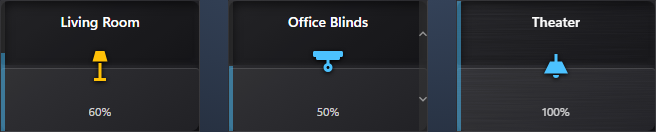

# Ted's Cards

A collection of custom Lovelace cards for [Home Assistant](https://www.home-assistant.io/), inspired by [Mushroom Cards](https://github.com/piitaya/lovelace-mushroom).



> **⚠️ Interim release — testing only.** This is a pre-release build published for testing purposes only and is not intended for production use. Features may change or break without notice.

> **Status:** early development. Includes `ted-light-card`, `ted-cover-card`, `ted-remote-card`, and `ted-room-card`; more are planned.

## Cards

| Card | Type | Description |
| --- | --- | --- |
| Light Card | `custom:ted-light-card` | Light tile with click-to-dim halves and an indicator bar. |
| Cover Card | `custom:ted-cover-card` | Cover tile with click-to-position halves and an indicator bar. |
| Remote Card | `custom:ted-remote-card` | Remote control for Apple TV and Kaleidescape devices. |
| Room Card | `custom:ted-room-card` | Overview card for a Home Assistant area. |

## Installation

### HACS (recommended)

1. Open HACS in Home Assistant.
2. Go to **Frontend** → menu (⋮) → **Custom repositories**.
3. Add `https://github.com/tedr91/HA-Teds-Cards` with category **Dashboard**.
4. Search for **Ted's Cards** and install.
5. Refresh your browser.

### Manual

1. Download `ted-cards.js` from the [latest release](https://github.com/tedr91/HA-Teds-Cards/releases/latest).
2. Copy it to `<config>/www/community/ted-cards/ted-cards.js`.
3. Add the resource to your dashboard:
   - **Settings** → **Dashboards** → ⋮ → **Resources** → **Add resource**
   - URL: `/local/community/ted-cards/ted-cards.js`
   - Type: **JavaScript Module**
4. Refresh your browser.

## Usage

### Light Card

A compact light tile split into two clickable halves by a subtle divider. Supports `light`
entities only. Brightness is shown on a thin vertical indicator bar on the card's left edge.

**Interactions**

The card has **three interactive regions** — the **upper half**, the **lower half**, and the **centered icon** — each of which spans the full card area (padding and hint bars included). Every region responds to **single tap**, **double tap**, and **long press**, and each gesture can be reassigned in the editor's **Switch Behavior** section.

| Region | Single tap (default) | Double tap (default) | Long press (default) |
| --- | --- | --- | --- |
| Upper half | Increase brightness to the next 5% | Full on (100%) | More info |
| Lower half | Turn off | Turn off | More info |
| Icon | Toggle | More info | More info |

Available actions: **Increase brightness**, **Decrease brightness**, **Full on (100%)**, **Turn off**, **Toggle**, **More info**, and **Nothing**.

For **toggle-only** lights (no brightness support), the upper-half single tap defaults to **Full on** and the lower-half single tap to **Turn off**; the left indicator bar shows full when on and empty when off.

Minimal config:

```yaml
type: custom:ted-light-card
entity: light.living_room
```

All options:

```yaml
type: custom:ted-light-card
entity: light.living_room
name: Living Room          # optional, defaults to entity friendly name
icon: mdi:floor-lamp       # optional, defaults to entity icon
theme: ted-style           # optional, visual styling: ted-style (default) | ha
```

`theme` (optional) — **Visual styling**, selectable in the editor's **Appearance** section:
- `ted-style` (default): a self-contained "Ted's Home Theater" look (Windows 11 Fluent / Mica-dark) that looks the same regardless of your Home Assistant theme.
- `ha`: follow the active Home Assistant theme (surfaces, text, and accent color).

Brightness is shown on a thin vertical **indicator bar** pinned to the card's left edge (it fills bottom→up with the light's brightness; it is not interactive). Its color — labeled **Indicator bar color** in the editor's **Appearance** section — is set by `indicator_color` (optional) when the light is on:
- `theme` (default): the theme accent color.
- `light`: the light's current color (its `rgb_color`), falling back to a warm tone.
- `other`: a custom color — set `indicator_color_custom` to an `[r, g, b]` array (chosen via the editor's color picker).

`show_indicator` (optional, default `true`, in the **Appearance** section) toggles the indicator bar on or off, and `indicator_width` (optional, px, default `4`) sets its width.

`show_hint` (optional, default `false`, in the **Appearance** section): show a matching **hint bar** up the right edge with **+** / **−** hints, indicating the top half raises brightness and the bottom half lowers it. `hint_width` (optional, px, default `8`) sets the hint bar width.

The icon is centered in the card and lights up when the light is on. `icon_color` (optional, in the **Appearance** section) sets its on color:
- `theme`: the theme accent color.
- `light` (default): the light's current color (its `rgb_color`), falling back to a warm tone.
- `other`: a custom color — set `icon_color_custom` to an `[r, g, b]` array.

`background_on` (optional, in the **Appearance** section): override the card's background color while the light is **on**. Pick a color with the editor's color picker (stored as a `#RRGGBB` hex string). When unset, the theme background is used.

`brushed` (optional, default off, in the **Appearance** section): overlay a brushed-metal sheen just above the background. Pair it with a metallic `background_on` color (e.g. silver `#c0c0c0`) for a brushed-aluminum look.

`rocker` (optional, default on, in the **Appearance** section): when on, the card behaves as a rocker switch — the two halves run separate **UP** / **DOWN** actions and a divider separates them. Turn it **off** to make the whole card a single button that always runs the **Icon** behavior (the UP/DOWN options and divider are hidden). `rocker_effect` (optional, default on, disabled when **Rocker** is off): a Decora-style rocker bevel that makes one half of the card appear raised, pivoting at the center. The raised half follows the state — **top** half raised when off, **bottom** half raised when on.

`orientation` (optional, default `vertical`, directly below **Visual styling**): switch the card to **horizontal**. In horizontal mode the indicator bar runs along the **bottom** (filling left → right), the hint bar runs along the **top**, the divider is vertical, the **right** half is **UP** and the **left** half is **DOWN**, and the name sits on the left with the state on the right (icon centered). The default size becomes 6 × 1 in a grid (Sections) view, or 240 × 80 px elsewhere.

Also in the **Appearance** section: `show_name`, `show_icon`, and `show_state` (all default **on**) toggle the name, centered icon, and the state/brightness label; `name_scale`, `icon_scale`, and `state_scale` (percent, default `100`) scale the name text, icon, and state label. `width` and `height` (px, default `100` × `120` vertical, `240` × `80` horizontal) set the card's fixed size when it is **not** a direct item in a grid (Sections) view — e.g. inside a stack, masonry, or panel view. As a direct grid item the card honors the grid cell size instead.

### Switch Behavior

The editor's **Switch Behavior** section lets you reassign the action for every region × gesture. It contains three groups — **UP behavior**, **DOWN behavior**, and **Icon behavior** — each exposing a **Single tap**, **Double tap**, and **Long press** action picker. The config keys are `up_tap` / `up_double_tap` / `up_hold`, `down_tap` / `down_double_tap` / `down_hold`, and `icon_tap` / `icon_double_tap` / `icon_hold`. Any option left at its default is omitted from the saved YAML.

```yaml
up_tap: increase           # increase | decrease | full_on | full_off | toggle | more_info | none
down_double_tap: toggle
icon_hold: none
```

### Memory (dimmable lights)

For dimmable lights you can choose the brightness the light turns **on** to. The editor shows a **Memory** section (only for brightness-capable lights) with three modes:
- `off` (default): turn on at the light's last brightness (standard Home Assistant behavior).
- `static`: always turn on to a fixed brightness — set `memory_value` (1–100 %, default 100).
- `helper`: turn on to the value of an `input_number` / `number` helper — set `memory_entity`. The helper's value is read as a **percentage** (1–100).

```yaml
memory_mode: static        # off | static | helper
memory_value: 60           # static mode, 1–100 %
# or
memory_mode: helper
memory_entity: input_number.living_room_brightness
```

### Cover Card

A compact cover tile split into two clickable halves by a subtle divider. Supports `cover`
entities only (blinds, shades, shutters, curtains, garage doors, …). The current position is
shown on a thin vertical indicator bar on the card's left edge.

**Interactions**

The card has **three interactive regions** — the **upper half**, the **lower half**, and the
**centered icon** — each spanning the full card area (padding and hint bars included). Every region
responds to **single tap**, **double tap**, and **long press**, reassignable in the editor's
**Switch Behavior** section.

| Region | Single tap (default) | Double tap (default) | Long press (default) |
| --- | --- | --- | --- |
| Upper half | Open more (next 5%) | Fully open | More info |
| Lower half | Close more (next 5%) | Fully closed | More info |
| Icon | Toggle | More info | More info |

The **icon's Toggle** is smart: while the cover is moving it **stops**, otherwise it opens (to the
configured memory position) or closes. Available actions: **Open more**, **Close more**, **Fully
open**, **Fully closed**, **Toggle**, **Stop**, **Tilt open**, **Tilt closed**, **More info**, and
**Nothing**. Tilt actions appear in the editor only for tilt-capable covers.

For **open/close-only** covers (no position support), the upper-half single tap defaults to **Fully
open** and the lower-half to **Fully closed**. Tilt-only covers use their tilt position as the
primary value driven by the up/down regions.

Minimal config:

```yaml
type: custom:ted-cover-card
entity: cover.living_room_blinds
```

All options:

```yaml
type: custom:ted-cover-card
entity: cover.living_room_blinds
name: Living Room Blinds   # optional, defaults to entity friendly name
icon: mdi:blinds           # optional, defaults to a device-class icon
icon_open: mdi:blinds-open # optional, shown while the cover is open
theme: ted-style           # optional, visual styling: ted-style (default) | ha
```

`icon_open` (optional) sets a different icon to show while the cover is open — e.g. `icon: mdi:garage`
with `icon_open: mdi:garage-open`. When unset, `icon` (or a device-class default) is used in all states.

`theme`, `show_indicator`, `indicator_color`, `indicator_width`, `icon_color`, `show_hint`, and `hint_width`
work as in the Light Card (all in the editor's **Appearance** section). `show_indicator` (**on by
default**) toggles the indicator bar; `indicator_color` (`theme` default / `other` custom) — labeled
**Indicator bar color** — colors it when open, and `indicator_width` (px, default `4`) sets its width.
`show_hint` (**on by default**) shows a right-edge **hint bar** with **up/down chevron** hints, and
`hint_width` (px, default `8`) sets its width. The indicator bar fills from the bottom up with the
cover's current position.

`background_open` (optional, in the **Appearance** section): override the card's background color while the cover is **open**. Pick a color with the editor's color picker (stored as a `#RRGGBB` hex string). When unset, the theme background is used.

`brushed` (optional, default off, in the **Appearance** section): overlay a brushed-metal sheen just above the background. Pair it with a metallic `background_open` color (e.g. silver `#c0c0c0`) for a brushed-aluminum look.

`rocker` (optional, default on, in the **Appearance** section): when on, the card behaves as a rocker switch — the two halves run separate **UP** / **DOWN** actions and a divider separates them. Turn it **off** to make the whole card a single button that always runs the **Icon** behavior (the UP/DOWN options and divider are hidden). `rocker_effect` (optional, default on, disabled when **Rocker** is off): a Decora-style rocker bevel that makes one half of the card appear raised, pivoting at the center. The raised half follows the state — **top** half raised when closed, **bottom** half raised when open.

`orientation` (optional, default `vertical`, directly below **Visual styling**): switch the card to **horizontal**. In horizontal mode the indicator bar runs along the **bottom** (filling left → right), the hint bar runs along the **top**, the divider is vertical, the **right** half is **UP** and the **left** half is **DOWN**, and the name sits on the left with the state on the right (icon centered). The default size becomes 6 × 1 in a grid (Sections) view, or 240 × 80 px elsewhere.

Also in the **Appearance** section: `show_name`, `show_icon`, and `show_state` (all default **on**) toggle the name, centered icon, and the state/position label; `name_scale`, `icon_scale`, and `state_scale` (percent, default `100`) scale the name text, icon, and state label. `width` and `height` (px, default `100` × `120` vertical, `240` × `80` horizontal) set the card's fixed size when it is **not** a direct item in a grid (Sections) view — e.g. inside a stack, masonry, or panel view. As a direct grid item the card honors the grid cell size instead.

### Switch Behavior (cover)

The **Switch Behavior** section reassigns the action for every region × gesture, grouped into **UP
behavior**, **DOWN behavior**, and **Icon behavior**. Config keys are `up_tap` / `up_double_tap` /
`up_hold`, `down_tap` / `down_double_tap` / `down_hold`, and `icon_tap` / `icon_double_tap` /
`icon_hold`. Any option left at its default is omitted from the saved YAML.

```yaml
up_tap: open_step          # open_step | close_step | open | close | toggle | stop | tilt_open | tilt_close | more_info | none
icon_hold: stop
```

### Memory (position-capable covers)

For covers that support `set_cover_position` you can choose the position the cover **opens** to. The
editor shows a **Memory** section (only for position-capable covers) with three modes:
- `off` (default): open fully (100%).
- `static`: always open to a fixed position — set `memory_value` (1–100 %, default 100).
- `helper`: open to the value of an `input_number` / `number` helper — set `memory_entity` (read as
  a percentage 1–100). Changing the position from the card also writes the new value back to the helper.

```yaml
memory_mode: static        # off | static | helper
memory_value: 70           # static mode, 1–100 %
# or
memory_mode: helper
memory_entity: input_number.blinds_position
```

### Room Card

An overview card for a Home Assistant **area**, with a compact **status bar** along the top edge and
one or more **button sections** below it. The area is the card's primary selection, made in the
editor's **Room** section (an Area picker fed by your Home Assistant areas); it also seeds default
temperature/occupancy entities for new status items.

Minimal config:

```yaml
type: custom:ted-room-card
area: living_room
```

All options:

```yaml
type: custom:ted-room-card
area: living_room          # the Home Assistant area id
name: Living Room          # optional title override, defaults to the area's name
theme: ted-style           # optional, visual styling: ted-style (default) | ha
brushed: false             # optional brushed-metal sheen over the background
status_items:              # optional, the top status bar (see below)
  - type: temperature
    entity: sensor.living_room_temperature
  - type: occupancy
    entity: binary_sensor.living_room_motion
  - type: brightness
    entity: light.living_room
  - type: volume
    entity: media_player.living_room
  - type: led
    entity: binary_sensor.living_room_window
sections:                  # optional, grids of buttons below the status bar
  - title: Lights
    max_rows: 0            # 0 = unlimited; otherwise caps rows (5 buttons/row)
    buttons:
      - type: custom:ted-light-card
        entity: light.living_room
      - type: custom:ted-cover-card
        entity: cover.living_room
      - type: custom:ted-label-button-card
        name: Scene
```

`theme` and `brushed` work as in the other cards (see the Light Card section).

**Header** — the top strip shows an optional **icon** and the room **name**. In the editor's **Header**
section: **Display icon in header** (default off; pick the icon below **Name**) with an optional **Icon
size override**, **Display name in header** (default on) with an optional **Name size override**, and
**Display header divider line** (default on).

**Room Photo** — an optional photo behind the card UI (above the background/brushed effect, below the
header, status, and buttons). In the editor's **Room Photo** section:

- **Show photo** (default on).
- **Photo source** — **Bundled** (a curated set served from a CDN; pick one or leave **Auto** to match
  the room name) or **Custom** (upload your own via the HA image picker).
- **Photo placement** — **Top of card** (default), **Below header**, or **Fill card**.
- **Photo height** (px) — leave empty to show the full image at card width; set a height to crop it
  (hidden for **Fill**).
- **Photo alignment** — the vertical focal point (Top / Center / Bottom) used when the photo is cropped.
- **Edge Gradient (Scrim)** — darken any of the **Top / Left / Right / Bottom** edges so text/buttons
  stay readable. Sensible defaults per placement (Top→top edge, Fill→top+bottom, Below header→none).
- **Photo opacity** (default 100%).

The default (Show photo on, Auto) silently shows nothing when the room name doesn't match a bundled
photo or the image can't be loaded.

**Status bar** — a small strip of items pinned to the top edge of the card, managed in the editor's
**Status items** section (add, reorder, delete). Each item is one of:

| Type | Shows | Entity |
| --- | --- | --- |
| `temperature` | Icon + value | any sensor (auto-filled from the area) |
| `occupancy` | Icon + value | any sensor (auto-filled from the area) |
| `brightness` | Tap-to-open vertical slider | `light`, `number`, or `input_number` |
| `volume` | Tap-to-open volume slider (double-tap mutes) | `media_player` |
| `led` | Colored status dot | any entity |

Each item also accepts an optional `icon` and `name`. `led` items accept `on_color` / `off_color`
and an advanced `colors` map (state → color) for per-state colors.

**Button sections** — one or more grids of buttons below the status bar, managed in the editor's
**Button sections** section (add, reorder, delete sections; add, reorder, delete buttons within each).
Each button is a `ted-label-button-card`, `ted-cover-card`, or `ted-light-card`, edited inline with
that card's own editor. Buttons lay out 5 per row as squares; set a section's **Max rows** to cap the
height (`0` = unlimited). When the buttons overflow the cap, the last visible cell becomes a **…**
button that reveals the rest.

Each section has a **Section title** plus a **Show title in card** toggle (default **off**) and a
**Title alignment** selector (Left / Center / Right; disabled while the title is hidden). The title
still labels the section in the editor even when it isn't shown in the card.

**Spacer** — both the status strip and button sections can hold a **Spacer**: a transparent,
non-interactive placeholder whose only option is its **Size** in px. Status-strip spacers add a
horizontal gap (default `24` px); button-section spacers reserve an empty square cell (default `100`
px, matching a button).


## Changelog

The newest entry below is used as the GitHub Release notes by the release workflow, so it shows in
the Home Assistant / HACS **update** dialog when you update. Newest first.

### v2.0.53

- Light & Cover Cards: the **Name**, **Icon**, and **State** elements are now in a reorderable **Name / Icon / State** section in the editor — use the up/down arrows on each row to set their stacking order (top→bottom vertically, left→right horizontally).
- Light & Cover Cards: removed the forced top/bottom-half clipping — elements are no longer cut off when only some are shown (e.g. Name on with Icon and State off).
- Light & Cover Cards: when two or more elements are shown they now automatically spread to fill the card; a single element positions by its place in the order.

### v2.0.52

- Room Card: the status-strip **icon size** is now configurable (default `16` px) via a **Status icon size** option next to the Vertical alignment in the Status items section.

### v2.0.51

- Room Card: **Display header divider line** now defaults to **off**.
- Room Card photo: new cards start with **Photo height** = `135` px (still editable; clear it for the full image), and **Edge Gradient (Scrim)** is now a multi-select dropdown.
- Room Card editor: fixed the missing expand chevron on rows with a long entity id (e.g. occupancy) — long ids now truncate instead of pushing the chevron off-screen.
- Room Card: status-strip icons are now a consistent **22px** and stay vertically aligned across sensor, brightness, and volume items.

### v2.0.50

- Room Card: fixed the status strip **Vertical alignment** so it moves the status items (not just the header) — the items previously stayed centered regardless of the setting.

### v2.0.49

- Room Card photo: the **Below header** photo now starts a gap below the status area (matching the header→body spacing) instead of butting right against it.

### v2.0.48

- Room Card photo: the **Shift buttons down** option is now also available for the **Below header** placement (it pads the body so the buttons sit below the photo band).

### v2.0.47

- Room Card photo: the **Shift buttons down** pad now also accounts for the card's padding so buttons clear the photo fully. The card padding and header→body gap are now driven by CSS variables (`--rc-card-padding`, `--rc-header-body-gap`) used in both the layout and that calculation.

### v2.0.46

- Room Card photo: renamed **Photo alignment** to **Photo vertical alignment** and paired it on one line with **Photo placement**. For **Top of card** placement, added a **Shift buttons down** toggle (default on) that pads the body so the first button section sits below the photo banner instead of overlapping it.

### v2.0.45

- Room Card: added a **Room Photo** — an optional photo behind the card UI (above the background, below the header/status/buttons). Choose a **bundled** photo (auto-matched to the room name) or upload a **custom** one; control **placement** (top / below header / fill), **height** + **alignment** (crop focal point), an **Edge Gradient (Scrim)** to keep text readable, and **opacity**. On by default, silently hidden when there's no name match or the image can't load.

### v2.0.44

- Room Card: the **Status items** section now has a **Vertical alignment** option (Top / Middle / Bottom, default Top) controlling how the status strip content aligns vertically within the header.

### v2.0.43

- Room Card: added a **Header** section to the editor with an optional **icon** (selectable below the name) and controls for showing/sizing the header **icon** and **name**, plus a toggle for the **header divider line**. Defaults: icon off, name on, divider on.
- All card editors: the **Appearance** section is now labeled **Appearance (general)**.

### v2.0.42

- Room Card: added a **Spacer** that can be added to the status strip or a button section. A spacer is a transparent, non-interactive placeholder whose only option is its **Size** in px — status-strip spacers default to `24` px wide, button-section spacers default to `100` px (a single square button).

### v2.0.41

- Room Card: each button section now has a **Show title in card** toggle (default **off**) and a **Title alignment** selector (Left / Center / Right, disabled while the title is hidden). The section title still labels the section in the editor even when it isn't shown in the card.

### v2.0.40

- Light and cover cards: added an **Orientation** option (Vertical / Horizontal) in the editor's Appearance section. In **Horizontal** mode the card is wide and short (defaults to 6 × 1 in a grid, 240 × 80 px elsewhere): the indicator bar runs along the bottom (filling left → right), the hint bar runs along the top, the divider is vertical, the right half is **UP** and the left half is **DOWN**, and the name/state sit left/right with the icon centered.

### v2.0.39

- Light and cover cards: the divider line between the name and state now only shows while the card behaves as a rocker (hidden when **Rocker** is off).

### v2.0.38

- Light and cover cards: added a **Rocker** toggle (defaults on) next to **Rocker effect** in the editor. When **Rocker** is off, the visual rocker effect is disabled, the **UP** / **DOWN** behavior options are disabled, and tapping anywhere on the card runs the **Icon** behavior — turning the card into a single button. **Breaking:** the visual-effect option moved from `rocker` to `rocker_effect`; `rocker` now controls the rocker behavior.

### v2.0.37

- Room Card sub-button editors (Light, Cover, Button) now pair each show toggle with a size control on one line: **Show name / Name size**, **Show icon / Icon size**, **Show state / State size**.
- Added a **State size** option to the light and cover cards, and **Name / Icon / State size** options to the button (label) card; each size field is disabled when its matching show toggle is off.
- Button (label) card: the **Hold** action now defaults to **Nothing** when no entity is selected, and **More info** once an entity is chosen.

### v2.0.36

- Light and cover card editors: the **Show hint bar** / **Hint bar width** options now sit directly after the indicator bar options for a more logical grouping.
- The **Width** / **Height** fields now show helper text clarifying they only apply when the card isn't a direct item in a grid (Sections) view, and they're automatically disabled when the card is grid-sized.

### v2.0.35

- Light and cover cards: added a **Show indicator bar** toggle (`show_indicator`), and the indicator bar default width is now `4px`.
- The right-edge hint bar now has its own width (`hint_width`), decoupled from the indicator bar, and its symbols (`+`/`−` and chevrons) scale with that width.
- Appearance editor: the show toggle and width for each bar sit on one line, with the indicator color override directly below.

### v2.0.34

- Light and cover cards: the left **indicator bar** width is now configurable via `indicator_width` (px, default `8`).
- Renamed the bar to **Indicator bar** in both editors and unified its color config to `indicator_color` / `indicator_color_custom`. **Breaking:** replace `brightness_color`/`brightness_color_custom` (light) and `position_color`/`position_color_custom` (cover) in existing card configs with `indicator_color`/`indicator_color_custom`.

### v2.0.33

- Room Card volume status item now greys out and isn't clickable when its media player is off or in standby.
- Room Card volume slider now dims while muted, matching the Denon Marantz card.

### v2.0.32

- The paired appearance fields in the light and cover editors (Show name/Name size, Show icon/Icon size, Show state/Show hint) now stay side by side in narrow contexts like the embedded Room Card button editor, cutting the wasted vertical space.

### v2.0.31

- Fixed light and cover cards rendering at the wrong size inside Room Card buttons — they now fill the square button cell instead of using their standalone fixed width/height.

### v2.0.30

- Light and cover cards used as Room Card buttons now default their width/height to the fixed square button size, and those inputs are disabled (the room layout controls button size).
- The **Width** and **Height** fields now sit side by side in the light and cover card editors instead of stacking.

### v2.0.29

- Fixed the Room Card editor for real this time: typing in a button's **Name** field (or any button field) no longer reverts to a previous value. The embedded button editors are controlled components, so the room editor now echoes each change straight back to them to keep their fields in sync.

### v2.0.28

- Fixed the Room Card editor: collapsing a status item or a button no longer collapses the entire section (nested expansion panels were reacting to each other's bubbled toggle events).
- Fixed the Room Card editor: typing in a button's **Name** field (and other button fields) no longer drops characters or reverts to a previous value — the embedded button editor now keeps ownership of its config while open.

### v2.0.27

- Fixed the Room Card editor: the status-item and button menus now use reliable controls (inline move/delete buttons and a self-contained “add” menu) instead of the Home Assistant popup menu, which did not render in the card-editor preview.
- Documented the Room Card status bar and button sections.

### v2.0.26

- Built out the Room Card: a top **status bar** (temperature, occupancy, brightness slider, volume slider, and status LEDs) and configurable **button sections** (label, cover, and light buttons laid out 5 per row, with a max-rows cap and an overflow button).


## Development

```sh
npm install
npm run build      # produces dist/ted-cards.js
npm run watch      # rebuild on change (with sourcemaps)
npm run typecheck  # tsc --noEmit
```

To test against a running Home Assistant instance, copy `dist/ted-cards.js` into `<config>/www/` and add it as a Lovelace resource (type: JavaScript Module).

## Releasing

The GitHub Actions workflow at `.github/workflows/release.yml` automatically builds `ted-cards.js` and attaches it to any GitHub Release. To cut a release: add a `### vX.Y.Z` entry to the [Changelog](#changelog), bump the version in `package.json`, push a `vX.Y.Z` tag, and publish a release. The workflow builds and attaches the asset and sets the GitHub Release notes from the matching changelog entry, so those notes appear in the Home Assistant / HACS update dialog. HACS picks up the new asset.

## Credits

The Clock Weather Card was inspired by [pkissling/clock-weather-card](https://github.com/pkissling/clock-weather-card) and its fork [samuelgoodell/clock-weather-card-hui-icons](https://github.com/samuelgoodell/clock-weather-card-hui-icons) (both MIT).

- **"Fancy" animated weather icons** — [Meteocons](https://github.com/basmilius/weather-icons) by [Bas Milius](https://github.com/basmilius), [MIT](./src/cards/clock-weather-card/icons/LICENSE). Bundled and mapped to Home Assistant conditions following pkissling/clock-weather-card.
- **"Cool" weather icons** — the Home Assistant frontend weather SVGs, ported from [samuelgoodell/clock-weather-card-hui-icons](https://github.com/samuelgoodell/clock-weather-card-hui-icons) ([MIT](./src/cards/clock-weather-card/icons/LICENSE-hui-icons)), which adapts them from [home-assistant/frontend](https://github.com/home-assistant/frontend).

## License

[MIT](./LICENSE)
