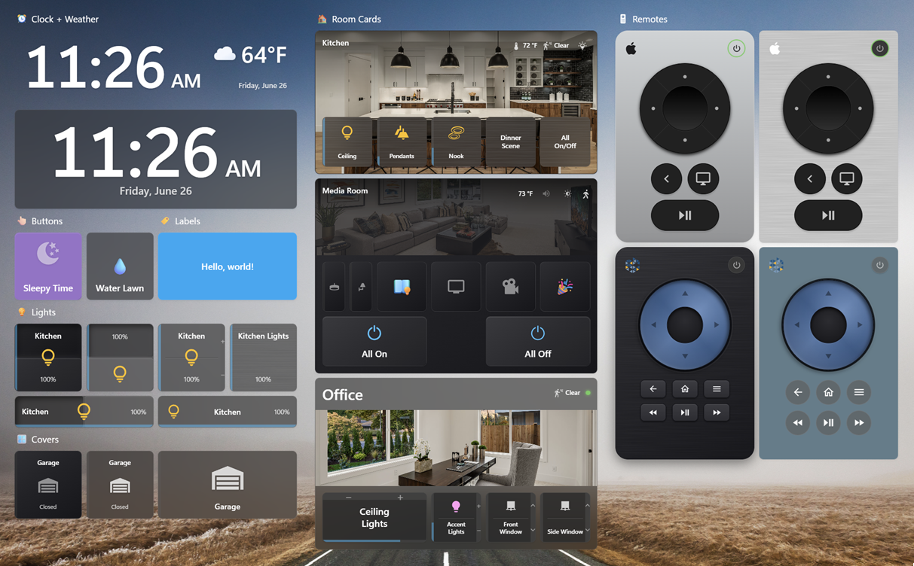
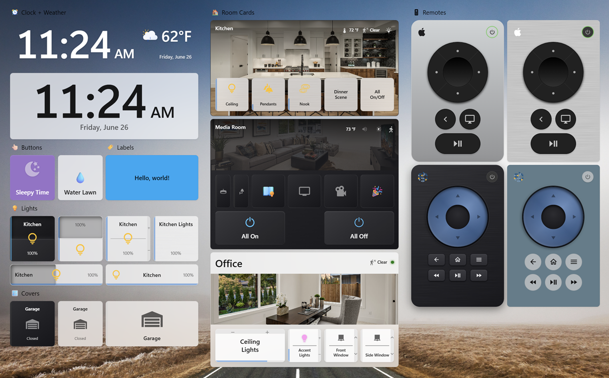
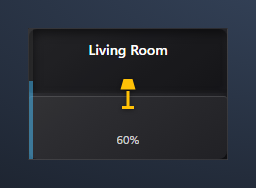
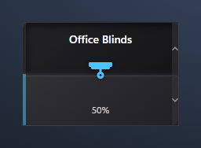
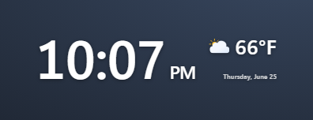
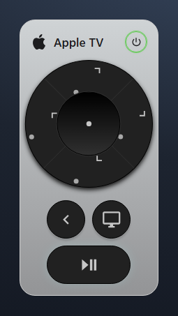
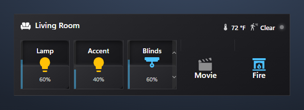

<p align="center">
  <picture>
    <source media="(prefers-color-scheme: dark)" srcset="images/logo4/logo-ondark-512.png">
    
  </picture>
</p>

[](https://github.com/hacs/integration)     [](LICENSE)

> **⚠️ Interim release — testing only.** This is a pre-release build published for testing purposes only and is not intended for production use. Features may change or break without notice.

# Ted's Cards

This is my collection of custom cards for [Home Assistant](https://www.home-assistant.io/) which I use for my HA wall panels and handheld devices. 

After spending months attempting to find an "on/off/brightness" switch that I liked aesthetically, I finally gave up and decided to create my own.  The rest of the cards happened as strived to achieve a consistent look and feel without a ton of styling overrides cluttering up all my YAML files. 😊


---

## ✨ Card Types

| Card | Type | Description |
| --- | --- | --- |
| Light Card | `custom:ted-light-card` | Light tile with click-to-dim halves and an indicator bar. |
| Cover Card | `custom:ted-cover-card` | Cover tile with click-to-position halves and an indicator bar. |
| Button Card | `custom:ted-button-card` | Label or button tile with an optional entity, icon, and tap/hold actions. |
| Expandable Button Card | `custom:ted-button-card` is the trigger; type `custom:ted-expandable-button-card` | A button that opens a popup of child buttons on tap (children can be expandable too). |
| Clock Weather Card | `custom:ted-clock-weather-card` | A large clock with the date and current weather. |
| Remote Card | `custom:ted-remote-card` | Remote control for media devices (e.g. Apple TV and Kaleidescape). |
| Room Card | `custom:ted-room-card` | Overview card for a Home Assistant area. |
| Camera Card | `custom:ted-camera-card` | One or more camera feeds (auto thumbnail or live stream) in single, quad, or multi layouts. |
| Music Card | `custom:ted-music-card` | Music Assistant player for the current device (wraps droans/mass-player-card; requires it + `mass_queue`). |
| Calendar Card | `custom:ted-calendar-card` | Calendar for the current device (wraps superdingo101/daylight-calendar-card; requires it). |
| Navbar Card | `custom:ted-navbar-card` | Navigation bar pinned to the top or bottom, with buttons and status items in left/center/right zones. |
| Alarm Card | `custom:ted-alarm-card` | Add, view, and enable/disable alarms (requires the Ted's Dashboard System integration). |
| Timer Card | `custom:ted-timer-card` | Start, view, and cancel countdown timers (requires the Ted's Dashboard System integration). |
| Announce Card | `custom:ted-announce-card` | Broadcast spoken (TTS) announcements to devices/areas, with predefined messages and recents (requires the Ted's Dashboard System integration). |
| Assist-Response Card | `custom:ted-assist-response-card` | Display a title + message (+ optional image) pushed by a voice intent or automation, and navigate the targeted screens to it — the visual counterpart to a spoken Assist answer (requires the Ted's Dashboard System integration). |
| Photo Viewer Card | `custom:ted-photo-viewer-card` | View a single photo or a folder album — page through it (arrows/keys), run a crossfade slideshow, favorite it, and set it as your wallpaper (favorite/set-as-wallpaper require the Ted's Dashboard System integration). |

---

## 📸 Screenshots



---

## 🔧 Requirements

* Home Assistant
* One or more calendar entities (e.g. `calendar.family`, `calendar.work`)

---

## 🚀 Installation

### Recommended: Install via HACS

[](https://my.home-assistant.io/redirect/hacs_repository/?owner=tedr91&repository=ha-teds-card&category=frontend)

OR

<details>
<summary>Add custom repository</summary>

1. Open HACS in Home Assistant.
2. Go to **Frontend** → menu (⋮) → **Custom repositories**.
3. Add `https://github.com/tedr91/Teds-Cards` with category **Dashboard**.
4. Search for **Ted's Cards** and install.
5. Refresh your browser.

</details>

👉 If you don’t have HACS yet, follow: [https://hacs.xyz/docs/use/](https://hacs.xyz/docs/use/)

---

### Manual Installation

<details>

<summary>Without HACS</summary>

1. Download `ted-cards.js` from the [latest release](https://github.com/tedr91/Teds-Cards/releases/latest).
2. Copy it to `<config>/www/community/ted-cards/ted-cards.js`.
3. Add the resource to your dashboard:
   - **Settings** → **Dashboards** → ⋮ → **Resources** → **Add resource**
   - URL: `/local/community/ted-cards/ted-cards.js`
   - Type: **JavaScript Module**
4. Refresh your browser.

💡 After updates, bump the version (`?v=2`) to avoid caching issues.

</details>


---

## 📖 Usage

> 🎨 **Every card** has an **Appearance (general)** section with **Transparency** and **Background blur** sliders — fade the card's surface and blur whatever sits behind it for a frosted-glass look over a dashboard wallpaper. Both default to off (fully opaque, no blur).

### 💡 Light Card

A compact light tile split into two clickable halves by a subtle divider. Supports `light`
entities only. Brightness is shown on a thin vertical indicator bar on the card's left edge.

**Interactions**

The card has **three interactive regions** — the **upper half**, the **lower half**, and the **centered icon** — each of which spans the full card area (padding and hint bars included). Every region responds to **single tap**, **double tap**, and **long press**, and each gesture can be reassigned in the editor's **Switch Behavior** section.

| Region | Single tap (default) | Double tap (default) | Long press (default) |
| --- | --- | --- | --- |
| Upper half | Increase brightness to the next 5% | Full on (100%) | More info |
| Lower half | Turn off | Turn off | More info |
| Icon | Toggle | More info | More info |

Available actions: **Increase brightness**, **Decrease brightness**, **Full on (100%)**, **Turn off**, **Toggle**, **More info**, and **Nothing**.

For **toggle-only** lights (no brightness support), the upper-half single tap defaults to **Full on** and the lower-half single tap to **Turn off**; the left indicator bar shows full when on and empty when off.

<p align="center">
  
</p>

Minimal config:

```yaml
type: custom:ted-light-card
entity: light.living_room
```

<details>
<summary><b>Detailed options</b></summary>

```yaml
type: custom:ted-light-card
entity: light.living_room
name: Living Room          # optional, defaults to entity friendly name
icon: mdi:floor-lamp       # optional, defaults to entity icon
theme: ted-style           # optional, visual styling: ted-style (default) | ha
```

`theme` (optional) — **Visual styling**, selectable in the editor's **Appearance** section:
- `ted-style` (default): a self-contained "Ted's Home Theater" look (Windows 11 Fluent / Mica-dark) that looks the same regardless of your Home Assistant theme.
- `ha`: follow the active Home Assistant theme (surfaces, text, and accent color).

Brightness is shown on a thin vertical **indicator bar** pinned to the card's left edge (it fills bottom→up with the light's brightness; it is not interactive). Its color — labeled **Indicator bar color** in the editor's **Appearance** section — is set by `indicator_color` (optional) when the light is on:
- `theme` (default): the theme accent color.
- `light`: the light's current color (its `rgb_color`), falling back to a warm tone.
- `other`: a custom color — set `indicator_color_custom` to an `[r, g, b]` array (chosen via the editor's color picker).

`show_indicator` (optional, default `true`, in the **Appearance** section) toggles the indicator bar on or off, and `indicator_width` (optional, px, default `4`) sets its width.

`show_hint` (optional, default `false`, in the **Appearance** section): show a matching **hint bar** up the right edge with **+** / **−** hints, indicating the top half raises brightness and the bottom half lowers it. `hint_width` (optional, px, default `8`) sets the hint bar width.

The icon is centered in the card and lights up when the light is on. `icon_color` (optional, in the **Appearance** section) sets its on color:
- `theme`: the theme accent color.
- `light` (default): the light's current color (its `rgb_color`), falling back to a warm tone.
- `other`: a custom color — set `icon_color_custom` to an `[r, g, b]` array.

`background_on` (optional, in the **Appearance** section): override the card's background color while the light is **on**. Pick a color with the editor's color picker (stored as a `#RRGGBB` hex string). When unset, the theme background is used.

`brushed` (optional, default off, in the **Appearance** section): overlay a brushed-metal sheen just above the background. Pair it with a metallic `background_on` color (e.g. silver `#c0c0c0`) for a brushed-aluminum look.

`rocker` (optional, default on, in the **Appearance** section): when on, the card behaves as a rocker switch — the two halves run separate **UP** / **DOWN** actions and a divider separates them. Turn it **off** to make the whole card a single button that always runs the **Icon** behavior (the UP/DOWN options and divider are hidden). `rocker_effect` (optional, default on, disabled when **Rocker** is off): a Decora-style rocker bevel that makes one half of the card appear raised, pivoting at the center. The raised half follows the state — **top** half raised when off, **bottom** half raised when on.

`orientation` (optional, default `vertical`, directly below **Visual styling**): switch the card to **horizontal**. In horizontal mode the indicator bar runs along the **bottom** (filling left → right), the hint bar runs along the **top**, the divider is vertical, the **right** half is **UP** and the **left** half is **DOWN**, and the name sits on the left with the state on the right (icon centered). The default size becomes 6 × 1 in a grid (Sections) view, or 240 × 80 px elsewhere.

Also in the **Appearance** section: `show_name`, `show_icon`, and `show_state` (all default **on**) toggle the name, centered icon, and the state/brightness label; `name_scale`, `icon_scale`, and `state_scale` (percent, default `100`) scale the name text, icon, and state label. `width` and `height` (px, default `100` × `120` vertical, `240` × `80` horizontal) set the card's fixed size when it is **not** a direct item in a grid (Sections) view — e.g. inside a stack, masonry, or panel view. As a direct grid item the card honors the grid cell size instead.

**Switch Behavior**

The editor's **Switch Behavior** section lets you reassign the action for every region × gesture. It contains three groups — **UP behavior**, **DOWN behavior**, and **Icon behavior** — each exposing a **Single tap**, **Double tap**, and **Long press** action picker. The config keys are `up_tap` / `up_double_tap` / `up_hold`, `down_tap` / `down_double_tap` / `down_hold`, and `icon_tap` / `icon_double_tap` / `icon_hold`. Any option left at its default is omitted from the saved YAML.

```yaml
up_tap: increase           # increase | decrease | full_on | full_off | toggle | more_info | none
down_double_tap: toggle
icon_hold: none
```

**Memory (dimmable lights)**

For dimmable lights you can choose the brightness the light turns **on** to. The editor shows a **Memory** section (only for brightness-capable lights) with three modes:
- `off` (default): turn on at the light's last brightness (standard Home Assistant behavior).
- `static`: always turn on to a fixed brightness — set `memory_value` (1–100 %, default 100).
- `helper`: turn on to the value of an `input_number` / `number` helper, read as a **percentage** (1–100). **Choosing this mode auto-creates and selects a dedicated helper for you** (`input_number.ted_light_mem_<entity>`) — no need to add one in Settings → Helpers. Add a card for the same light elsewhere and it reuses that helper automatically; delete the helper and the card falls back to the default. You can still point `memory_entity` at your own helper instead.

```yaml
memory_mode: static        # off | static | helper
memory_value: 60           # static mode, 1–100 %
# or
memory_mode: helper
memory_entity: input_number.living_room_brightness
```

</details>

### 🪟 Cover Card

A compact cover tile split into two clickable halves by a subtle divider. Supports `cover`
entities only (blinds, shades, shutters, curtains, garage doors, …). The current position is
shown on a thin vertical indicator bar on the card's left edge.

**Interactions**

The card has **three interactive regions** — the **upper half**, the **lower half**, and the
**centered icon** — each spanning the full card area (padding and hint bars included). Every region
responds to **single tap**, **double tap**, and **long press**, reassignable in the editor's
**Switch Behavior** section.

| Region | Single tap (default) | Double tap (default) | Long press (default) |
| --- | --- | --- | --- |
| Upper half | Open more (next 5%) | Fully open | More info |
| Lower half | Close more (next 5%) | Fully closed | More info |
| Icon | Toggle | More info | More info |

The **icon's Toggle** is smart: while the cover is moving it **stops**, otherwise it opens (to the
configured memory position) or closes. Available actions: **Open more**, **Close more**, **Fully
open**, **Fully closed**, **Toggle**, **Stop**, **Tilt open**, **Tilt closed**, **More info**, and
**Nothing**. Tilt actions appear in the editor only for tilt-capable covers.

For **open/close-only** covers (no position support), the upper-half single tap defaults to **Fully
open** and the lower-half to **Fully closed**. Tilt-only covers use their tilt position as the
primary value driven by the up/down regions.

<p align="center">
  
</p>

Minimal config:

```yaml
type: custom:ted-cover-card
entity: cover.living_room_blinds
```

<details>
<summary><b>Detailed options</b></summary>

```yaml
type: custom:ted-cover-card
entity: cover.living_room_blinds
name: Living Room Blinds   # optional, defaults to entity friendly name
icon: mdi:blinds           # optional, defaults to a device-class icon
icon_open: mdi:blinds-open # optional, shown while the cover is open
theme: ted-style           # optional, visual styling: ted-style (default) | ha
```

`icon_open` (optional) sets a different icon to show while the cover is open — e.g. `icon: mdi:garage`
with `icon_open: mdi:garage-open`. When unset, `icon` (or a device-class default) is used in all states.

`theme`, `show_indicator`, `indicator_color`, `indicator_width`, `icon_color`, `show_hint`, and `hint_width`
work as in the Light Card (all in the editor's **Appearance** section). `show_indicator` (**on by
default**) toggles the indicator bar; `indicator_color` (`theme` default / `other` custom) — labeled
**Indicator bar color** — colors it when open, and `indicator_width` (px, default `4`) sets its width.
`show_hint` (**on by default**) shows a right-edge **hint bar** with **up/down chevron** hints, and
`hint_width` (px, default `8`) sets its width. The indicator bar fills from the bottom up with the
cover's current position.

`background_open` (optional, in the **Appearance** section): override the card's background color while the cover is **open**. Pick a color with the editor's color picker (stored as a `#RRGGBB` hex string). When unset, the theme background is used.

`brushed` (optional, default off, in the **Appearance** section): overlay a brushed-metal sheen just above the background. Pair it with a metallic `background_open` color (e.g. silver `#c0c0c0`) for a brushed-aluminum look.

`rocker` (optional, default on, in the **Appearance** section): when on, the card behaves as a rocker switch — the two halves run separate **UP** / **DOWN** actions and a divider separates them. Turn it **off** to make the whole card a single button that always runs the **Icon** behavior (the UP/DOWN options and divider are hidden). `rocker_effect` (optional, default on, disabled when **Rocker** is off): a Decora-style rocker bevel that makes one half of the card appear raised, pivoting at the center. The raised half follows the state — **top** half raised when closed, **bottom** half raised when open.

`orientation` (optional, default `vertical`, directly below **Visual styling**): switch the card to **horizontal**. In horizontal mode the indicator bar runs along the **bottom** (filling left → right), the hint bar runs along the **top**, the divider is vertical, the **right** half is **UP** and the **left** half is **DOWN**, and the name sits on the left with the state on the right (icon centered). The default size becomes 6 × 1 in a grid (Sections) view, or 240 × 80 px elsewhere.

Also in the **Appearance** section: `show_name`, `show_icon`, and `show_state` (all default **on**) toggle the name, centered icon, and the state/position label; `name_scale`, `icon_scale`, and `state_scale` (percent, default `100`) scale the name text, icon, and state label. `width` and `height` (px, default `100` × `120` vertical, `240` × `80` horizontal) set the card's fixed size when it is **not** a direct item in a grid (Sections) view — e.g. inside a stack, masonry, or panel view. As a direct grid item the card honors the grid cell size instead.

**Switch Behavior**

The **Switch Behavior** section reassigns the action for every region × gesture, grouped into **UP
behavior**, **DOWN behavior**, and **Icon behavior**. Config keys are `up_tap` / `up_double_tap` /
`up_hold`, `down_tap` / `down_double_tap` / `down_hold`, and `icon_tap` / `icon_double_tap` /
`icon_hold`. Any option left at its default is omitted from the saved YAML.

```yaml
up_tap: open_step          # open_step | close_step | open | close | toggle | stop | tilt_open | tilt_close | more_info | none
icon_hold: stop
```

**Memory (position-capable covers)**

For covers that support `set_cover_position` you can choose the position the cover **opens** to. The
editor shows a **Memory** section (only for position-capable covers) with three modes:
- `off` (default): open fully (100%).
- `static`: always open to a fixed position — set `memory_value` (1–100 %, default 100).
- `helper`: open to the value of an `input_number` / `number` helper, read as a percentage (1–100).
  **Choosing this mode auto-creates and selects a dedicated helper for you** (`input_number.ted_cover_mem_<entity>`)
  — no need to add one in Settings → Helpers; add a card for the same cover elsewhere and it reuses that
  helper, and deleting the helper falls back to the default. Changing the position from the card also
  writes the new value back to the helper. You can still point `memory_entity` at your own helper instead.

```yaml
memory_mode: static        # off | static | helper
memory_value: 70           # static mode, 1–100 %
# or
memory_mode: helper
memory_entity: input_number.blinds_position
```

</details>

### 🏷️👆 Button Card

A small, versatile tile that works as either a **label** or a **button**. The entity is optional: with
no entity it's a static label (or an action button via the tap/hold actions); with an entity it shows
the entity's state and toggles (or opens more-info) by default. It's also the button type used inside
**Room Card** sections.

<p align="center">
  
</p>

Minimal config (button bound to an entity):

```yaml
type: custom:ted-button-card
entity: light.living_room
```

Minimal config (plain label):

```yaml
type: custom:ted-button-card
name: Hello, world!
```

<details>
<summary><b>Detailed options</b></summary>

```yaml
type: custom:ted-button-card
entity: light.living_room   # optional, the entity to control / show
name: Living Room           # optional label text, defaults to the entity friendly name
icon: mdi:lightbulb         # optional, defaults to the entity icon
theme: ted-style            # optional, visual styling: ted-style (default) | ha
icon_color: amber           # optional icon color (theme color name or #RRGGBB)
background: '#1c1c1c'        # optional background color override
brushed: false              # optional brushed-metal sheen over the background
neumorphic: false           # raised tile when off/idle, pressed when the entity is active
show_name: false            # show the name/label (default off)
name_scale: 100             # name text size, % (10–300)
show_icon: true             # show the icon
icon_scale: 100             # icon size, % (10–300)
show_state: true            # show the entity state under the name
state_scale: 100            # state text size, % (10–300)
width: 100                  # fixed width (px) when NOT a direct grid (Sections) item
height: 120                 # fixed height (px) when NOT a direct grid (Sections) item
tap_action:                 # optional, see Interactions below
  action: toggle
hold_action:
  action: more-info
double_tap_action:
  action: none
# Badge — a small number badge from any entity (e.g. an unread/notification count)
badge:
  entity: sensor.notifications   # the entity whose state is shown as the badge number
  color: red                     # optional badge background color
  text_color: white              # optional badge text color
  show_when_zero: false          # show the badge even when the value is 0 (default hides it)
# Dynamic highlighting — recolor the button from another entity's value
highlight:
  entity: sensor.days_until_bin_day
  rules:
    - operator: '<='             # is | is_not | > | >= | < | <=
      value: 2
      background_color: red
      icon_color: white          # optional
      halt: true                 # stop checking further rules once this one matches
    - operator: '<='
      value: 5
      background_color: orange
      halt: true
```

`theme` and `brushed` work as in the other cards (see the Light Card section). `icon_color` and
`background` are picked with the editor's color picker; leave them unset to follow the theme.

`neumorphic` (default **off**, in the **Appearance** section): a soft "neumorphic" effect — the tile
looks **raised** when the entity is off/idle (or has no entity) and **pressed in** when the entity is
active (e.g. a light `on`, a cover `open`, a media player `playing`, a lock `unlocked`).

In the **Appearance** section, `show_icon` (default **on**) and `show_name` / `show_state` (default
**off**) toggle the icon, label, and the entity-state line, and `name_scale` / `icon_scale` /
`state_scale` (percent, default `100`) scale each of them. `width` and `height` (px, default `100` ×
`120`) set the card's fixed size when it is **not** a direct item in a grid (Sections) view — e.g.
inside a stack, masonry, or panel view; as a direct grid item the card honors the grid cell.

**Interactions** — the editor's **Interactions** section sets `tap_action`, `hold_action`, and (under
**Add interaction**) `double_tap_action`, using Home Assistant's standard action picker (toggle,
more-info, navigate, call-service, etc.). Defaults adapt to the entity: **tap** is `toggle` for
toggleable domains (light, switch, fan, cover, lock, climate, media_player, …) and `more-info`
otherwise; **hold** is `more-info` when an entity is set. With no entity, both default to nothing.

**Badge** (editor **Badge** section) — overlays a small number from any entity in the top-right corner
(e.g. a notification count). It hides automatically when the value is `0` (or unavailable) unless
**Show when value is zero** is on; the badge and text colors are configurable.

**Dynamic highlighting** (editor **Dynamic highlighting** section) — recolors the button's background
and/or icon from a chosen entity's state. Add one or more **rules**, each comparing the entity with an
operator (`is` / `is not` / `>` / `≥` / `<` / `≤`) and a value (the value becomes a state dropdown for
`is` / `is not`). Rules are checked top-to-bottom and can be dragged to reorder; turn on **stop
processing** to halt at the first match — handy for threshold ladders like `≤ 2 → red`, `≤ 5 → orange`,
`≤ 10 → yellow`.

</details>

### �️👆 Expandable Button Card

A **Button Card that opens a popup of child buttons on tap**. The trigger looks and is configured
exactly like a normal **Button Card** (icon/name/state, theme, badge, dynamic highlighting); tapping it
opens a native popover holding a configurable set of child buttons. Each child is a full **Button
Card** with its own icon, colors, and actions — and a child can itself be **another Expandable Button
Card**, opening a nested popup without closing its parent. Selecting a leaf button runs its action and
closes the popup.

Minimal config:

```yaml
type: custom:ted-expandable-button-card
name: Scenes
icon: mdi:movie-open
items:
  - type: custom:ted-button-card
    name: Movie
    icon: mdi:movie-open
    tap_action: { action: call-service, service: script.movie_night }
  - type: custom:ted-button-card
    name: Bright
    icon: mdi:white-balance-sunny
    tap_action: { action: call-service, service: script.bright }
```

<details>
<summary><b>Detailed options</b></summary>

```yaml
type: custom:ted-expandable-button-card
# --- Trigger appearance: any Button Card option (icon/name/state, theme, badge, highlight, …) ---
name: Scenes
icon: mdi:movie-open
theme: ted-style
# --- Popup ---
popup_layout: grid          # grid (default) | list
popup_max_columns: 3        # optional cap on grid columns; unset = size to the button count
popup_title: Scenes         # optional heading shown at the top of the popup
flip_icon: true             # flip the trigger icon (e.g. a chevron) 180° while open (default true)
items:                      # child buttons shown in the popup
  - type: custom:ted-button-card
    name: Movie
    icon: mdi:movie-open
    tap_action: { action: call-service, service: script.movie_night }
  - type: custom:ted-expandable-button-card   # a nested expandable child
    name: More
    icon: mdi:dots-horizontal
    items:
      - type: custom:ted-button-card
        name: Reading
        icon: mdi:book-open-variant
```

The trigger's own tap/hold/double-tap actions are ignored — tapping the trigger always opens the
popup. Configure each child's actions on the child button itself.

**Popup** (editor) — **Popup layout** is **Grid** (square tiles) or **List** (a single vertical column).
For the grid, **Max columns** is optional — leave it empty and the grid sizes to the number of buttons
(a single row); set it to wrap onto multiple rows after that many columns. **Popup title** adds an
optional heading. **Flip icon when open** (default **on**) rotates the trigger icon 180° while the popup
is open — handy for a chevron that flips to point the other way. The popover anchors to the trigger,
opening downward (flipping up if there isn't room) and dismisses on outside-click or `Esc`.

**Popup buttons** (editor) — add **Button** or **Expandable button** children, drag to reorder, and edit
each inline with its own card editor. Nested expandable children open their own sub-popups, so you can
build multi-level menus behind a single tile.

</details>

### �🕒⛅ Clock Weather Card

A large clock with the current date and weather, designed to sit transparently on top of a dashboard
background. The clock, date, and weather can each be shown or hidden and positioned independently.

<p align="center">
  
</p>

Minimal config:

```yaml
type: custom:ted-clock-weather-card
weather_entity: weather.home
```

<details>
<summary><b>Detailed options</b></summary>

```yaml
type: custom:ted-clock-weather-card
theme: ted-style            # optional, visual styling: ted-style (default) | ha
force_transparent: true     # transparent card background (default true)
background: '#1c1c1c'        # background color override (only used when force_transparent: false)
brushed: false              # optional brushed-metal sheen over the background
# Clock
show_clock: true
clock_size: large           # small (60%) | medium (80%) | large (100%, default) | extra_large (120%) | custom
clock_size_custom: 100      # size %, used when clock_size: custom (10–400)
clock_offset: 0             # horizontal position: 0 = left, 50 = center, 100 = right
time_format: auto           # auto (default) | 12h | 24h | custom
time_format_custom: 'H:MM'  # token string, used when time_format: custom
# Date
show_date: true
date_size: standard         # standard (default) | custom
date_size_custom: 100       # size %, used when date_size: custom
date_format: standard       # standard (default) | custom
date_format_custom: 'dddd, MMMM D'   # token string, used when date_format: custom
date_below_clock: false     # stack the date directly under the clock
date_offset: 100            # horizontal position: 0 = left, 50 = center, 100 = right
# Weather
show_weather: true
weather_entity: weather.home   # a weather entity
weather_size: standard      # standard (default) | custom
weather_size_custom: 100    # size %, used when weather_size: custom
show_weather_icon: true     # show the condition icon (default true)
icon_style: fancy           # fancy (default) | cool | basic
show_current_temp: true     # show the current temperature
weather_above_clock: false  # place the weather above the clock instead of below
weather_offset: 100         # horizontal position: 0 = left, 50 = center, 100 = right
```

`theme` and `brushed` work as in the other cards (see the Light Card section). `force_transparent`
(default **on**) drops the card background so the clock floats over your dashboard; turn it **off** to
use the theme background or a `background` color override.

The editor groups the rest into **Clock Settings**, **Date Settings**, **Weather Settings**, and a
**Layout** section:

- **Sizes** — `clock_size`, `date_size`, and `weather_size` use preset percentages, or set them to
  **Custom** to enter an exact percent (`*_size_custom`).
- **Time / date format** — `time_format` (`auto` follows your Home Assistant locale) and `date_format`
  both offer a **Custom** mode where you supply a token string (`time_format_custom`,
  `date_format_custom`).
- **Layout** — `show_clock` / `show_date` / `show_weather` toggle each element, and `clock_offset`,
  `date_offset`, and `weather_offset` slide each one horizontally (0 left ↔ 50 center ↔ 100 right).
  `date_below_clock` stacks the date under the clock, and `weather_above_clock` moves the weather
  above it.

**Weather icon styles** (`icon_style`, shown when **Show weather icon** is on): **Fancy** (animated
Meteocons — the default), **Cool** (the Home Assistant frontend weather SVGs), or **Basic** (Material
Design weather icons). See [Credits](#credits) for icon attribution.

</details>

### 🎛️ Remote Card

A remote-control card for **Apple TV** and **Kaleidescape** players. The device family is auto-detected
from the remote entity's integration — Apple TV uses the built-in `apple_tv` integration, while
Kaleidescape uses the custom [`kaleidescape_strato`](https://github.com/tedr91/HA-kaleidescape-strato)
integration (note: **not** the built-in Kaleidescape integration). Buttons send `remote.send_command`
calls to the selected entity.

<p align="center">
  
</p>

Minimal config:

```yaml
type: custom:ted-remote-card
remote_entity: remote.living_room_apple_tv
```

<details>
<summary><b>Detailed options</b></summary>

```yaml
type: custom:ted-remote-card
remote_entity: remote.living_room_apple_tv             # required, the remote. entity (Apple TV or Kaleidescape)
media_player_entity: media_player.living_room_apple_tv  # recommended, drives state + play/pause + power
name: Living Room            # optional header name
theme: manufacturer          # visual styling: manufacturer (default) | ted-style | ha
background: '#1c1c1c'         # optional background color override
brushed: false               # optional brushed-metal sheen over the background
show_icon: true              # show the device icon in the header
icon_scale: 100              # icon size, % (10–300)
show_name: false             # show the name in the header
name_scale: 100              # name size, % (10–300)
scale: 100                   # overall card scale, % (50–200)
show_status_indicator: false # on/off/playing status dot in the header
# Apple TV only — quick-launch app buttons (each value is a media_player source name)
app_launch_1: Netflix
app_launch_2: Disney+
app_launch_3: YouTube
# Kaleidescape only — where the Home button navigates
kaleidescape_home: home      # home (default) | movie_covers | movie_list | movie_collections | system_status
```

`remote_entity` (required) is the `remote.*` entity that receives the button commands. The entity
pickers are limited to the two supported integrations, and the **device family is detected
automatically** from your selection — there's no family dropdown.

`media_player_entity` (recommended) is a matching `media_player.*` entity used to show the current
state and to make the **power** and **play/pause** buttons state-aware. When you pick the remote, the
card tries to auto-fill the matching media player (an entity on the same device first, then by name).

`theme` (in the **Appearance** section) offers **Manufacturer's Style** (default — a per-device look
resembling the real remote), **Ted's Style** (the self-contained "Ted's Home Theater" look), or
**Home Assistant theme**. `background` and `brushed` work as in the other cards (see the Light Card
section). The header is controlled by `show_icon` / `icon_scale`, `show_name` / `name_scale`, and
`show_status_indicator`; `scale` resizes the whole remote (50–200%).

**App Launchers** (Apple TV only) — up to six quick-launch buttons. Each `app_launch_N` is a
media_player **source** name; when a media player is configured the editor offers a dropdown of its
available sources.

**Home button target** (Kaleidescape only) — `kaleidescape_home` chooses where the **Home** button
navigates: **Home** (default), **Movie covers**, **Movie list**, **Movie collections**, or **System
status**.

</details>

### 🏠 Room Card

An overview card for a Home Assistant **area**, with a compact **status bar** along the top edge and
one or more **button sections** below it. The area is the card's primary selection, made in the
editor's **Room** section (an Area picker fed by your Home Assistant areas); it also seeds default
temperature/occupancy entities for new status items.

<p align="center">
  
</p>

Minimal config:

```yaml
type: custom:ted-room-card
area: living_room
```

<details>
<summary><b>Detailed options</b></summary>

```yaml
type: custom:ted-room-card
area: living_room          # the Home Assistant area id
name: Living Room          # optional title override, defaults to the area's name
theme: ted-style           # optional, visual styling: ted-style (default) | ha
brushed: false             # optional brushed-metal sheen over the background
status_items:              # optional, the top status bar (see below)
  - type: temperature
    entity: sensor.living_room_temperature
  - type: occupancy
    entity: binary_sensor.living_room_motion
  - type: brightness
    entity: light.living_room
  - type: volume
    entity: media_player.living_room
  - type: led
    entity: binary_sensor.living_room_window
sections:                  # optional, grids of buttons below the status bar
  - title: Lights
    max_rows: 0            # 0 = unlimited; otherwise caps rows (5 buttons/row)
    buttons:
      - type: custom:ted-light-card
        entity: light.living_room
      - type: custom:ted-cover-card
        entity: cover.living_room
      - type: custom:ted-button-card
        name: Scene
```

`theme` and `brushed` work as in the other cards (see the Light Card section).

**Header** — the top strip shows an optional **icon** and the room **name**. In the editor's **Header**
section: **Display icon in header** (default off; pick the icon below **Name**) with an optional **Icon
size override**, **Display name in header** (default on) with an optional **Name size override**, and
**Display header divider line** (default on).

**Room Photo** — an optional photo behind the card UI (above the background/brushed effect, below the
header, status, and buttons). In the editor's **Room Photo** section:

- **Show photo** (default on).
- **Photo source** — **Bundled** (a curated set served from a CDN; pick one or leave **Auto** to match
  the room name), **Custom** (upload your own via the HA image picker), or **Camera feed** (pick a
  `camera` entity, then choose its **Camera view** — Auto thumbnail (default) / Live stream — and
  **Fit mode** — Cover / Contain / Fill).
- **Photo placement** — **Top of card** (default), **Below header**, or **Fill card**.
- **Photo height** (px) — leave empty to show the full image at card width; set a height to crop it
  (hidden for **Fill**).
- **Photo alignment** — the vertical focal point (Top / Center / Bottom) used when the photo is cropped.
- **Edge Gradient (Scrim)** — darken any of the **Top / Left / Right / Bottom** edges so text/buttons
  stay readable. Sensible defaults per placement (Top→top edge, Fill→top+bottom, Below header→none).
- **Photo opacity** (default 100%).

The default (Show photo on, Auto) silently shows nothing when the room name doesn't match a bundled
photo or the image can't be loaded.

**Status bar** — a small strip of items pinned to the top edge of the card, managed in the editor's
**Status items** section (add, reorder, delete). Each item is one of:

| Type | Shows | Entity |
| --- | --- | --- |
| `temperature` | Icon + value | any sensor (auto-filled from the area) |
| `occupancy` | Icon + value | any sensor (auto-filled from the area) |
| `brightness` | Tap-to-open vertical slider | `light`, `number`, or `input_number` |
| `volume` | Tap-to-open volume slider (double-tap mutes) | `media_player` |
| `led` | Colored status dot | any entity |

Each item also accepts an optional `icon` and `name`. `led` items accept `on_color` / `off_color`
and an advanced `colors` map (state → color) for per-state colors.

**Button sections** — one or more grids of buttons below the status bar, managed in the editor's
**Button sections** section (add, reorder, delete sections; add, reorder, delete buttons within each).
Each button is a `ted-button-card`, `ted-cover-card`, `ted-light-card`, or `ted-camera-card`, edited inline with
that card's own editor. Buttons lay out 5 per row as squares; set a section's **Max rows** to cap the
height (`0` = unlimited). When the buttons overflow the cap, the last visible cell becomes a **…**
button that reveals the rest.

Each section has a **Section title** plus a **Show title in card** toggle (default **off**) and a
**Title alignment** selector (Left / Center / Right; disabled while the title is hidden). The title
still labels the section in the editor even when it isn't shown in the card.

**Spacer** — both the status strip and button sections can hold a **Spacer**: a transparent,
non-interactive placeholder whose only option is its **Size** in px. Status-strip spacers add a
horizontal gap (default `24` px); button-section spacers reserve an empty square cell (default `100`
px, matching a button).

</details>

---

### 📷 Camera Card

<a id="camera-card"></a>

A **camera feed** — or **several** — rendered with Home Assistant's own picture-glance image element so
each feed gets both **auto** thumbnail polling and **live** streaming for free. Show one camera, or lay
out multiple in a **Quad** (2×2) or **Multi** (one big feed plus a strip of smaller ones) arrangement. Use it on its own, as a Room
Card button, or as a Room Card photo source.

Minimal config:

```yaml
type: custom:ted-camera-card
cameras:
  - entity: camera.front_door
```

<details>
<summary><b>Detailed options</b></summary>

```yaml
type: custom:ted-camera-card
layout: single              # optional: single (default) | quad | big-small ("Multi")
big_small_position: right   # optional (Multi only): right (default) | bottom
big_small_width: 25         # optional (Multi only): small-feed strip width, % of the card
cameras:                    # required — one or more cameras, shown in order
  - entity: camera.front_door
    name: Front Door         # optional camera name, defaults to the entity's friendly name
    camera_view: auto        # optional per-camera: auto (thumbnail, default) | live (stream)
    enabled: true            # optional, set false to hide this camera from the layout
  - entity: camera.back_yard
    camera_view: live
show_name: false            # optional, overlay each camera's name along the bottom edge
name_size: 14               # optional, camera-name font size in px (default 14)
fit_mode: cover             # optional: cover (default) | contain | fill
aspect_ratio: "16:9"        # optional, e.g. "16:9" or "1.78" (ignored in grid layout)
theme: ted-style            # optional, visual styling: ted-style (default) | ha
brushed: false              # optional brushed-metal sheen behind the feed
width: 800                  # optional manual width (px), ignored in grid layout
height: 450                 # optional manual height (px), ignored in grid layout
tap_action:                 # optional, defaults to More Info of the tapped camera
  action: more-info
double_tap_action:
  action: none
```

- **Cameras** — add one or more `camera.*` entities. In the editor, use **Auto populate cameras** to
  add every camera at once, **drag** to reorder, the **switch** in each row header to show/hide a camera,
  and the **trash** icon to remove one. Each camera has an optional **Camera Name** (defaults to the
  entity's friendly name) and its own **view** (auto thumbnail or live stream).
- **Layout** — **Single** (one feed), **Quad** (2×2), or **Multi** (one large feed plus a strip of
  smaller ones, positioned to the **right** or **bottom**, with an adjustable **Small feeds width**
  that auto-sizes to keep every feed equal as you show/hide cameras). Slots with
  no camera show an empty placeholder.
- **Per-camera view** — each feed is an **Auto thumbnail** (default; periodically refreshed still) or a
  **Live stream** (continuous video), set in that camera's editor row.
- **Camera name overlay** — **Show Camera Name** overlays each feed's name along the bottom edge, with a
  configurable **Camera name size**.
- **Long-press a feed** — opens a quick popup to switch **that** feed between **Auto thumbnail** and
  **Live stream**, and (for any non-primary feed) **Make primary camera** to swap it into the big slot.
  These are live-view tweaks only and reset on reload — the editor holds the saved defaults.
- **Fit mode** — how each image fills its box: **Cover** (default), **Contain**, or **Fill**.
- **Aspect ratio** — optional, sets the card's shape when it isn't sized by the dashboard grid.
- **Sizing** — in a **grid** (sections) layout the card fills its grid cell; otherwise it uses the
  optional **Width** / **Height** (defaulting to 800×450). `theme` and `brushed` work as in the other
  cards (see the Light Card section).
- **Interactions** — **Tap** defaults to **More Info** of the tapped camera; **Double tap** defaults to
  none. Both accept the standard Home Assistant action options. (Long-press is reserved for the view popup.)
- **Efficient** — feeds only stream while the card is on-screen and the browser tab is visible, and
  hidden cameras use no bandwidth.

</details>

### 🧭 Navbar Card

A **navigation bar pinned to the top or bottom** of the dashboard. Each section holds an ordered mix of
**buttons** — each a full **Button Card**, so they get icons, colors, actions, badges, and dynamic
highlighting — and **status items** such as the **time**, **date**, **weather**, or a room's temperature,
brightness and volume, arranged in **left / center / right** zones. The **center** zone stays pinned to the
exact middle regardless of what's on the sides, so a "Home" button can sit perfectly centered.

> ℹ️ The navbar overlays the dashboard and reserves space so your content isn't hidden underneath it.
> It's brand new — please report any layout quirks.

Minimal config:

```yaml
type: custom:ted-navbar-card
sections:
  - placement: center
    items:
      - type: custom:ted-button-card
        name: Home
        icon: mdi:home
```

<details>
<summary><b>Detailed options</b></summary>

```yaml
type: custom:ted-navbar-card
theme: ha                 # optional, visual styling: ha (default) | ted-style
alignment: bottom         # bottom (default) | top | left | right (left/right = vertical bar)
bar_type: snap            # snap (edge-to-edge, default) | float (centered) — top/bottom only
size: 48                  # bar thickness in px; buttons size from this
min_width: 16             # float only: minimum bar width in px
max_width: 920            # float only: maximum bar width in px
background: ""            # optional card background color (theme name or hex/rgb)
transparency: 0           # 0–100% — fade the bar's background
blur: 0                   # 0–100% — blur the dashboard behind the bar
sections:                 # up to 5 sections
  - placement: left       # left | center | right (which zone the section sits in)
    align: center         # left | center | right (alignment of items within the section)
    visible: true         # optional, show/hide the section
    overflow: true        # optional, collapse items that don't fit into a “…” popover
    items:                # ordered mix of buttons, status items, and popups
      - type: datetime                      # status item (date + time; set display: time/date to show one)
        display: date
      - type: weather                       # status item (auto-picks a weather entity, or set entity:)
  - placement: center
    items:
      - type: custom:ted-button-card  # a button
        name: Home
        icon: mdi:home
        nav_button_size: normal             # normal (default) | wide
  - placement: right
    items:
      - type: datetime                      # status item — updates live
        display: time
      # A "popup menu" is an Expandable Button Card: a normal button tile that opens a
      # popover of child buttons (configure layout / title / nesting on the card itself).
      - type: custom:ted-expandable-button-card
        icon: mdi:dots-horizontal
        popup_layout: grid                  # grid (default) | list
        popup_max_columns: 3                # optional cap on grid columns (unset = fit items)
        popup_title: Settings               # optional heading
        flip_icon: true                     # flip the trigger icon 180° while open (default true)
        items:
          - type: custom:ted-button-card
            name: Settings
            icon: mdi:cog
```

- **Navbar alignment** — pin the bar to the **Bottom** (default) or **Top** edge (horizontal), or the **Left** / **Right** edge for a **vertical** bar. A vertical bar is always snap (Float is hidden), clears the header & sidebar, and maps the section zones top→**left**, middle→**center**, bottom→**right**.
- **Navbar type** — **Snap** spans edge-to-edge; **Float** centers the bar with margins and rounded corners (top/bottom bars only). A floating bar **auto-sizes to fit its buttons** (just a little wider) — unless it has **left-** or **right-**zone items, in which case it spans the full (maximum) width so those items can pin to the edges.
- **Minimum width** / **Maximum width** (float only) — the bounds the floating bar is sized within (defaults **16** and **920** px).
- **Size** — the bar thickness in pixels; buttons size automatically from it.
- **Sections** (up to **5**) — each sits in a **left / center / right** zone and has its own content
  **alignment**. Sections, and the items inside them, are added and **dragged to reorder** in the
  editor. The **center** zone is pinned to the exact center of the bar, independent of the left/right
  content.
- **Items** — each section's **+ Add item** menu adds a **button**, a **status item**, or a **popup**, mixed in
  any order and **dragged to reorder**.
- **Buttons** — a full **Button Card** (entity, icon, colors, actions, badge, dynamic
  highlighting). **Button size** is **Normal** (square) or **Wide**.
- **Status items** — **Time**, **Date** and **Weather**, plus a room's **Temperature**, **Occupancy**,
  **Brightness**, **Volume**, an entity **Status LED**, and a **Spacer**. Brightness and volume open a
  slider on tap, and the clock updates live.
- **Popups** — the **+ Add item** menu's **Popup menu** adds an **Expandable Button Card**: a normal
  button tile that opens a popover of child buttons. Configure its layout (Grid with optional **Max
  columns**, or List), an optional **title**, **Flip icon when open**, and nested menus on the card
  itself — handy for tucking extra controls behind one button.
- **Overflow** — when a section's items don't fit the bar, the extras **auto-collapse into a “…” popover**
  (turn **Auto-collapse overflow** off per section to keep them inline).

</details>

### ⏰ Alarm Card

Add, view, and enable/disable **alarms**. Requires the **[Ted's Dashboard System](https://github.com/tedr91/Teds-Dashboard-System)**
integration (which owns the alarms and fires them reliably server-side). The card reads
`sensor.teds_alarms` and calls the backend's `add_alarm` / `update_alarm` / `remove_alarm` services.

```yaml
type: custom:ted-alarm-card
title: Alarms            # optional header (default "Alarms")
entity: sensor.teds_alarms   # optional, override the alarms sensor
show_add: true           # optional, show the add form (default true)
theme: ha                # optional, visual styling: ha (default) | ted-style
```

Each alarm row has an enable toggle, its label (and any description / repeat days), the time, and a
delete button. The add form takes a label and time. **Appearance** (in the editor) offers **Visual
styling**, **Transparency** / **Background blur**, a **Brushed** sheen, and a **Subtle shadow** toggle —
matching the other cards.

### ⏱️ Timer Card

Start, view, and cancel **countdown timers**. Also requires the **Ted's Dashboard System** integration;
the card reads `sensor.teds_timers` and calls `start_timer` / `cancel_timer`.

```yaml
type: custom:ted-timer-card
title: Timers            # optional header (default "Timers")
entity: sensor.teds_timers   # optional, override the timers sensor
show_add: true           # optional, show the start form (default true)
theme: ha                # optional, visual styling: ha (default) | ted-style
```

Running timers show a **live countdown** with a cancel button; the start form takes a name and an
**H / M / S** duration; recently used timers appear as quick-start chips. The same **Appearance**
options as the Alarm card apply.

---

## 📋 Changelog

The newest entry below is used as the GitHub Release notes by the release workflow, so it shows in
the Home Assistant / HACS **update** dialog when you update. Newest first.

### v0.9.52

- **Room Card:** added a `1.5x` button height, and the button sections now scroll on their own so the status header stays visible on a fixed-size card.
- **Calendar Card:** replaced the “Calendar source” option with a yaml-only `dashboard_integration` flag (consistent with the other cards) — calendars come from Settings when it's on, otherwise from the card's own `entities`. A card-only calendar's empty state no longer points to Settings. The Header editor section was tidied (Show header on its own row, color + transparency paired), gained a **Show controls** toggle, and disables the rest when the header is hidden.

### v0.9.51

- **Room Card auto-populate: taller light/cover tiles.** Auto-populated light and cover tiles are now double-height with default name/icon/state styling.

### v0.9.50

- **Clock: system-aware custom hour.** With `time_format: custom`, the hour token now follows Home Assistant's 12/24-hour setting — `h:MM` renders as `h:MM` (12-hour) or `H:MM` (24-hour) automatically, keeping your leading-zero/separator style.
- **Confirmation dialogs work over the card editor.** The self-contained confirmation and prompt dialogs (e.g. the Room Card “Auto-populate” overwrite warning) are now native modal dialogs, so they appear above the card editor **and** are interactive instead of passing clicks through to it.

### v0.9.49

- **Room Card auto-populate refinements.** Auto-populated light/cover tiles now show a compact name + icon + state (at 75%), generic buttons show a name (60%) + state without an icon, the Media section uses a multi-speaker icon, and the section layout switches to tabs whenever there is more than one section. The editor's “Auto-populate” overwrite confirmation now appears above the card editor instead of behind it.

### v0.9.48

- **Room Card auto-populate.** The Room Card can now build itself from a room's entities. Standalone cards get an **Auto-populate from area** button in the editor (with an overwrite warning), and cards with `dashboard_integration: true` and no sections automatically adopt the device's area and populate live — hiding themselves when the device has no area. It adds occupancy, temperature (a single thermostat is shown and adjustable from the header), main-light brightness, and volume status items, and groups controls into Controls, Scenes, Thermostats, Media, and Others sections.

### v0.9.47

### v0.9.46

- **Vision card: bulk actions + list-order fix.** The filter row now has right-aligned “mark all reviewed” and “clear all” buttons, and marking an old event reviewed no longer pops it to the top of the list — it keeps its chronological position.

### v0.9.45

- **Vision false-alarm fixes.** Events are no longer all tagged as false alarms (a boolean-coercion bug), "Drop" now discards false alarms flagged during the detailed pass, and the global-only Vision Analysis settings are hidden from the "This device" tab.

### v0.9.44

- **Consistent collapsible-list UX + card-picker cleanup.** List rows now show the expand chevron at the far right with a trash-can delete button immediately to its left across the Settings and Navbar editors. The Settings, Announce, and Notification Center cards are hidden from the "Add card" chooser (they are configured through the dashboard).

### v0.9.43

- **Vision Analysis: false-alarm filtering, real video, and two-pass analysis.** The AI flags likely false alarms; a "Filter out false alarms" setting (Off / Log only / Drop) can skip a trigger's actions, and the Vision card shows a "False alarm" tag and filter. Capture defaults to recording the real camera stream (falls back to stitched frames), and an optional two-pass mode does a fast first analysis then a detailed refine, with separate AI Task entities per pass and smart provider defaults. Capture window default is now 10s.

### v0.9.42

- **Vision "Display live feed" opens the camera live.** Targeted screens navigate to the Cameras view and the triggering camera becomes the primary feed, switched to a live stream. Also fixed Settings list rows that rendered taller than the standard height.

### v0.9.41

- **Vision trigger actions reworked into four fixed on/off sections** (Display live feed, Toast notification, Push notification, Custom action), each with a header toggle.

### v0.9.40

- **Vision "Additional actions" reworked into consistent collapsible lists.**

### v0.9.39

- **Thermostat voice aliases moved into the Thermostats list** (expand a thermostat for a collapsible "Aliases" section).

### v0.9.38

- **Settings polish.** Consistent list-row heights and button styles across the Cameras, Vision, Announce, and Navbar editors; typed "+ Add" buttons open a type-picker popup; the Vision severity-filter description sits above its checkboxes.

### v0.9.37

- **Consistent collapsible section headers across the settings editors**, plus Announce view polish.

### v0.9.36

- **Vision Analysis redesigned to per-camera triggers and actions**, moved into the Cameras list (the separate Vision settings tab was removed).

### v0.9.35

- **Native Camera Vision Analysis.** AI-analyzes camera detection events (severity, summaries, thumbnail/clip) into a timeline card, with per-camera opt-in, using Home Assistant's built-in AI Task (no LLM Vision required).

_Earlier entries predate the v0.9 version reset and remain in the git history._

--- 

## License

[MIT](./LICENSE)
